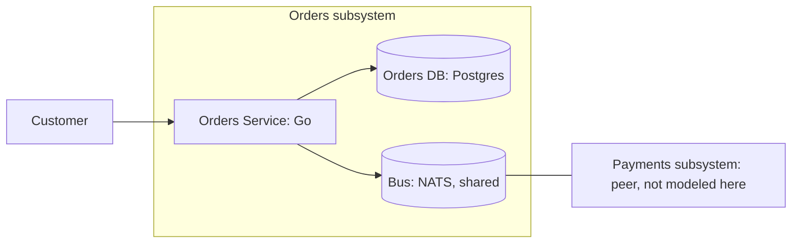

# BUILD: Orders Subsystem

Mode: full (self-contained).

> Single deliverable. Self-contained by design: a coding agent with zero prior context builds the
> system from this file alone, under hard TDD (section 11). Source-of-truth files are referenced per
> section for full detail, but you do not need to open them to build. When this document and a
> source file disagree, the source file wins and this document is a defect: stop and fix it.
>
> This is the orders child of the checkout-split recursive decomposition (parent:
> `examples/checkout-split/parent`). The pack under `design/pack/` is the parent's frozen
> interface; if it changes, the parent reissues it and this design re-verifies
> (`machinery check --gate g5`).
>
> Sources (under `design/`): `orders.modelith.yaml` (domain), `workspace.dsl` / `ARCHITECTURE.md`
> (architecture), `machines/Order.machine.json` (XState v5 machine), `machines/Order.matrix.md`
> (named units and failures), `machines/Order.oracle.md` (generated transition oracle), `pack/`
> (frozen parent interface), `packmap.yaml` + `formal/` (contract-refinement proof).

## 1. Purpose and scope

The orders half of checkout-split: one service owning the Order entity, coupled to the payments
subsystem only through the three boundary events in `design/pack/events.md` (request out; markPaid,
markDeclined in). Customers place and cancel orders, an operator ships them, and the payments
subsystem settles them; the subsystem exists so the order lifecycle can be built, tested, and
proven against its contract without ever seeing the payments internals.

**In scope**

- The Order lifecycle (Placed, Paid, Shipped, Declined, Cancelled) as one state machine over a
  database row.
- Publishing `request` through a transactional outbox; consuming `markPaid` / `markDeclined`
  idempotently under at-least-once delivery.
- The parent-delegated invariant `no-ship-without-capture`, enforced structurally by the machine.

**Out of scope**

- Payment settlement itself (capture, decline, refund): owned by the payments subsystem.
- Cancellation after payment: needs the refund flow payments owns, so `cancel` is ignored on Paid.
- End-user auth and capacity targets: recorded as out of scope in the NFR record (section 4).

## 2. Glossary

From the pack's domain slice and the parent's ubiquitous language. The only source for these words.

- **Order** - a customer order in the orders subsystem; the one entity this subsystem owns.
- **OrderStatus** - the Order lifecycle enum, frozen by the pack: `Placed` (created; awaiting
  payment settlement), `Paid` (payment captured; may ship), `Shipped` (handed to the carrier;
  terminal), `Declined` (payment declined; terminal), `Cancelled` (cancelled before settlement;
  terminal).
- **Payment** - the foreign entity owned by the payments subsystem; referenced here only through
  boundary-event payloads (`Payment.orderId`, `Payment.id`, `Payment.amount`).
- **Pack** - `design/pack/`, the generated, frozen interface between the parent design and this
  child: the owned domain slice, the boundary event contracts, the delegated invariant, and the
  contract machine. Regenerated only at the parent (`machinery pack generate`), never edited here.
- **Contract machine (OrdersContract)** - the abstract protocol the sibling subsystem relies on;
  this design's Order machine must refine it (section 5).
- **Boundary event** - one of the three bus events in `pack/events.md`: `request` (produced),
  `markPaid` and `markDeclined` (consumed). There are no other cross-boundary events.
- **Outbox** - the table written in the same transaction as the Order row; a dispatcher publishes
  from it to the bus, giving at-least-once delivery without dual writes.
- **Dedupe key** - the payload attribute that makes at-least-once redelivery idempotent:
  `Payment.orderId` for `request`, `Payment.id` for the settlement events.
- **`_ignores`** - the machine's explicit no-transition declarations: an event received in a
  resting state that is dropped, with a stated reason, instead of transitioning.
- **Walking skeleton** - the thinnest end-to-end slice exercising one real transition through one
  real boundary, built first to prove the topology.
- **Hard TDD** - a test-writer agent writes tests from sections 6 and 7; tests are locked; the
  implementer makes them pass without editing them (section 11).

## 3. Domain model (the what)

Source of truth: `design/orders.modelith.yaml` (lints clean). The Order entity and the OrderStatus
enum are the pack's frozen public shape (`pack/domain.modelith.yaml`); internal additions belong in
this model, never in the enum.

ER diagram: N/A: single-entity model with no internal relationships to render. The only
cross-entity relationship (Order to Payment) crosses the subsystem boundary, where Payment is a
foreign, reference-only entity, and is governed by the event contracts in section 4.

Data dictionary (the ONE canonical schema; later sections reference it, never restate it):

| entity | attribute | type | notes |
|---|---|---|---|
| **Order** | `id` | string | primary key |
| | `status` | `OrderStatus` | machine state; enum frozen by the pack |
| | `total` | number | strictly positive (`order-total-positive`) |

Actions: `place` (Customer; preserves `order-total-positive`), `markPaid` (System), `markDeclined`
(System), `ship` (Operator; preserves `no-ship-without-capture`), `cancel` (Customer).

Invariants (non-negotiable):

| id | statement | owner |
|---|---|---|
| `order-total-positive` | An order's total is strictly positive. | Order |
| `no-ship-without-capture` | An order ships only after its payment is captured. | Order (delegated by the parent pack) |

## 4. Architecture (the how)

Source of truth: `design/workspace.dsl` and `design/ARCHITECTURE.md`. Data shapes are section 3.

### 4.1 Context and containers



| container | technology | why |
|---|---|---|
| Orders Service | Go | one small service owning the Order lifecycle |
| Bus | NATS (shared) | the broker the parent topology fixes; all coupling crosses it |
| Orders DB | Postgres | row-per-order with row locks; PITR restore |

Deployment topology: one service instance, one shared broker, one database. Replicas / HA: N/A:
toy example; capacity is out of scope, recorded as such in the NFR record below.

### 4.2 Architecture Contract (boundaries + dependency rules)

The coding agent must not introduce cross-boundary dependencies outside `allow`; G4-import
enforces this against the code. The parent additionally denies any direct dependency between the
orders and payments services.

```yaml
contract_version: 2
boundaries:
  - id: orders.svc
    kind: container
    element: orders
    code: [ "cmd/**", "internal/**" ]
externals:
  - id: external.bus
    element: bus
    imports: [ "example.com/busdriver" ]
  - id: external.ordersdb
    element: ordersdb
    imports: [ "example.com/pgdriver" ]
dependency_rules:
  allow:
    - orders.svc -> external.bus
    - orders.svc -> external.ordersdb
  deny: []
```

### 4.3 Interface contracts at each boundary

**Event contracts (from the pack; do not widen).** The governing artifact for the bus; a boundary
change is a parent edit that reissues the pack.

| event | producer | consumer | payload | delivery | ordering | dedupe |
|---|---|---|---|---|---|---|
| request | orders | payments | Payment.orderId, Payment.amount | at-least-once | none | Payment.orderId |
| markPaid | payments | orders | Payment.orderId | at-least-once | none | Payment.id |
| markDeclined | payments | orders | Payment.orderId | at-least-once | none | Payment.id |

**Command API (customer and operator).** `place(total)` creates an Order (rejects `total <= 0`,
the `order-total-positive` validation; creation is not a machine transition); `cancel(id)` and
`ship(id)` fire the corresponding machine events. Errors are enumerated: NotFound, InvalidTotal,
IllegalState (a command the current state ignores, surfaced with the `_ignores` reason). Consumed
events are deduped by their dedupe key before the machine fires and dropped-and-logged on
redelivery, never errored.

### 4.4 Dependency mitigation posture

| dependency | failure modes | mitigation | residual | bound |
|---|---|---|---|---|
| `bus` | down, redelivery, reorder | outbox + idempotent consumers (dedupe keys above) | duplicates land as `_ignores` on every resting state | ack window |
| `ordersdb` | unavailable, corrupt | retry with backoff, PITR restore | transient unavailability surfaces after retries | retry <= 3 |

### 4.5 Persistence and placement

| component | placement | persistence | concurrency |
|---|---|---|---|
| `Order` | orders service | db row | single writer per order id |

Events serialize on the row lock; there is no in-memory actor.

### 4.6 NFR record

- Security: broker credentials only; no inbound calls except the customer API. End-user auth out
  of scope, recorded as such.
- Capacity: toy example; out of scope, recorded as such.
- Observability: log every markDeclined and every dedupe drop with the order id.

## 5. Behavior: the state machines (the logic)

One stateful component: the Order machine, `design/machines/Order.machine.json` (XState v5,
JSON-serializable). The JSON is not pasted here; the file is the source and the gates lint it
there.

**Lifecycle.** An Order is created at `Placed` by a customer's `place`; the `request` entry action
enqueues the payment request in the outbox in the same transaction as the insert. From Placed it
settles to `Paid` on `markPaid`, to `Declined` on `markDeclined`, or to `Cancelled` on the
customer's `cancel`. From Paid the operator ships it (`ship` -> `Shipped`, recording the carrier
handoff). Shipped, Declined, and Cancelled are final. Every event that must not transition is an
explicit `_ignores` with a reason: `ship` on Placed (an unpaid order cannot ship,
`no-ship-without-capture`), duplicate or stale settlement events on Paid (deduped by `Payment.id`),
and `cancel` on Paid (the refund flow belongs to payments).

**Named-unit contract table** (the units the coding agent implements; source
`design/machines/Order.matrix.md`, which remains what G3 checks):

| name | kind | signature | pre / post | maps to | test type | fixture |
|---|---|---|---|---|---|---|
| `request` | action | `(ctx) -> publish` | on entry to Placed, enqueue the payment request in the outbox, same transaction as the insert | bus relationship; dedupe `Payment.orderId` | integration | real outbox table + fake broker (contract-tested) |
| `recordShipment` | action | `(ctx) -> ctx` | stamps carrier handoff; only reachable from Paid, which is `no-ship-without-capture` | inv `no-ship-without-capture` (structural) | unit | none |
| `recordCancel` | action | `(ctx) -> ctx` | stamps cancellation reason | - | unit | none |

**Failure catalog** (source: the matrix, part b):

| failure | detection | transition | recovery | bounding mitigation |
|---|---|---|---|---|
| bus down while publishing `request` | outbox dispatcher error | none (outbox retries outside the machine) | dispatcher backoff | outbox + retry, ARCHITECTURE.md section 6 |
| duplicate `markPaid` redelivery | dedupe by `Payment.id` | none (`_ignores` on Paid) | drop and log | idempotent consumer |
| `ordersdb` unavailable | row-lock/write error | none (command rejected, caller retries) | retry with backoff | retry <= 3 |

**Contract refinement.** The pack's contract machine is what the payments subsystem relies on.
`design/packmap.yaml` maps this machine's states onto it (Placed -> Open, Paid -> Paid, Shipped /
Declined / Cancelled -> Done), pinned to the pack hash. The generated refinement
(`design/formal/OrderPackRefinement.tla`, from `machinery pack refine`) proves this machine
refines the pack's OrdersContract; `machinery verify-formal` TLC-checks it.

## 6. Traceability matrix

Every invariant from section 3 appears here, ids as whole tokens in table cells (Gx-trace matches
them structurally). `no-ship-without-capture` is delegated by the parent pack; G5-pack requires it
traced in this child.

| invariant id | enforced by (guard / structural) | in component | interface contract | test id(s) |
|---|---|---|---|---|
| `no-ship-without-capture` | structural: `Shipped` is reachable only from `Paid`, and `Paid` only on `markPaid`; see `_ignores` on Placed | Order machine (orders.svc) | consumed `markPaid` event (section 4.3) | T-ORDE-04 (stable ORDE-e6d28f), P-no-ship-without-capture |
| `order-total-positive` | creation-time validation at the API boundary (attested; creation is not a machine transition) | orders.svc command API | `place` command (section 4.3) | P-order-total-positive |

No invariant is dropped. `order-total-positive` is enforced by neither a guard nor the machine's
structure; it is carried as a named risk in section 12.

## 7. Test specification (the hard-TDD oracle)

This section is the input to the test-writer agent (section 11). It writes tests from here; it
does not invent them.

**Transition tests.** Every row of `design/machines/Order.oracle.md` (4 transition rows), keyed on
the STABLE id column (e.g. `ORDE-e6d28f`), never the sequential test id: row numbers renumber when
the design changes, stable ids do not. Regenerate with `machinery oracle design/machines`; the
stable-id diff is the affected-test list. The `_ignores` declarations appear as the absence of
outgoing rows, covered by the redelivery property below.

**Guard-branch completeness analysis.** N/A: the Order machine declares no guards, so there is no
conjunction clause to falsify.

**Named-unit test plan** (from the section 5 table): the outbox `request` action is an integration
test against the real outbox table with a contract-tested fake broker; `recordShipment` and
`recordCancel` are unit tests with no fixture. Idempotency contracts are never derived from
transition tests.

**Contract tests per boundary** (section 4.3):

| test id | scenario | expected |
|---|---|---|
| C-DB-01 | `place` inserts the Order row and the outbox `request` row in one transaction; rollback | neither row persists |
| C-BUS-01 | dispatched `request` payload | exactly the contract payload (Payment.orderId, Payment.amount), dedupe key set |
| C-BUS-02 | `markPaid` / `markDeclined` delivered twice (dedupe by `Payment.id`) | second delivery dropped and logged; row unchanged |

**Property tests per invariant.** P-no-ship-without-capture: for any event sequence not containing
`markPaid`, the order never reaches Shipped. P-order-total-positive: `place` with `total <= 0` is
rejected and every persisted order has `total > 0`. Redelivery property test: any resting state
receiving a duplicate settlement event is unchanged (the `_ignores` reasons).

## 8. State migration

`Order.status` is persisted (placement table, section 4.5). No persisted instances yet; the
protocol applies from first deployment: any rename/split/removal of an OrderStatus value ships
with a mapping table from old persisted values to new states, or an explicit drain rule, in this
section. Note: the enum is the pack's frozen shape, so such a change is a PARENT change that
reissues packs.

## 9. Build plan

Walking skeleton first, then vertical slices, each fully green before the next.

- **M0 - Walking skeleton.** `place` runs one real Postgres transaction inserting the Order row
  and the outbox `request` row; the dispatcher publishes to the broker fixture; a consumed
  `markPaid` lands the order on Paid (stable id ORDE-33e568). One real transition through one real
  boundary. DoD: C-DB-01, C-BUS-01, and ORDE-33e568 green.
- **M1 - Settlement slice.** `markDeclined` and `cancel` paths plus consumer dedupe. DoD: all 4
  oracle rows green by stable id; C-BUS-02 and the redelivery property green.
- **M2 - Ship and invariants.** `ship` from Paid only; the property tests. DoD:
  P-no-ship-without-capture and P-order-total-positive green; every `_ignores` case exercised.
- **M3 - Gates.** DoD: `machinery check design --impl <dir>` reports 0 blocking findings (G5-pack
  included) and `machinery verify-formal design` proves the contract refinement; no cross-boundary
  violations.

## 10. Language realization notes

Target language: Go. Explicit `status` field plus a transition switch mirroring the machine JSON;
no machine library and no in-memory actor. State persists on the Order row; a single writer per
order id (the row lock, section 4.5) serializes events. The outbox insert shares the order's
transaction; a dispatcher publishes from the outbox with backoff (failure catalog, section 5).
Consumed events are deduped by their dedupe key before the machine fires. `_ignores` events return
a logged no-op, not an error, except commands, which surface IllegalState.

### Toolchain and versions

Go 1.26, stdlib testing; machinery oracle design/machines; machinery check design (add --impl
<dir> once code exists); machinery pack refine design; machinery verify-formal design (Java for
TLC). Library pins live in the impl's go.mod (the lockfile); the design needs no third-party
libraries beyond the drivers named in the Architecture Contract (`example.com/pgdriver`,
`example.com/busdriver`).

## 11. Hard-TDD protocol (read this before writing any code)

Test-writer derives tests from sections 6 and 7 keyed on oracle stable ids; tests lock; the
implementer makes them pass without editing them. Generated tests live apart from hand-written
ones, so regenerating on a design change never clobbers them. A wrong test is a design defect: fix
the design, regenerate (`machinery oracle`, `machinery pack refine`), rerun.

## 12. Open questions and residual risks

1. **`order-total-positive` is attested, not machine-enforced.** Creation is not a transition, so
   no guard exists; enforcement is the API-boundary validation plus P-order-total-positive. Named
   risk, accepted with test coverage.
2. **Cancellation after payment is deferred.** `cancel` is ignored on Paid because the refund flow
   belongs to payments; a post-capture cancellation needs a parent-level flow and a new boundary
   event. Deferred to the parent.
3. **The public lifecycle is frozen.** Any OrderStatus change is a parent change that reissues
   packs (section 8); this child cannot evolve its public shape alone. Accepted by design.
4. **The refinement proof covers the mapped machine only.** Properties outside the contract
   vocabulary (end-to-end latency, cross-subsystem liveness) are the parent's residuals, not
   proven here.
5. **Outbox delay under a bus outage.** Dispatcher retries are bounded only by the ack window
   (failure catalog); a long outage delays `request` publication, and duplicates on recovery are
   absorbed by the consumer dedupe. Accepted.
