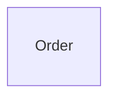

{/* Generated by `modelith render`. Do not edit by hand; edit the .modelith.yaml source and re-render. */}

# Checkout Split / orders

The orders subsystem, designed against its contract pack. The Order entity's public shape (its lifecycle enum) is frozen by the pack; everything internal is this design's own.

## Glossary

- **`Customer`** - The person who places or cancels an order before payment settlement.
- **`Operator`** - The fulfillment operator who records a carrier handoff after capture.
- **`System`** - An authenticated subsystem event handler acting without a human surface.

## Enums

### `OrderStatus`

| Value | Definition |
| --- | --- |
| `Placed` | Created; awaiting payment settlement. |
| `Paid` | Payment captured; may ship. |
| `Shipped` | Handed to the carrier; terminal. |
| `Declined` | Payment declined; terminal. |
| `Cancelled` | Cancelled before settlement; terminal. |

## Entities

### `Order`

A customer order in the orders subsystem.

**Attributes**

| Name | Type | Description |
| --- | --- | --- |
| `id` | string |  |
| `status` | OrderStatus |  |
| `total` | number |  |

**Actions**

- `place` - actor `Customer`; preserves order-total-positive
- `markPaid` - actor `System`
- `markDeclined` - actor `System`
- `ship` - actor `Operator`; preserves no-ship-without-capture
- `cancel` - actor `Customer`

**Invariants**

- **order-total-positive** - An order's total is strictly positive.

## Relationships

## Invariants

- **no-ship-without-capture** - An order ships only after its payment is captured. Delegated by the parent; enforced structurally: Shipped is reachable only from Paid, and Paid only on the payments subsystem's markPaid event.

## Scenarios

### Positive order settles before shipment

Exercises creation validation and the capture-before-ship lifecycle rule.

**Actors:** Customer, System, Operator

**Steps**

1. A `Customer` places an `Order` with a strictly positive total.
2. The payment `System` marks the `Order` paid after capture.
3. An `Operator` ships the paid `Order`; an unpaid order would be rejected.

**Invariants touched**

- **order-total-positive** - An order's total is strictly positive.
- **no-ship-without-capture** - An order ships only after its payment is captured. Delegated by the parent; enforced structurally: Shipped is reachable only from Paid, and Paid only on the payments subsystem's markPaid event.
