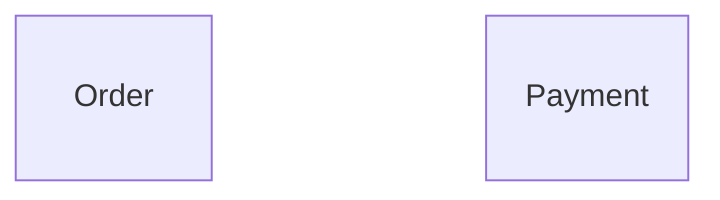

{/* Generated by `modelith render`. Do not edit by hand; edit the .modelith.yaml source and re-render. */}

# Checkout Split

A deliberately small two-subsystem checkout: an orders service and a payments service coupled only through the bus. The worked example for recursive decomposition via contract packs.

## Glossary

- **`Customer`** - The person who places or cancels an order before payment settlement.
- **`Operator`** - The fulfillment or payments operator authorized to ship or refund.
- **`System`** - An authenticated subsystem event handler acting without a human surface.

## Enums

### `OrderStatus`

| Value | Definition |
| --- | --- |
| `Placed` | Created; awaiting payment settlement. |
| `Paid` | Payment captured; may ship. |
| `Shipped` | Handed to the carrier; terminal. |
| `Declined` | Payment declined; terminal. |
| `Cancelled` | Cancelled before settlement; terminal. |

### `PaymentStatus`

| Value | Definition |
| --- | --- |
| `Requested` | Created from an order's payment request. |
| `Captured` | Funds taken. |
| `Declined` | Declined by the processor; terminal. |
| `Refunded` | Captured funds returned; terminal. |

## Entities

### `Order`

A customer order in the orders subsystem.

**Attributes**

| Name | Type | Description |
| --- | --- | --- |
| `id` | string |  |
| `status` | OrderStatus |  |
| `total` | number |  |

**Actions**

- `place` - actor `Customer`; preserves order-total-positive
- `markPaid` - actor `System`
- `markDeclined` - actor `System`
- `ship` - actor `Operator`; preserves no-ship-without-capture
- `cancel` - actor `Customer`

**Invariants**

- **order-total-positive** - An order's total is strictly positive.

### `Payment`

A payment attempt in the payments subsystem.

**Attributes**

| Name | Type | Description |
| --- | --- | --- |
| `id` | string |  |
| `orderId` | string |  |
| `amount` | number |  |
| `status` | PaymentStatus |  |

**Actions**

- `request` - actor `System`
- `capture` - actor `System`; preserves payment-single-capture
- `decline` - actor `System`
- `refund` - actor `Operator`

**Invariants**

- **payment-single-capture** - A payment is captured at most once.

## Relationships

## Invariants

- **no-ship-without-capture** - An order ships only after its payment is captured. Cross-subsystem; enforcement is delegated to the orders subsystem, which may only reach Shipped from Paid, and Paid only on the payments subsystem's markPaid event.

## Scenarios

### Positive order settles before shipment

Exercises creation validation and the capture-before-ship lifecycle rule.

**Actors:** Customer, System, Operator

**Steps**

1. A `Customer` places an `Order` with a strictly positive total.
2. The payment `System` captures a `Payment` and marks the `Order` paid.
3. An `Operator` ships the paid `Order`; an unpaid order would be rejected.

**Invariants touched**

- **order-total-positive** - An order's total is strictly positive.
- **no-ship-without-capture** - An order ships only after its payment is captured. Cross-subsystem; enforcement is delegated to the orders subsystem, which may only reach Shipped from Paid, and Paid only on the payments subsystem's markPaid event.

### Payment captures at most once

Exercises settlement, duplicate capture handling, and the refund path.

**Actors:** System, Operator

**Steps**

1. The order `System` requests a `Payment`.
2. The processor `System` captures it once; a duplicate capture has no effect.
3. An `Operator` refunds the captured `Payment`.

**Invariants touched**

- **payment-single-capture** - A payment is captured at most once.
