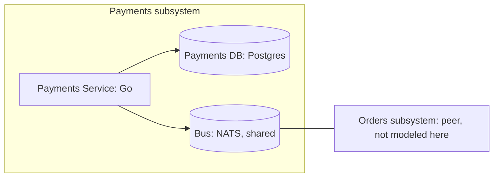

# BUILD: Payments Subsystem

Mode: full (self-contained).

> Single deliverable. Self-contained by design: a coding agent with zero prior context builds the
> system from this file alone, under hard TDD (section 11). Source-of-truth files are referenced per
> section for full detail, but you do not need to open them to build. When this document and a
> source file disagree, the source file wins and this document is a defect: stop and fix it.
>
> This is the payments child of the checkout-split recursive decomposition (parent:
> `examples/checkout-split/parent`). The pack under `design/pack/` is the parent's frozen
> interface; if it changes, the parent reissues it and this design re-verifies
> (`machinery check --gate g5`).
>
> Sources (under `design/`): `payments.modelith.yaml` (domain), `workspace.dsl` /
> `ARCHITECTURE.md` (architecture), `machines/Payment.machine.json` (XState v5 machine),
> `machines/Payment.matrix.md` (named units and failures), `machines/Payment.oracle.md` (generated
> transition oracle), `pack/` (frozen parent interface), `packmap.yaml` + `formal/`
> (contract-refinement proof).

## 1. Purpose and scope

The payments half of checkout-split: one service owning the Payment entity, coupled to the orders
subsystem only through the three boundary events in `design/pack/events.md` (request in; markPaid,
markDeclined out). It settles the payment for each order request and reports the outcome; it
exists so settlement can be built, tested, and proven against its contract without ever seeing the
orders internals.

**In scope**

- The Payment lifecycle (Requested, Captured, Declined, Refunded) as one state machine over a
  database row.
- Creating a Payment from the consumed `request` event (deduped); publishing `markPaid` /
  `markDeclined` through a transactional outbox.
- The invariant `payment-single-capture`, enforced structurally by the machine.

**Out of scope**

- The order lifecycle (place, ship, cancel): owned by the orders subsystem.
- Notifying orders of a refund: no boundary event exists for it (section 12).
- End-user auth and capacity targets: recorded as out of scope in the NFR record (section 4).

## 2. Glossary

From the pack's domain slice and the parent's ubiquitous language. The only source for these words.

- **Payment** - a payment attempt in the payments subsystem; the one entity this subsystem owns.
- **PaymentStatus** - the Payment lifecycle enum, frozen by the pack: `Requested` (created from an
  order's payment request), `Captured` (funds taken), `Declined` (declined by the processor;
  terminal), `Refunded` (captured funds returned; terminal).
- **Order** - the foreign entity owned by the orders subsystem; referenced here only through
  boundary-event payloads (`Payment.orderId`).
- **Processor** - the external party that captures or declines funds; it surfaces here as the
  System actor firing `capture` / `decline` and as the API key in the NFR record (section 4.6);
  its integration shape is a named residual (section 12).
- **Pack** - `design/pack/`, the generated, frozen interface between the parent design and this
  child: the owned domain slice, the boundary event contracts, and the contract machine.
  Regenerated only at the parent (`machinery pack generate`), never edited here.
- **Contract machine (PaymentsContract)** - the abstract protocol the sibling subsystem relies on;
  this design's Payment machine must refine it (section 5).
- **Boundary event** - one of the three bus events in `pack/events.md`: `request` (consumed),
  `markPaid` and `markDeclined` (produced). There are no other cross-boundary events.
- **Outbox** - the table written in the same transaction as the Payment row; a dispatcher
  publishes from it to the bus, giving at-least-once delivery without dual writes.
- **Dedupe key** - the payload attribute that makes at-least-once redelivery idempotent:
  `Payment.orderId` for `request`, `Payment.id` for the settlement events.
- **`_ignores`** - the machine's explicit no-transition declarations: an event received in a
  resting state that is dropped, with a stated reason, instead of transitioning.
- **Walking skeleton** - the thinnest end-to-end slice exercising one real transition through one
  real boundary, built first to prove the topology.
- **Hard TDD** - a test-writer agent writes tests from sections 6 and 7; tests are locked; the
  implementer makes them pass without editing them (section 11).

## 3. Domain model (the what)

Source of truth: `design/payments.modelith.yaml` (lints clean). The Payment entity and the
PaymentStatus enum are the pack's frozen public shape (`pack/domain.modelith.yaml`); internal
additions belong in this model, never in the enum.

ER diagram: N/A: single-entity model with no internal relationships to render. The only
cross-entity relationship (Payment to Order, via `orderId`) crosses the subsystem boundary, where
Order is a foreign, reference-only entity, and is governed by the event contracts in section 4.

Data dictionary (the ONE canonical schema; later sections reference it, never restate it):

| entity | attribute | type | notes |
|---|---|---|---|
| **Payment** | `id` | string | primary key; dedupe key for the settlement events |
| | `orderId` | string | the foreign Order; dedupe key for `request` |
| | `amount` | number | taken from the `request` payload (section 12) |
| | `status` | `PaymentStatus` | machine state; enum frozen by the pack |

Actions: `request` (System), `capture` (System; preserves `payment-single-capture`), `decline`
(System), `refund` (Operator).

Invariants (non-negotiable):

| id | statement | owner |
|---|---|---|
| `payment-single-capture` | A payment is captured at most once. | Payment |

The pack delegates no cross-subsystem invariant to this child (`delegated_invariants: []`).

## 4. Architecture (the how)

Source of truth: `design/workspace.dsl` and `design/ARCHITECTURE.md`. Data shapes are section 3.

### 4.1 Context and containers



| container | technology | why |
|---|---|---|
| Payments Service | Go | one small service owning payment settlement |
| Bus | NATS (shared) | the broker the parent topology fixes; all coupling crosses it |
| Payments DB | Postgres | row-per-payment with row locks; PITR restore |

Deployment topology: one service instance, one shared broker, one database. Replicas / HA: N/A:
toy example; capacity is out of scope, recorded as such in the NFR record below.

### 4.2 Architecture Contract (boundaries + dependency rules)

The coding agent must not introduce cross-boundary dependencies outside `allow`; G4-import
enforces this against the code. The parent additionally denies any direct dependency between the
payments and orders services.

```yaml
contract_version: 2
boundaries:
  - id: payments.svc
    kind: container
    element: payments
    code: [ "cmd/**", "internal/**" ]
externals:
  - id: external.bus
    element: bus
    imports: [ "example.com/busdriver" ]
  - id: external.paydb
    element: paydb
    imports: [ "example.com/pgdriver" ]
dependency_rules:
  allow:
    - payments.svc -> external.bus
    - payments.svc -> external.paydb
  deny: []
```

### 4.3 Interface contracts at each boundary

**Event contracts (from the pack; do not widen).** The governing artifact for the bus; a boundary
change is a parent edit that reissues the pack.

| event | producer | consumer | payload | delivery | ordering | dedupe |
|---|---|---|---|---|---|---|
| request | orders | payments | Payment.orderId, Payment.amount | at-least-once | none | Payment.orderId |
| markPaid | payments | orders | Payment.orderId | at-least-once | none | Payment.id |
| markDeclined | payments | orders | Payment.orderId | at-least-once | none | Payment.id |

**Settlement surface.** A consumed `request` creates the Payment at Requested (creation is not a
machine transition; redelivery is deduped by `Payment.orderId`, so a duplicate creates no second
payment). The processor outcome fires `capture` or `decline`; the operator fires `refund`. Errors
are enumerated: NotFound, IllegalState (an event the current state ignores). Consumed events are
deduped by their dedupe key before the machine fires.

### 4.4 Dependency mitigation posture

| dependency | failure modes | mitigation | residual | bound |
|---|---|---|---|---|
| `bus` | down, redelivery, reorder | outbox + idempotent consumers (dedupe by `Payment.orderId`) | duplicate `request` creates no second payment | ack window |
| `paydb` | unavailable, corrupt | retry with backoff, PITR restore | transient unavailability surfaces after retries | retry <= 3 |

### 4.5 Persistence and placement

| component | placement | persistence | concurrency |
|---|---|---|---|
| `Payment` | payments service | db row | single writer per payment id |

Events serialize on the row lock; there is no in-memory actor.

### 4.6 NFR record

- Security: broker credentials; processor API key in the secret store. Out of scope beyond that,
  recorded as such.
- Capacity: toy example; out of scope, recorded as such.
- Observability: log every decline and every dedupe drop with the order id.

## 5. Behavior: the state machines (the logic)

One stateful component: the Payment machine, `design/machines/Payment.machine.json` (XState v5,
JSON-serializable). The JSON is not pasted here; the file is the source and the gates lint it
there.

**Lifecycle.** A Payment is created at `Requested` by the consumed `request` event (creation is
not a transition; redelivery is deduped by `Payment.orderId`). The processor outcome either
captures it (`capture` -> `Captured`, publishing `markPaid`) or declines it (`decline` ->
`Declined`, publishing `markDeclined`). From Captured the operator may refund (`refund` ->
`Refunded`, recording the refund). Declined and Refunded are final. Every event that must not
transition is an explicit `_ignores` with a reason: `request` redelivery and premature `refund` on
Requested; duplicate `capture` (`payment-single-capture`) and stale `decline` on Captured.

**Named-unit contract table** (the units the coding agent implements; source
`design/machines/Payment.matrix.md`, which remains what G3 checks):

| name | kind | signature | pre / post | maps to | test type | fixture |
|---|---|---|---|---|---|---|
| `markPaid` | action | `(ctx) -> publish` | on capture, enqueue markPaid in the outbox, same transaction as the status write | bus relationship; dedupe `Payment.id` | integration | real outbox table + fake broker (contract-tested) |
| `markDeclined` | action | `(ctx) -> publish` | on decline, enqueue markDeclined in the outbox, same transaction | bus relationship; dedupe `Payment.id` | integration | real outbox table + fake broker (contract-tested) |
| `recordRefund` | action | `(ctx) -> ctx` | stamps the refund; only reachable from Captured, which is `payment-single-capture` | inv `payment-single-capture` (structural) | unit | none |

**Failure catalog** (source: the matrix, part b):

| failure | detection | transition | recovery | bounding mitigation |
|---|---|---|---|---|
| duplicate `request` redelivery | dedupe by `Payment.orderId` | none (creation dedupe; `_ignores` on Requested) | drop and log | idempotent consumer |
| duplicate `capture` redelivery | dedupe by `Payment.id` | none (`_ignores` on Captured) | drop and log | idempotent consumer |
| `paydb` unavailable | write error | none (command rejected, caller retries) | retry with backoff | retry <= 3 |

**Contract refinement.** The pack's contract machine is what the orders subsystem relies on.
`design/packmap.yaml` maps this machine's states onto it (Requested -> Settling, Captured /
Declined / Refunded -> Done), pinned to the pack hash. The generated refinement
(`design/formal/PaymentPackRefinement.tla`, from `machinery pack refine`) proves this machine
refines the pack's PaymentsContract; `machinery verify-formal` TLC-checks it.

## 6. Traceability matrix

Every invariant from section 3 appears here, ids as whole tokens in table cells (Gx-trace matches
them structurally).

| invariant id | enforced by (guard / structural) | in component | interface contract | test id(s) |
|---|---|---|---|---|
| `payment-single-capture` | structural: `capture` is handled only in `Requested`; redelivery lands in `_ignores` on `Captured` | Payment machine (payments.svc) | `capture` outcome + produced `markPaid` event (section 4.3) | T-PAYM-01 (stable PAYM-975859), P-payment-single-capture |

No invariant is dropped; none needs a known-risk callout (the one invariant is structural).

## 7. Test specification (the hard-TDD oracle)

This section is the input to the test-writer agent (section 11). It writes tests from here; it
does not invent them.

**Transition tests.** Every row of `design/machines/Payment.oracle.md` (3 transition rows), keyed
on the STABLE id column (e.g. `PAYM-975859`), never the sequential test id: row numbers renumber
when the design changes, stable ids do not. Regenerate with `machinery oracle design/machines`;
the stable-id diff is the affected-test list. The `_ignores` declarations appear as the absence of
outgoing rows, covered by the redelivery property below.

**Guard-branch completeness analysis.** N/A: the Payment machine declares no guards, so there is
no conjunction clause to falsify.

**Named-unit test plan** (from the section 5 table): the outbox `markPaid` and `markDeclined`
actions are integration tests against the real outbox table with a contract-tested fake broker;
`recordRefund` is a unit test with no fixture. Idempotency contracts are never derived from
transition tests.

**Contract tests per boundary** (section 4.3):

| test id | scenario | expected |
|---|---|---|
| C-DB-01 | `capture` writes the status and the outbox `markPaid` row in one transaction; rollback | neither change persists |
| C-BUS-01 | dispatched `markPaid` / `markDeclined` payload | exactly the contract payload (Payment.orderId), dedupe key `Payment.id` set |
| C-BUS-02 | `request` delivered twice (dedupe by `Payment.orderId`) | one Payment row; second delivery dropped and logged |

**Property tests per invariant.** P-payment-single-capture: for any event sequence, `markPaid` is
published at most once per payment and no payment leaves Captured except by `refund`. Redelivery
property test: any resting state receiving a duplicate event is unchanged (the `_ignores`
reasons).

## 8. State migration

`Payment.status` is persisted (placement table, section 4.5). No persisted instances yet; the
protocol applies from first deployment: any change to a PaymentStatus value ships with a mapping
table or drain rule here, and is a PARENT change (frozen shape).

## 9. Build plan

Walking skeleton first, then vertical slices, each fully green before the next.

- **M0 - Walking skeleton.** Consume a real `request` from the broker fixture, create the Payment
  row (deduped by `Payment.orderId`), fire `capture`, and land on Captured with the outbox
  `markPaid` row written in the same Postgres transaction (stable id PAYM-975859). One real
  transition through one real boundary. DoD: C-DB-01, C-BUS-01, C-BUS-02, and PAYM-975859 green.
- **M1 - Settlement breadth.** `decline` (PAYM-36d434) and `refund` (PAYM-8835f6) paths plus the
  duplicate-capture and stale-decline `_ignores`. DoD: all 3 oracle rows green by stable id; the
  redelivery property green.
- **M2 - Invariants and gates.** DoD: P-payment-single-capture green;
  `machinery check design --impl <dir>` reports 0 blocking findings (G5-pack included) and
  `machinery verify-formal design` proves the contract refinement; no cross-boundary violations.

## 10. Language realization notes

Target language: Go. Explicit `status` field plus a transition switch mirroring the machine JSON;
no machine library and no in-memory actor. State persists on the Payment row; a single writer per
payment id (the row lock, section 4.5) serializes events. The outbox write shares the status
write's transaction; a dispatcher publishes from the outbox with backoff. Consumed events are
deduped by their dedupe key before the machine fires; a duplicate `request` creates no second
payment. `_ignores` events return a logged no-op.

### Toolchain and versions

Go 1.26, stdlib testing; machinery oracle design/machines; machinery check design (add --impl
<dir> once code exists); machinery pack refine design; machinery verify-formal design (Java for
TLC). Library pins live in the impl's go.mod (the lockfile); the design needs no third-party
libraries beyond the drivers named in the Architecture Contract (`example.com/pgdriver`,
`example.com/busdriver`).

## 11. Hard-TDD protocol (read this before writing any code)

Test-writer derives tests from sections 6 and 7 keyed on oracle stable ids; tests lock; the
implementer makes them pass without editing them. Generated tests live apart from hand-written
ones, so regenerating on a design change never clobbers them. A wrong test is a design defect: fix
the design, regenerate (`machinery oracle`, `machinery pack refine`), rerun.

## 12. Open questions and residual risks

1. **The processor is not modeled as a container.** `capture` and `decline` arrive as System-actor
   actions; the NFR record covers only the API-key posture. The integration shape (webhook vs
   poll) is an implementation decision, named here so it is not assumed designed.
2. **A refund never notifies orders.** `refund` produces no boundary event (the pack fixes exactly
   three), so the orders subsystem never learns of it. A parent-level change would be needed;
   deferred to the parent.
3. **`Payment.amount` is unconstrained here.** No invariant covers it; the value is taken from the
   `request` payload as-is (the positivity rule lives with the orders subsystem as
   `order-total-positive`). Accepted: validation at the source, not the sink.
4. **The public lifecycle is frozen.** Any PaymentStatus change is a parent change that reissues
   packs (section 8); this child cannot evolve its public shape alone. Accepted by design.
5. **The refinement proof covers the mapped machine only.** Properties outside the contract
   vocabulary (end-to-end latency, cross-subsystem liveness) are the parent's residuals, not
   proven here.
