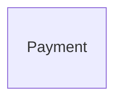

{/* Generated by `modelith render`. Do not edit by hand; edit the .modelith.yaml source and re-render. */}

# Checkout Split / payments

The payments subsystem, designed against its contract pack. The Payment entity's public shape is frozen by the pack.

## Glossary

- **`Operator`** - The payments operator authorized to refund captured funds.
- **`System`** - An authenticated order or processor event handler acting without a human surface.

## Enums

### `PaymentStatus`

| Value | Definition |
| --- | --- |
| `Requested` | Created from an order's payment request. |
| `Captured` | Funds taken. |
| `Declined` | Declined by the processor; terminal. |
| `Refunded` | Captured funds returned; terminal. |

## Entities

### `Payment`

A payment attempt in the payments subsystem.

**Attributes**

| Name | Type | Description |
| --- | --- | --- |
| `id` | string |  |
| `orderId` | string |  |
| `amount` | number |  |
| `status` | PaymentStatus |  |

**Actions**

- `request` - actor `System`
- `capture` - actor `System`; preserves payment-single-capture
- `decline` - actor `System`
- `refund` - actor `Operator`

**Invariants**

- **payment-single-capture** - A payment is captured at most once. Structural: capture is only handled in Requested.

## Relationships

## Scenarios

### Payment captures at most once

Exercises settlement, duplicate capture handling, and the refund path.

**Actors:** System, Operator

**Steps**

1. The order `System` requests a `Payment`.
2. The processor `System` captures it once; a duplicate capture has no effect.
3. An `Operator` refunds the captured `Payment`.

**Invariants touched**

- **payment-single-capture** - A payment is captured at most once. Structural: capture is only handled in Requested.
