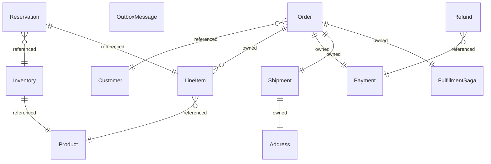

{/* Generated by `modelith render`. Do not edit by hand; edit the .modelith.yaml source and re-render. */}

# Order Fulfillment

A distributed order-fulfillment platform. Placing an order runs a saga that reserves inventory, captures payment, and dispatches a shipment across separate services, compensating on failure. Reliable messaging uses a transactional outbox with idempotent consumers.

## Glossary

- **`Carrier`** - An external shipping carrier that dispatches and tracks parcels.
- **`Operator`** - A human operator managing catalog and stock.
- **`PaymentGateway`** - An external payment processor that authorizes, captures, and refunds.
- **`System`** - The platform acting on its own behalf across services.

## Enums

### `MessageStatus`

| Value | Definition |
| --- | --- |
| `Pending` | Written to the outbox, not yet published. |
| `Published` | Handed to the broker at least once. |
| `Consumed` | Acknowledged by an idempotent consumer. |

### `OrderStatus`

| Value | Definition |
| --- | --- |
| `Pending` | Created, not yet confirmed. |
| `Confirmed` | Validated and priced. |
| `Reserved` | Inventory held for every line. |
| `Paid` | Payment captured. |
| `Shipped` | Handed to the carrier. |
| `Delivered` | Received by the customer; terminal. |
| `Cancelled` | Ended before fulfillment; terminal. |
| `Failed` | Ended by an unrecoverable error; terminal. |

### `PaymentStatus`

| Value | Definition |
| --- | --- |
| `Pending` | Not yet authorized. |
| `Authorized` | Funds held. |
| `Captured` | Funds taken. |
| `Failed` | Declined or errored; terminal. |
| `Refunded` | Captured funds returned; terminal. |

### `ReservationStatus`

| Value | Definition |
| --- | --- |
| `Held` | Stock set aside. |
| `Committed` | Consumed by a shipment. |
| `Released` | Returned to available stock. |

### `SagaStatus`

| Value | Definition |
| --- | --- |
| `Reserving` | Holding stock; the first forward step. |
| `Paying` | Capturing payment; stock is held. |
| `Shipping` | Dispatching; payment is captured. |
| `Compensating` | Unwinding after a failure. |
| `Completed` | Fulfilled; terminal. |
| `Failed` | Compensated and abandoned; terminal. |
| `FailedDirty` | Compensation could not complete within the retry bound; an obligation may still be held. Explicit residual; pages an operator. |

### `ShipmentStatus`

| Value | Definition |
| --- | --- |
| `Pending` | Awaiting dispatch. |
| `Dispatched` | Handed to the carrier. |
| `InTransit` | Moving to the customer. |
| `Delivered` | Received; terminal. |
| `Lost` | Lost in transit; terminal. |

## Entities

### `Address`

A postal destination for a `Shipment`. Part of the `Shipment` it belongs to.

**Attributes**

| Name | Type | Description |
| --- | --- | --- |
| `line1` | string |  |
| `city` | string |  |
| `postalCode` | string |  |
| `country` | string |  |

**Actions**

- `capture` - actor `Customer`

**Invariants**

- **address-country-present** - An `Address` has a non-empty country.

### `Customer`

A person who places orders. A `Customer` owns the `Order` records they create.

**Attributes**

| Name | Type | Description |
| --- | --- | --- |
| `name` | string |  |
| `email` | string |  |

**Actions**

- `register` - actor `System`; preserves customer-email-unique

**Invariants**

- **customer-email-unique** - No two `Customer` records share an email.

### `FulfillmentSaga`

The orchestration that drives an `Order` through reserve, pay, and ship, and unwinds on failure. A `FulfillmentSaga` moves through SagaStatus.

**Attributes**

| Name | Type | Description |
| --- | --- | --- |
| `status` | SagaStatus |  |

**Actions**

- `start` - actor `System`
- `advance` - actor `System`
- `compensate` - actor `System`; preserves saga-compensation
- `complete` - actor `System`; preserves saga-terminal
- `abort` - actor `System`; preserves saga-terminal, saga-compensation

**Invariants**

- **saga-terminal** - A `FulfillmentSaga` in Completed or Failed is terminal.

### `Inventory`

The stock position for a `Product`: how much is on hand and how much is currently reserved. Availability is on hand minus reserved.

**Relationships**

- `Product` - 1:1 - referenced

**Attributes**

| Name | Type | Description |
| --- | --- | --- |
| `onHand` | integer |  |
| `reserved` | integer |  |

**Actions**

- `restock` - actor `Operator`
- `reserve` - actor `System`; preserves reserved-within-stock, available-nonneg
- `release` - actor `System`; preserves available-nonneg
- `commit` - actor `System`

**Invariants**

- **reserved-within-stock** - The reserved quantity of an `Inventory` never exceeds its onHand quantity.
- **available-nonneg** - The available quantity of an `Inventory`, onHand minus reserved, is never negative.

### `LineItem`

One `Product` and a quantity within an `Order`. A `LineItem` cannot exist apart from its `Order`.

**Relationships**

- `Product` - n:1 - referenced

**Attributes**

| Name | Type | Description |
| --- | --- | --- |
| `quantity` | integer |  |
| `unitPriceCents` | integer |  |

**Actions**

- `add` - actor `Customer`; preserves line-item-quantity-positive

**Invariants**

- **line-item-quantity-positive** - A `LineItem` quantity is positive.

### `Order`

A customer's request to buy, priced from its `LineItem` set and driven to fulfillment by a `FulfillmentSaga`. An `Order` moves through OrderStatus.

**Relationships**

- `Customer` - n:1 - referenced
- `LineItem` - 1:n - owned
- `Payment` - 1:1 - owned
- `Shipment` - 1:1 - owned
- `FulfillmentSaga` - 1:1 - owned

**Attributes**

| Name | Type | Description |
| --- | --- | --- |
| `totalCents` | integer |  |
| `status` | OrderStatus |  |

**Actions**

- `place` - actor `Customer`; preserves order-total-matches-items, order-owned-by-customer
- `confirm` - actor `System`
- `markReserved` - actor `System`
- `markPaid` - actor `System`
- `markShipped` - actor `System`
- `markDelivered` - actor `System`; preserves order-delivered-terminal
- `cancel` - actor `Customer`
- `fail` - actor `System`; preserves order-delivered-terminal

**Invariants**

- **order-owned-by-customer** - Every `Order` belongs to exactly one `Customer`.
- **order-total-matches-items** - An `Order` total equals the sum over its `LineItem` records of quantity times unit price.
- **order-forward** - An `Order` moves forward through its statuses or to Cancelled or Failed; it never moves backward.
- **order-delivered-terminal** - An `Order` in Delivered, Cancelled, or Failed is terminal.

### `OutboxMessage`

A domain event written in the same transaction as the state change that produced it, then published to the broker. A `OutboxMessage` moves through MessageStatus.

**Attributes**

| Name | Type | Description |
| --- | --- | --- |
| `messageType` | string |  |
| `status` | MessageStatus |  |

**Actions**

- `enqueue` - actor `System`
- `publish` - actor `System`; preserves outbox-at-least-once
- `markConsumed` - actor `System`

**Invariants**

- **outbox-at-least-once** - A `OutboxMessage` is published until it is Consumed; delivery is at least once.

### `Payment`

The money movement for an `Order`, handled through the `PaymentGateway`. A `Payment` moves through PaymentStatus.

**Attributes**

| Name | Type | Description |
| --- | --- | --- |
| `amountCents` | integer |  |
| `idempotencyKey` | string |  |
| `status` | PaymentStatus |  |

**Actions**

- `authorize` - actor `PaymentGateway`
- `capture` - actor `PaymentGateway`; preserves payment-idempotent
- `fail` - actor `PaymentGateway`; preserves payment-terminal
- `refund` - actor `PaymentGateway`; preserves payment-terminal

**Invariants**

- **payment-amount-nonneg** - A `Payment` amount is zero or positive.
- **payment-idempotent** - A `Payment` with a given idempotencyKey is captured at most once.
- **payment-terminal** - A `Payment` in Failed or Refunded is terminal.

### `Product`

A sellable item in the catalog. `Inventory` tracks stock for a `Product`.

**Attributes**

| Name | Type | Description |
| --- | --- | --- |
| `sku` | string |  |
| `name` | string |  |
| `priceCents` | integer |  |

**Actions**

- `create` - actor `Operator`; preserves product-price-nonneg
- `reprice` - actor `Operator`; preserves product-price-nonneg

**Invariants**

- **product-price-nonneg** - A `Product` price is zero or positive.

### `Refund`

A return of captured funds on a `Payment`, issued during compensation.

**Relationships**

- `Payment` - n:1 - referenced

**Attributes**

| Name | Type | Description |
| --- | --- | --- |
| `amountCents` | integer |  |

**Actions**

- `issue` - actor `PaymentGateway`

**Invariants**

- **refund-amount-positive** - A `Refund` amount is positive.

### `Reservation`

A hold placed on an `Inventory` for one `LineItem`. A `Reservation` moves through ReservationStatus from Held to Committed or Released.

**Relationships**

- `Inventory` - n:1 - referenced
- `LineItem` - 1:1 - referenced

**Attributes**

| Name | Type | Description |
| --- | --- | --- |
| `quantity` | integer |  |
| `status` | ReservationStatus |  |

**Actions**

- `hold` - actor `System`; preserves reservation-quantity-positive, reserved-within-stock
- `commit` - actor `System`; preserves reservation-terminal
- `release` - actor `System`; preserves reservation-terminal

**Invariants**

- **reservation-quantity-positive** - A `Reservation` quantity is positive.
- **reservation-terminal** - A `Reservation` in Committed or Released is terminal.

### `Shipment`

The physical fulfillment of an `Order` to an `Address`, handled by the `Carrier`. A `Shipment` moves through ShipmentStatus.

**Relationships**

- `Address` - 1:1 - owned

**Attributes**

| Name | Type | Description |
| --- | --- | --- |
| `trackingId` | string |  |
| `status` | ShipmentStatus |  |

**Actions**

- `dispatch` - actor `Carrier`; preserves no-ship-before-pay
- `markInTransit` - actor `Carrier`
- `deliver` - actor `Carrier`; preserves shipment-terminal
- `markLost` - actor `Carrier`; preserves shipment-terminal

**Invariants**

- **shipment-terminal** - A `Shipment` in Delivered or Lost is terminal.

## Relationships

## Invariants

- **no-ship-before-pay** - A `Shipment` is dispatched only after its `Order` `Payment` is Captured.
- **capture-matches-total** - A captured `Payment` amount equals its `Order` total.
- **refund-within-capture** - A `Refund` amount does not exceed the captured amount of its `Payment`.
- **reserve-before-pay** - An `Order` is not Paid until every `Reservation` for its `LineItem` records is Held.
- **saga-compensation** - If a `FulfillmentSaga` fails after reserving or capturing, every `Reservation` is Released and every captured `Payment` is Refunded.
- **exactly-once-effect** - Consumers are idempotent, so at-least-once `OutboxMessage` delivery yields an exactly-once effect.

## Scenarios

### Happy path fulfillment

**Steps**

1. A `Customer` places an `Order` with two `LineItem` records, each for a `Product`; the total matches the items.
2. The `FulfillmentSaga` starts, holds a `Reservation` on each `Inventory`, and the `Order` becomes Reserved.
3. The `PaymentGateway` captures the `Payment` for the order total; the `Order` becomes Paid.
4. The `Carrier` dispatches the `Shipment` to its `Address` and later delivers it; the `Order` becomes Delivered.

**Invariants touched**

- **order-total-matches-items** - An `Order` total equals the sum over its `LineItem` records of quantity times unit price.
- **reserved-within-stock** - The reserved quantity of an `Inventory` never exceeds its onHand quantity.
- **capture-matches-total** - A captured `Payment` amount equals its `Order` total.
- **no-ship-before-pay** - A `Shipment` is dispatched only after its `Order` `Payment` is Captured.
- **order-forward** - An `Order` moves forward through its statuses or to Cancelled or Failed; it never moves backward.

### Payment failure compensates

**Steps**

1. A `Reservation` is Held for each line, then the `PaymentGateway` fails the `Payment`.
2. The `FulfillmentSaga` compensates: every `Reservation` is Released and the `Order` is Failed.

**Invariants touched**

- **saga-compensation** - If a `FulfillmentSaga` fails after reserving or capturing, every `Reservation` is Released and every captured `Payment` is Refunded.
- **reservation-terminal** - A `Reservation` in Committed or Released is terminal.
- **order-delivered-terminal** - An `Order` in Delivered, Cancelled, or Failed is terminal.
- **payment-terminal** - A `Payment` in Failed or Refunded is terminal.

### Insufficient inventory

**Steps**

1. A hold would push an `Inventory` reserved quantity above onHand, so it is refused.
2. The `FulfillmentSaga` cannot reserve and the `Order` is Cancelled.

**Invariants touched**

- **reserved-within-stock** - The reserved quantity of an `Inventory` never exceeds its onHand quantity.
- **available-nonneg** - The available quantity of an `Inventory`, onHand minus reserved, is never negative.
- **order-delivered-terminal** - An `Order` in Delivered, Cancelled, or Failed is terminal.

### Duplicate payment is idempotent

**Steps**

1. A capture is retried with the same idempotencyKey.
2. The `Payment` is captured only once.

**Invariants touched**

- **payment-idempotent** - A `Payment` with a given idempotencyKey is captured at most once.
- **capture-matches-total** - A captured `Payment` amount equals its `Order` total.

### Cancel after payment refunds and releases

**Steps**

1. A `Customer` cancels a Paid `Order`.
2. The `FulfillmentSaga` compensates: a `Refund` is issued and each `Reservation` is Released.

**Invariants touched**

- **saga-compensation** - If a `FulfillmentSaga` fails after reserving or capturing, every `Reservation` is Released and every captured `Payment` is Refunded.
- **refund-within-capture** - A `Refund` amount does not exceed the captured amount of its `Payment`.
- **reservation-terminal** - A `Reservation` in Committed or Released is terminal.

### Shipment lost in transit

**Steps**

1. The `Carrier` marks a Dispatched `Shipment` as Lost.
2. The `Shipment` is terminal in Lost.

**Invariants touched**

- **shipment-terminal** - A `Shipment` in Delivered or Lost is terminal.

### Reliable messaging retries

**Steps**

1. An `OutboxMessage` is enqueued in the same transaction as an `Order` change.
2. It is published at least once until an idempotent consumer marks it Consumed.

**Invariants touched**

- **outbox-at-least-once** - A `OutboxMessage` is published until it is Consumed; delivery is at least once.
- **exactly-once-effect** - Consumers are idempotent, so at-least-once `OutboxMessage` delivery yields an exactly-once effect.

### Reserve precedes pay

**Steps**

1. The `FulfillmentSaga` holds every `Reservation` before the `PaymentGateway` captures the `Payment`.

**Invariants touched**

- **reserve-before-pay** - An `Order` is not Paid until every `Reservation` for its `LineItem` records is Held.
- **reserved-within-stock** - The reserved quantity of an `Inventory` never exceeds its onHand quantity.

