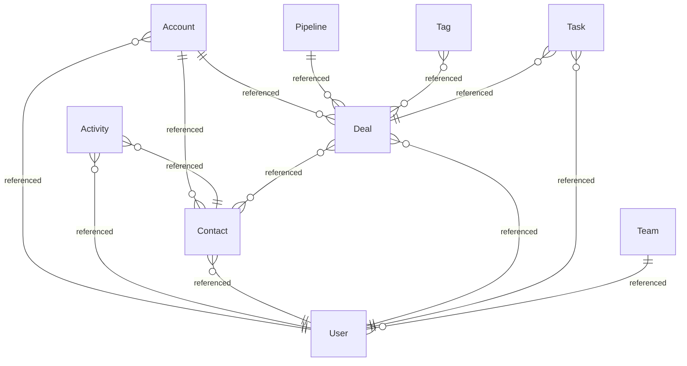

{/* Generated by `modelith render`. Do not edit by hand; edit the .modelith.yaml source and re-render. */}

# Go CRM

A single-binary customer relationship manager operated from a native command-line interface, storing all data in an embedded LadybugDB property graph, with a small role- and ownership-based access model that governs both row-level visibility and CRUD.

## Glossary

- **`Admin`** - A `User` role with unrestricted CRUD and visibility across all records.
- **`Manager`** - A `User` role that can read and write records owned by any member of the manager's `Team`, and reassign ownership within that team.
- **`Owner`** - The `User` to whom a record belongs; ownership is the unit of row-level visibility.
- **`ReadOnly`** - A `User` role that may read records within its `VisibilityScope` but may not create, update, or delete.
- **`Rep`** - A `User` role that can create records, write records it owns, and read records within its `Team`.
- **`Session`** - A local expiring credential written to disk after a successful login that identifies the acting `User` for later commands until logout or expiry.
- **`VisibilityScope`** - The set of records a `User` may read, determined by role and ownership: own records for a `Rep`, team records for a `Manager`, all records for an `Admin`.

## Enums

### `ActivityType`

| Value | Definition |
| --- | --- |
| `Call` | A phone call. |
| `Meeting` | An in-person or virtual meeting. |
| `Email` | An email exchange. |
| `Note` | A freeform note. |

### `DealStage`

| Value | Definition |
| --- | --- |
| `Lead` | Unqualified opportunity. |
| `Qualified` | Confirmed fit and budget. |
| `Proposal` | A proposal has been sent. |
| `Negotiation` | Terms under negotiation. |
| `Won` | Closed successfully; terminal. |
| `Lost` | Closed unsuccessfully; terminal. |

### `TaskStatus`

| Value | Definition |
| --- | --- |
| `Open` | Created, not started. |
| `InProgress` | Being worked. |
| `Done` | Completed; terminal. |
| `Cancelled` | Abandoned; terminal. |

### `UserRole`

| Value | Definition |
| --- | --- |
| `Admin` | Unrestricted access. |
| `Manager` | Team-wide read and write and reassignment. |
| `Rep` | Own and team records. |
| `ReadOnly` | Read within scope only. |

### `UserStatus`

| Value | Definition |
| --- | --- |
| `Active` | May authenticate and act. |
| `Disabled` | May not authenticate; retained for audit. |

## Entities

### `Account`

An organization that is a customer or prospect. An `Account` groups the `Contact` people who work there and the `Deal` opportunities pursued with it.

**Relationships**

- `Contact` - 1:n - referenced
- `Deal` - 1:n - referenced
- `User` - n:1 - referenced

**Attributes**

| Name | Type | Description |
| --- | --- | --- |
| `name` | string |  |
| `domain` | string |  |
| `industry` | string |  |

**Actions**

- `create` - actor `User`; preserves account-owned
- `update` - actor `Owner`
- `reassign` - actor `Manager`
- `delete` - actor `Owner`

**Invariants**

- **account-owned** - Every `Account` has exactly one owning `User`.

### `Activity`

An immutable record of an interaction (a call, meeting, email, or note) about a `Contact` or `Deal`. An `Activity` is an append-only log entry, not a stateful object.

**Relationships**

- `User` - n:1 - referenced
- `Contact` - n:1 - referenced

**Attributes**

| Name | Type | Description |
| --- | --- | --- |
| `type` | ActivityType |  |
| `subject` | string |  |
| `body` | string |  |
| `occurredAt` | timestamp |  |

**Actions**

- `log` - actor `User`; preserves activity-immutable, activity-owned
- `delete` - actor `Manager` - Remove an `Activity`, for correction only.

**Invariants**

- **activity-immutable** - An `Activity` body and occurredAt never change after creation.
- **activity-owned** - Every `Activity` records the `User` who logged it.

### `Contact`

A person associated with an `Account`. A `Contact` is the human counterpart the CRM `User` communicates with, and is the subject of `Activity` records.

**Relationships**

- `User` - n:1 - referenced

**Attributes**

| Name | Type | Description |
| --- | --- | --- |
| `fullName` | string |  |
| `email` | string |  |
| `phone` | string |  |
| `title` | string |  |

**Actions**

- `create` - actor `User`; preserves contact-owned
- `update` - actor `Owner`
- `reassign` - actor `Manager`
- `delete` - actor `Owner`

**Invariants**

- **contact-owned** - Every `Contact` has exactly one owning `User`.

### `Deal`

A sales opportunity with an `Account`, progressing through the stages of a `Pipeline`. A `Deal` moves forward through its stages and ends as Won or Lost.

**Relationships**

- `User` - n:1 - referenced
- `Contact` - n:n - referenced

**Attributes**

| Name | Type | Description |
| --- | --- | --- |
| `title` | string |  |
| `amountCents` | integer |  |
| `stage` | DealStage |  |
| `closeDate` | timestamp |  |

**Actions**

- `create` - actor `User`; preserves deal-owned, deal-amount-nonneg
- `advanceStage` - actor `Owner`; preserves deal-stage-forward
- `win` - actor `Owner`; preserves deal-terminal, deal-won-has-closedate
- `lose` - actor `Owner`; preserves deal-terminal
- `reopen` - actor `Manager`; preserves deal-stage-forward
- `reassign` - actor `Manager`

**Invariants**

- **deal-owned** - Every `Deal` has exactly one owning `User`.
- **deal-amount-nonneg** - A `Deal` amount is zero or positive.
- **deal-stage-forward** - A `Deal` moves only to a later stage or to Won or Lost; it never moves backward except by an explicit reopen.
- **deal-terminal** - A `Deal` in Won or Lost is terminal and changes only by reopen.
- **deal-won-has-closedate** - A `Deal` in Won has a closeDate.

### `Pipeline`

A named grouping of `Deal` records that share a go-to-market motion, for example Enterprise or SMB. Every pipeline uses the same canonical stage set; a `Pipeline` is a namespace, not a redefinition of the stages.

**Relationships**

- `Deal` - 1:n - referenced

**Attributes**

| Name | Type | Description |
| --- | --- | --- |
| `name` | string |  |
| `isDefault` | boolean |  |

**Actions**

- `create` - actor `Admin`
- `setDefault` - actor `Admin`; preserves one-default-pipeline

**Invariants**

- **one-default-pipeline** - Exactly one `Pipeline` is marked default.

### `Tag`

A freeform label applied to `Contact`, `Account`, or `Deal` records for grouping and filtering. A `Tag` has no lifecycle of its own.

**Relationships**

- `Deal` - n:n - referenced

**Attributes**

| Name | Type | Description |
| --- | --- | --- |
| `name` | string |  |
| `color` | string |  |

**Actions**

- `create` - actor `User`
- `apply` - actor `User` - Attach a `Tag` to a record.
- `remove` - actor `User`

**Invariants**

- **tag-name-unique** - No two `Tag` records share a name.

### `Task`

A unit of follow-up work with a due date, owned by a `User` and optionally linked to a `Deal`. A `Task` moves from Open through to a terminal Done or Cancelled.

**Relationships**

- `User` - n:1 - referenced
- `Deal` - n:1 - referenced

**Attributes**

| Name | Type | Description |
| --- | --- | --- |
| `title` | string |  |
| `dueDate` | timestamp |  |
| `status` | TaskStatus |  |

**Actions**

- `create` - actor `User`; preserves task-owned
- `start` - actor `Owner`
- `complete` - actor `Owner`; preserves task-terminal
- `cancel` - actor `Owner`; preserves task-terminal
- `reassign` - actor `Manager`; preserves task-assignee-visible

**Invariants**

- **task-owned** - Every `Task` has exactly one owning `User`.
- **task-terminal** - A `Task` in Done or Cancelled is terminal.
- **task-assignee-visible** - A `Task` may be reassigned only to a `User` the assigner can see: an `Admin` to any `User`, a `Manager` to a member of the manager's `Team` (`VisibilityScope` is a set of records, so eligibility is by team membership, not by scope membership).

### `Team`

A named group of `User` records used to scope row-level visibility. A `Manager` reads and writes the records of every `User` in the manager's team.

**Relationships**

- `User` - 1:n - referenced

**Attributes**

| Name | Type | Description |
| --- | --- | --- |
| `name` | string |  |

**Actions**

- `create` - actor `Admin`
- `rename` - actor `Admin`

**Invariants**

- **team-name-unique** - No two `Team` records share a name.

### `User`

A person who authenticates to the CRM and performs actions. A `User` holds a single role and belongs to at most one `Team`. Every record in the system is owned by exactly one `User`.

**Attributes**

| Name | Type | Description |
| --- | --- | --- |
| `username` | string |  |
| `passwordHash` | string |  |
| `role` | UserRole |  |
| `status` | UserStatus |  |
| `createdAt` | timestamp |  |

**Actions**

- `register` - actor `Admin`; preserves username-unique, password-hashed - Create a new `User` with a role and an initial password.
- `login` - actor `User`; preserves disabled-cannot-auth - Authenticate and open a `Session`.
- `logout` - actor `User` - Close the current `Session`.
- `changePassword` - actor `User`; preserves password-hashed - Replace the stored password hash.
- `disable` - actor `Admin` - Mark a `User` Disabled.
- `enable` - actor `Admin` - Return a Disabled `User` to Active.
- `assignRole` - actor `Admin` - Change a `User` role.

**Invariants**

- **username-unique** - No two `User` records share a username.
- **password-hashed** - A `User` password is persisted only as a hash, never in plaintext.
- **disabled-cannot-auth** - A `User` whose status is Disabled cannot establish a `Session`.
- **single-team** - A `User` belongs to at most one `Team`.
- **manager-has-team** - A `User` with role Manager belongs to exactly one `Team`; team scope is a Manager's entire write authority, so a teamless Manager could not write even its own records.

## Relationships

## Invariants

- **rbac-crud-verbs** - A `User` may perform a verb only if the role grants it: `Admin`, `Manager`, and `Rep` may create, read, update, and delete; `ReadOnly` may only read.
- **rbac-read-visibility** - A `User` may read only records within its `VisibilityScope`: an `Admin` reads all records, and every other `User` reads records it owns or that are owned by a member of its `Team`.
- **rbac-write-scope** - A `User` may update or delete a record only within scope: an `Admin` any record, a `Manager` any record owned by a member of the manager's `Team`, a `Rep` only records it owns; a `ReadOnly` `User` may write nothing.
- **rbac-reassign-authority** - Only an `Admin`, or a `Manager` acting within the manager's `Team`, may change the `Owner` of a record; an `Admin` may reassign to any `User`, and a `Manager` only to a member of the manager's `Team`, so a reassignment never moves a record outside the actor's own authority.
- **session-active-user** - A `Session` is valid only while its `User` status is Active.

## Scenarios

### Rep creates and wins a deal

**Steps**

1. A `Rep` logs in, opening a `Session`.
2. The `Rep` creates an `Account`, a `Contact` at that account, and a `Deal` for the account.
3. The `Rep` advances the `Deal` from Lead through Qualified, Proposal, and Negotiation.
4. The `Rep` marks the `Deal` Won, supplying a closeDate.

**Invariants touched**

- **rbac-crud-verbs** - A `User` may perform a verb only if the role grants it: `Admin`, `Manager`, and `Rep` may create, read, update, and delete; `ReadOnly` may only read.
- **rbac-write-scope** - A `User` may update or delete a record only within scope: an `Admin` any record, a `Manager` any record owned by a member of the manager's `Team`, a `Rep` only records it owns; a `ReadOnly` `User` may write nothing.
- **deal-stage-forward** - A `Deal` moves only to a later stage or to Won or Lost; it never moves backward except by an explicit reopen.
- **deal-won-has-closedate** - A `Deal` in Won has a closeDate.
- **deal-owned** - Every `Deal` has exactly one owning `User`.

### Rep cannot see another team's deal

**Steps**

1. A `Rep` on one `Team` requests a `Deal` owned by a `Rep` on another team.
2. The read is denied because the `Deal` is outside the requesting rep's `VisibilityScope`.

**Invariants touched**

- **rbac-read-visibility** - A `User` may read only records within its `VisibilityScope`: an `Admin` reads all records, and every other `User` reads records it owns or that are owned by a member of its `Team`.

### ReadOnly user is refused a write

**Steps**

1. A `ReadOnly` `User` attempts to update a `Contact` within its `VisibilityScope`.
2. The update is refused because the role grants no write verb.

**Invariants touched**

- **rbac-crud-verbs** - A `User` may perform a verb only if the role grants it: `Admin`, `Manager`, and `Rep` may create, read, update, and delete; `ReadOnly` may only read.
- **rbac-write-scope** - A `User` may update or delete a record only within scope: an `Admin` any record, a `Manager` any record owned by a member of the manager's `Team`, a `Rep` only records it owns; a `ReadOnly` `User` may write nothing.

### Manager reassigns within the team

**Steps**

1. A `Manager` reassigns a `Deal` from one team member to another.
2. The reassignment succeeds because both are in the manager's `Team`.

**Invariants touched**

- **rbac-reassign-authority** - Only an `Admin`, or a `Manager` acting within the manager's `Team`, may change the `Owner` of a record; an `Admin` may reassign to any `User`, and a `Manager` only to a member of the manager's `Team`, so a reassignment never moves a record outside the actor's own authority.
- **rbac-write-scope** - A `User` may update or delete a record only within scope: an `Admin` any record, a `Manager` any record owned by a member of the manager's `Team`, a `Rep` only records it owns; a `ReadOnly` `User` may write nothing.

### Disabled user cannot log in

**Steps**

1. An `Admin` disables a `User`.
2. The disabled `User` attempts to log in and is refused before any `Session` is created.

**Invariants touched**

- **disabled-cannot-auth** - A `User` whose status is Disabled cannot establish a `Session`.
- **session-active-user** - A `Session` is valid only while its `User` status is Active.

### A won deal is reopened

**Steps**

1. A `Deal` in Won is reopened by a `Manager` back to Negotiation.
2. Only reopen may move a terminal `Deal`.

**Invariants touched**

- **deal-terminal** - A `Deal` in Won or Lost is terminal and changes only by reopen.
- **deal-stage-forward** - A `Deal` moves only to a later stage or to Won or Lost; it never moves backward except by an explicit reopen.

### Task runs to completion

**Steps**

1. A `Rep` creates a `Task` linked to a `Deal`, starts it, then completes it.
2. The completed `Task` is terminal.

**Invariants touched**

- **task-owned** - Every `Task` has exactly one owning `User`.
- **task-terminal** - A `Task` in Done or Cancelled is terminal.

### Logging activities and tagging a deal

**Steps**

1. A `Rep` logs a call `Activity` about a `Contact`, then a meeting `Activity` about the `Deal`.
2. The `Rep` applies a `Tag` to the `Deal`, which runs in the default `Pipeline`.
3. The `Activity` records cannot be edited once written.

**Invariants touched**

- **activity-immutable** - An `Activity` body and occurredAt never change after creation.
- **activity-owned** - Every `Activity` records the `User` who logged it.
- **one-default-pipeline** - Exactly one `Pipeline` is marked default.
- **tag-name-unique** - No two `Tag` records share a name.

