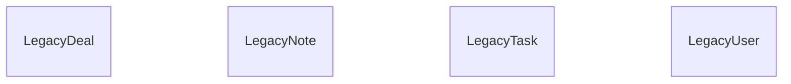

{/* Generated by `modelith render`. Do not edit by hand; edit the .modelith.yaml source and re-render. */}

# Go CRM prototype

The working prototype that proves the CRM workflow but is not suitable as the production foundation. Its embedded schema and behavior are inputs to the rebuild, not constraints on the target architecture.

## Enums

### `LegacyActivityType`

| Value | Definition |
| --- | --- |
| `Call` | A phone call. |
| `Meeting` | A meeting. |
| `Email` | An email. |
| `Note` | A freeform note. |

### `LegacyDealStage`

| Value | Definition |
| --- | --- |
| `New` | A newly captured opportunity. |
| `Working` | An opportunity being qualified. |
| `ClosedWon` | A successfully closed opportunity. |
| `ClosedLost` | An unsuccessfully closed opportunity. |

### `LegacyTaskStatus`

| Value | Definition |
| --- | --- |
| `Todo` | Work has not started. |
| `Doing` | Work is in progress. |
| `Done` | Work is complete. |

### `LegacyUserRole`

| Value | Definition |
| --- | --- |
| `Admin` | May manage every prototype record. |
| `Sales` | May manage assigned sales records. |

### `LegacyUserStatus`

| Value | Definition |
| --- | --- |
| `Enabled` | May sign in to the prototype. |
| `Blocked` | May not sign in to the prototype. |

## Entities

### `LegacyDeal`

A minimally tracked sales opportunity.

**Attributes**

| Name | Type | Description |
| --- | --- | --- |
| `title` | string |  |
| `amount` | integer |  |
| `stage` | LegacyDealStage |  |

**Invariants**

- **legacy-deal-amount-nonnegative** - A prototype deal amount is never negative.

### `LegacyNote`

A prototype interaction or note attached to a customer.

**Attributes**

| Name | Type | Description |
| --- | --- | --- |
| `kind` | LegacyActivityType |  |
| `title` | string |  |
| `body` | string |  |
| `createdAt` | timestamp |  |

**Invariants**

- **legacy-note-body-preserved** - The prototype preserves a note body after creation.

### `LegacyTask`

A prototype follow-up item.

**Attributes**

| Name | Type | Description |
| --- | --- | --- |
| `title` | string |  |
| `due` | timestamp |  |
| `status` | LegacyTaskStatus |  |

**Invariants**

- **legacy-task-due-present** - Every prototype task has a due timestamp.

### `LegacyUser`

A prototype operator with coarse-grained access.

**Attributes**

| Name | Type | Description |
| --- | --- | --- |
| `username` | string |  |
| `password` | string |  |
| `role` | LegacyUserRole |  |
| `status` | LegacyUserStatus |  |

**Invariants**

- **legacy-username-unique** - No two prototype users share a username.

## Relationships

## Scenarios

### Prototype sales workflow

**Steps**

1. A `LegacyUser` signs in and creates a `LegacyDeal`.
2. The user records a `LegacyTask` and a `LegacyNote` while working the deal.
3. The deal closes and the related task is completed.

**Invariants touched**

- **legacy-username-unique** - No two prototype users share a username.
- **legacy-deal-amount-nonnegative** - A prototype deal amount is never negative.
- **legacy-task-due-present** - Every prototype task has a due timestamp.
- **legacy-note-body-preserved** - The prototype preserves a note body after creation.
