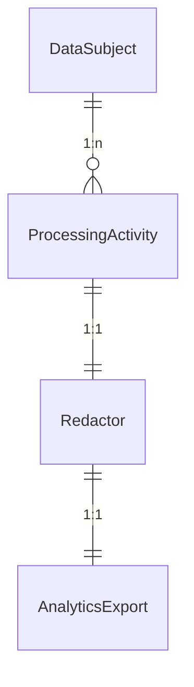

{/* Generated by `modelith render`. Do not edit by hand; edit the .modelith.yaml source and re-render. */}

# PII Flow

A minimal data-processing pipeline used as the reference example for a bring-your-own Datalog external checker. A `DataSubject` supplies personal data that a `ProcessingActivity` handles for a stated purpose; the result is redacted before it reaches an `AnalyticsExport` sink, so no sensitive attribute ever leaves the system unredacted. The example exists to demonstrate the sensitive-data-flow checker, not to model a full privacy program: consent and collection-minimality remain outside what a static flow graph can decide, and are carried as declared residuals on the checker's coverage claim.

## Glossary

- **`AnalyticsExport`** - The sink where processed data leaves the system, for example to a reporting or analytics destination.
- **`Controller`** - The operator of the processing system, responsible for registering subjects and honoring erasure.
- **`DataSubject`** - The natural person whose personal data is collected and processed.
- **`ProcessingActivity`** - A defined operation performed on a `DataSubject` record for a stated purpose.
- **`Redactor`** - A processing step that strips or masks sensitive attributes before data moves further downstream.

## Enums

### `SubjectStatus`

| Value | Definition |
| --- | --- |
| `Active` | The subject's data is live and may be processed. |
| `Erased` | The subject's data has been erased and may not be processed further. |

## Entities

### `AnalyticsExport`

The sink where processed data leaves the system, for example to a reporting or analytics destination outside the processing boundary.

**Attributes**

| Name | Type | Description |
| --- | --- | --- |
| `destination` | string |  |

**Invariants**

- **priv-export-idempotent** - A stable export id has at most one effect at the analytics destination.

### `DataSubject`

A natural person about whom personal data is held. A `DataSubject` originates one or more `ProcessingActivity` records; its status governs whether further processing is permitted.

**Relationships**

- `ProcessingActivity` - 1:n

**Attributes**

| Name | Type | Description |
| --- | --- | --- |
| `email` | string |  |
| `nationalId` | string |  |
| `status` | SubjectStatus |  |

**Actions**

- `register` - actor `Controller` - Record a new subject whose data may be processed. Postcondition: status Active.
- `erase` - actor `Controller`; preserves subject-erased-terminal - Honor an erasure request: destroy the subject's data and record the erasure evidence. Precondition: status Active. Postcondition: status Erased.

**Invariants**

- **priv-consent-required** - Personal data is processed only with recorded consent.
- **priv-minimal-collection** - Only attributes necessary for the stated purpose are collected.
- **subject-erased-terminal** - A `DataSubject` in Erased accepts no further lifecycle actions and is never processed again; erasure is terminal.

### `ProcessingActivity`

A defined operation carried out on a `DataSubject` record for a stated purpose, for example onboarding or billing. Every `ProcessingActivity` routes its output through exactly one `Redactor` before the data can move further downstream.

**Relationships**

- `Redactor` - 1:1

**Attributes**

| Name | Type | Description |
| --- | --- | --- |
| `purpose` | string |  |

**Invariants**

- **priv-purpose-present** - Every `ProcessingActivity` has a non-empty stated purpose before subject data is read.

### `Redactor`

A processing step that strips or masks sensitive attributes (email, national identifiers) before data reaches an export sink. Taint analysis treats a `Redactor` as a boundary: what flows out of it is no longer sensitive for the purposes of the flow checker.

**Relationships**

- `AnalyticsExport` - 1:1

**Attributes**

| Name | Type | Description |
| --- | --- | --- |
| `method` | string |  |

**Invariants**

- **priv-redaction-effective** - A `Redactor` output contains neither email nor national identifier data.

## Relationships

## Invariants

- **priv-no-unredacted-export** - No sensitive attribute reaches an export sink without passing through redaction.

## Scenarios

### Erasure is honored and exports stay redacted

The pipeline end to end: registration, processing through redaction, export, then terminal erasure.

**Actors:** Controller

**Steps**

1. A `Controller` registers a `DataSubject`; its status is Active.
2. A `ProcessingActivity` handles the subject's record for its stated purpose and routes the output through its `Redactor`.
3. The redacted output reaches the `AnalyticsExport` sink; no sensitive attribute leaves unredacted.
4. The `Controller` erases the subject; its status becomes Erased, the erasure evidence is recorded, and no further processing occurs.

**Invariants touched**

- **priv-no-unredacted-export** - No sensitive attribute reaches an export sink without passing through redaction.
- **subject-erased-terminal** - A `DataSubject` in Erased accepts no further lifecycle actions and is never processed again; erasure is terminal.
