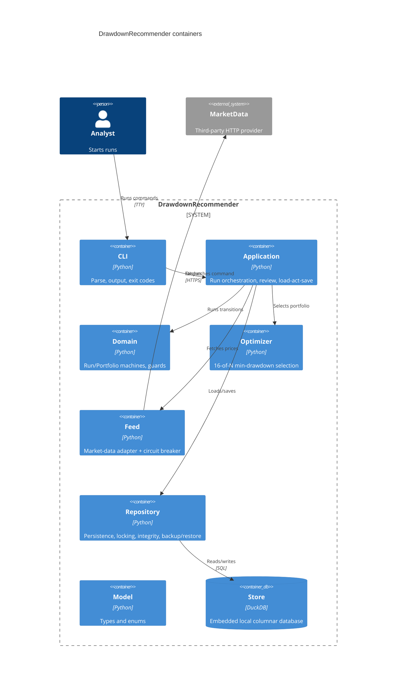

# Drawdown Portfolio Recommender Architecture

Phase 2 of the machinery design. Source of truth for the model is `workspace.dsl`; this document
carries the narrative, the machine-checkable Architecture Contract, the interface contracts, the
dependency mitigation postures, the persistence-and-placement decisions, and the NFR record.

## 1. System context

A single local command-line tool, written in Python, used by a small quant desk. An `Analyst`
configures indices and starts recommendation runs; a `Manager` reviews the resulting portfolios.
There is no server. Two dependencies are external to the tool: a third-party market-data provider
reached over HTTP (`mkt`), and an embedded local columnar database file (`store`, DuckDB).

## 2. Containers

One process, seven code containers plus the embedded store and the external provider:

- **CLI** (`cli`): parse the command line, render output, map outcomes to exit codes.
- **Application** (`app`): orchestrate a run (collect through the feed, optimize, persist) and the
  review commands; run the load-act-save loop.
- **Domain** (`domain`): the RecommendationRun and Portfolio state machines as pure transition
  functions, the guards, and the invariant predicates. No I/O.
- **Optimizer** (`optimizer`): a pure transform that selects the 16-of-N portfolio minimizing
  historical maximum drawdown. It has a contract spec rather than an entity lifecycle machine.
- **Feed** (`feed`): the market-data adapter. Holds the circuit breaker that protects the tool from
  a failing provider. The only importer of the provider client.
- **Repository** (`repo`): the only importer of the store client. All persistence, optimistic
  version checks, the integrity check, backup and restore.
- **Model** (`model`): entity types and enums (the schema in the domain model). The one canonical
  data schema; no other layer restates it.
- **Store** (`store`, DuckDB): the embedded local columnar database, the state of record.


```mermaid
C4Container
  title DrawdownRecommender containers
  Person(analyst, "Analyst", "Starts runs")
  System_Boundary(pf, "DrawdownRecommender") {
    Container(cli, "CLI", "Python", "Parse, output, exit codes")
    Container(app, "Application", "Python", "Run orchestration, review, load-act-save")
    Container(domain, "Domain", "Python", "Run/Portfolio machines, guards")
    Container(optimizer, "Optimizer", "Python", "16-of-N min-drawdown selection")
    Container(feed, "Feed", "Python", "Market-data adapter + circuit breaker")
    Container(repo, "Repository", "Python", "Persistence, locking, integrity, backup/restore")
    Container(model, "Model", "Python", "Types and enums")
    ContainerDb(store, "Store", "DuckDB", "Embedded local columnar database")
  }
  System_Ext(mkt, "MarketData", "Third-party HTTP provider")
  Rel(analyst, cli, "Runs commands", "TTY")
  Rel(cli, app, "Dispatches command")
  Rel(app, domain, "Runs transitions")
  Rel(app, optimizer, "Selects portfolio")
  Rel(app, feed, "Fetches prices")
  Rel(app, repo, "Loads/saves")
  Rel(feed, mkt, "Fetches", "HTTPS")
  Rel(repo, store, "Reads/writes", "SQL")
```

## 3. Technology stack and why

- **Python**: the natural language for a numerical/optimization tool; rich price-series and
  optimization libraries; easy local CLI.
- **DuckDB embedded** (`duckdb`): a local columnar file, well suited to storing price series and
  candidate sets; no server. Accessed only through `repo`.
- **HTTP market-data provider** (`mkt`): the source of constituents and prices; the one networked
  dependency, wrapped by `feed` behind a circuit breaker.
- No web framework and no state-machine library: the machines are small transition functions.

## 4. Deployment topology

One Python process on one analyst's machine, opening one local DuckDB file and calling one HTTP
provider. No replicas, no orchestration. A `recommend` command runs a whole run to completion in one
process; review commands (`accept`, `reject`, `reopen`) are separate invocations against the same
file. Backups are file copies via `backup`; `restore` replaces the file. The tool is offline-capable
once prices are cached: a run only needs the provider while Collecting.

## 5. Architecture Contract

Machine-checkable twin of the narrative; `machinery check design --gate g2` verifies it against
`workspace.dsl`. `feed` is the sole importer of the provider client and `repo` the sole importer of
the store client: the blanket denies with a single explicit allow each enforce that.

```yaml
contract_version: 2
boundaries:
  - id: pf.cli
    kind: container
    element: cli
    code: [ "pf/cli/**" ]
    exposes: [ "pf/cli/__init__.py" ]
  - id: pf.app
    kind: container
    element: app
    code: [ "pf/app/**" ]
    exposes: [ "pf/app/__init__.py" ]
  - id: pf.domain
    kind: container
    element: domain
    code: [ "pf/domain/**" ]
    exposes: [ "pf/domain/__init__.py" ]
  - id: pf.optimizer
    kind: container
    element: optimizer
    code: [ "pf/optimizer/**" ]
    exposes: [ "pf/optimizer/__init__.py" ]
  - id: pf.feed
    kind: container
    element: feed
    code: [ "pf/feed/**" ]
    exposes: [ "pf/feed/__init__.py" ]
  - id: pf.repo
    kind: container
    element: repo
    code: [ "pf/repo/**" ]
    exposes: [ "pf/repo/__init__.py" ]
  - id: pf.model
    kind: container
    element: model
    code: [ "pf/model/**" ]
externals:
  - id: external.marketdata
    element: mkt
    imports: [ "httpx", "marketdata_client" ]
  - id: external.duckdb
    element: store
    imports: [ "duckdb" ]
ignore:
  - "pf/testsupport/**"
dependency_rules:
  allow:
    - pf.cli       -> pf.app
    - pf.cli       -> pf.model
    - pf.app       -> pf.domain
    - pf.app       -> pf.optimizer
    - pf.app       -> pf.feed
    - pf.app       -> pf.repo
    - pf.app       -> pf.model
    - pf.domain    -> pf.model
    - pf.optimizer -> pf.model
    - pf.feed      -> pf.model
    - pf.feed      -> external.marketdata
    - pf.repo      -> pf.model
    - pf.repo      -> external.duckdb
  deny:
    - "pf.* -> external.marketdata"
    - "pf.* -> external.duckdb"
  notes:
    - "feed is the sole importer of the market-data client; repo is the sole importer of DuckDB."
    - "The domain and optimizer are pure: they depend only on the model, never on feed, repo, or a store."
    - "The CLI goes through the app; it never touches domain, feed, repo, or the externals directly."
```

## 6. Action ownership

The domain action set is closed. Each action has exactly one component accountable for its
validation and outcome; collaborators remain interface-contract dependencies of that owner.

| action | owning component |
|---|---|
| `Index.refresh` | `pf.app` |
| `Security.upsert` | `pf.repo` |
| `CandidateSet.build` | `pf.app` |
| `RecommendationRun.start` | `pf.app` |
| `RecommendationRun.abort` | `pf.app` |
| `Portfolio.advance` | `pf.domain` |
| `Portfolio.accept` | `pf.domain` |
| `Portfolio.reject` | `pf.domain` |
| `Portfolio.reopen` | `pf.domain` |
| `Holding.set` | `pf.optimizer` |

## 7. Interface contracts at each boundary

For each boundary crossing: request/response shape, enumerated errors (these become `onError`
branches in Phase 3), and idempotency. One row per allowed edge; the sections below elaborate.

| edge | shape | errors | idempotency |
|---|---|---|---|
| `pf.cli -> pf.app` | `Command{ verb, args, actorRole } -> Result{ stdout, exitCode, err }` | `AuthzError`, `NotFoundError`, `ConflictError`, `FeedError`, `InfeasibleError`, `CorruptError`, `ValidationError`, `InternalError` | `recommend` is not idempotent (each run is a new record); review commands are idempotent under the portfolio `version` |
| `pf.app -> pf.domain` | `RunTransition(state, trigger, ctx) -> (next, actions, err)`, `PortfolioTransition(state, event, ctx) -> (next, actions, RejectedError)`; guards are pure `(ctx, event) -> bool` | `RejectedError` when no guarded transition applies | pure functions: safe to repeat |
| `pf.app -> pf.optimizer` | `optimize(candidates, prices, k=16, lookbackDays, limits: OptimizerLimits) -> Portfolio{ holdings, maxDrawdown } \| InfeasibleError{reason}` | `InfeasibleError` (closed reason `INVALID_INPUT \| INCOMPLETE_HISTORY \| INSUFFICIENT_CANDIDATES \| LIMIT_EXCEEDED \| INVALID_OUTPUT`) for any invalid whole input: fewer than 16 candidates, any invalid/misaligned history, or any violated `OptimizerLimits` bound | pure and deterministic for a given (candidates, prices, k, lookbackDays, limits) |
| `pf.app -> pf.feed` | `fetchPrices(tickers, lookbackDays, limits: OptimizerLimits) -> PriceMatrix`, `fetchConstituents(index, limits: ReferenceLimits) -> [rankedConstituent]` | `FeedError` (provider 5xx, timeout, rate-limit, `RESPONSE_LIMIT_EXCEEDED`, `INVALID_RESPONSE`), `CircuitOpenError` (breaker open, fast-fail) | reads are idempotent; safe to retry within the run's bounded retry count |
| `pf.app -> pf.repo` | `LoadCandidateSet(id, limits) -> CandidateSnapshot{identities, version} \| NotFoundError \| CorruptError \| IOError \| BusyError \| ValidationError`, `Load<T>(id) -> (T, version, err)`, and the RepoSession publication API of section 7a (`Save/ApplyReference/CommitRecommendation/Backup/Restore` with `OperationHandle` + independent `OperationId`) | `NotFoundError`, `ConflictError` (version moved), `BusyError` (transient lock/busy, distinct from conflict), `CorruptError`, `IOError`, `ValidationError`; `TerminalError` for later lifecycle events on Ready/Failed runs | `Save` is idempotent under `(id, expectedVersion)`: a repeat with a stale version refuses rather than double-writing; repository admission failures create no run, make no feed call and consume no feed retry |
| `pf.feed -> external.marketdata` | HTTPS calls to the provider, behind the circuit breaker that owns the failure classification | provider 5xx, timeout, and 429 mapped here onto `FeedError`; no provider type escapes `pf.feed` | reads only; retried under the breaker, which fast-fails with `CircuitOpenError` once open |
| `pf.repo -> external.duckdb` | SQL through the DuckDB client, wrapped so no store type escapes `pf.repo` | store errors mapped here onto `ConflictError`, `CorruptError`, `IOError` | writes carry the optimistic `version` predicate, so a retried write is a no-op once the version moved |
| `pf.cli -> pf.model`, `pf.app -> pf.model`, `pf.domain -> pf.model`, `pf.optimizer -> pf.model`, `pf.feed -> pf.model`, `pf.repo -> pf.model` | type-only: the canonical entity types and enums; no functions with side effects | none; the module performs no operation that can fail | n/a: no calls cross this edge, only type references |

### cli -> app

- **shape**: `Command{ verb, args, actorRole } -> Result{ stdout, exitCode, err }`.
- **errors**: `AuthzError`, `NotFoundError`, `ConflictError`, `FeedError`, `InfeasibleError`,
  `CorruptError`, `ValidationError`, `InternalError`.
- **idempotency**: `recommend` is not idempotent (each run is a new record); review commands are
  idempotent under the portfolio `version`.

### app -> domain (pure, no I/O)

- **shape**: `RunTransition(state, trigger, ctx) -> (next, actions, err)` and
  `PortfolioTransition(state, event, ctx) -> (next, actions, RejectedError)`; guards are pure
  `(ctx, event) -> bool`.
- **errors**: `RejectedError` when no guarded transition applies.
- **idempotency**: pure functions.

### app -> optimizer (pure transform)

- **shape**: `optimize(candidates: [Security], prices: PriceMatrix, k=16, lookbackDays) ->
  Portfolio{ holdings: [Holding], maxDrawdown } | InfeasibleError`.
- **errors**: `InfeasibleError` when fewer than 16 candidates have full price history.
- **idempotency**: pure and deterministic for a given (candidates, prices, k, lookback).

### app -> feed

- **shape**: `fetchPrices(tickers, lookbackDays) -> PriceMatrix | FeedError`;
  `fetchConstituents(index) -> [rankedTicker] | FeedError`.
- **errors**: `FeedError` (provider 5xx, timeout, rate-limit), `CircuitOpenError` (breaker open,
  fast-fail). The breaker classifies these; the run treats both as retriable then fatal.
- **idempotency**: reads are idempotent; safe to retry.

### app -> repo

- **shape**: `Load<T>(id) -> (T, version, err)`; `Save<T>(value, expectedVersion) -> err`
  (writes only if the stored version is unchanged, then bumps it); `Open() -> err` (opens and runs
  the integrity check); `Backup(path)`, `Restore(path)`.
- **errors**: `NotFoundError`, `ConflictError` (version moved), `CorruptError`, `IOError`.
- **idempotency**: `Save` idempotent under `(id, expectedVersion)`.

### feed -> mkt / repo -> store (externals)

- **feed -> mkt**: HTTP; maps provider 5xx / timeout / 429 onto `FeedError`; the breaker opens after
  a failure threshold and fast-fails with `CircuitOpenError` until a cooldown elapses.
- **repo -> store**: SQL via the DuckDB client, wrapped so no store type escapes `repo`; maps store
  errors onto `ConflictError`, `CorruptError`, `IOError`.

### repo publication API (write admission arbitration)

`pf.repo` owns WRITE admission arbitration and outcome records; `pf.app` owns the command and
passes handles through its existing app->repo port. `repo` never calls or imports `pf.app`;
`pf.model` holds only the type declarations (no operational helper).

- `OperationId{commandId, attempt, kind in Save|Reference|Recommendation|Backup|Restore}`:
  unique per actual write attempt; the repo rejects reuse within its session.
- `PublicationRequest`: closed union of the exact frozen operation arguments -
  `Save(value, expectedVersion)`, `Reference(changeSet, expectedVersions)`,
  `Recommendation(run, portfolio, holdings, expectedVersions)`, `Backup(path, limits)`,
  `Restore(path, expectedReceipt, limits)`; copied/frozen during `BeginOperation`.
- `OperationHandle`: opaque repo-session capability for exactly one OperationId and captured
  request; single-use; wrong session/command/kind/target/version/value or retired attempt
  cannot authorize a call.
- `OperationSnapshot in Preparing | DeniedAwaitingDrain | Admitted | Published(receipt) |
  Unpublished(error, timeoutWon) | Unresolved(reference)`; the first three are progress, the
  last three are terminal returned outcomes only when all workers that could publish for that
  handle have stopped.
- `RepoReply<R> = CallRejected(InternalError(OPERATION_BINDING_MISMATCH)) | Published(receipt)
  | Unpublished(typedError, timeoutWon) | Unresolved(ReconciliationRef)`.
- Public operations on one explicit `RepoSession`: `OpenRepository(path, clock)` (injected
  monotonic clock, nowMillis only), `BeginOperation(id, request, deadlineAtMillis)`,
  `Save/ApplyReference/CommitRecommendation/Backup/Restore(value..., operation, expectedId)`
  (both the handle AND the independently captured expectedId are compared, plus EXACT captured
  argument equality, before mutation authority), `Expire(operation)`, `Inspect(operation)`,
  `RequestDrain(operation)`, and read-only `Reconcile(reference)` (authoritative retained
  outcome for that exact session/operation only; matching current contents never proves this
  operation committed).
- Recommendation payload closure: Ready requires a portfolio and exactly 16 holdings; Failed
  requires null portfolio and empty holdings; both persist their identified run atomically;
  other payload combinations are ValidationError before publication.
- Deadline arbitration: the admission gate samples the injected clock and admits iff now<T
  strictly; at exactly T admission is denied. An admitted commit may finish after T and its
  authoritative Published/Unpublished/Unresolved result decides the outcome; a timeout winner
  before admission denies publication and must drain before a confirmed Unpublished; only
  Unpublished is eligible for rollback or retry.
- Drained Unresolved: at most one read-only Reconcile; if still unknown the CLI reports
  `IOError(PUBLICATION_OUTCOME_UNKNOWN)` (exit 12) with no rollback, no retry and no
  lifecycle-error transition. Unknown publication is an explicitly reported operational
  residual OUTSIDE the modeled machines - never a new PortfolioStatus/RunStatus.

### CLI exit-code map (closed, injective over public error classes)

success 0; AuthzError 2; NotFoundError 3; ConflictError 4; FeedError 5; InfeasibleError 6;
CorruptError 7; ValidationError 8; InternalError 9; BusyError 10; TerminalError 11; IOError 12;
CircuitOpenError 13. stderr carries the stable class and, where specified, reason plus a
bounded message; stdout is empty on failure. Different reasons within a class need not get
different process codes. This assignment is this example's illustrative convention.

### Bound vocabulary (closed)

- input/admission representation bounds: candidate/source/row counts and maxScalarBytes
  (including rank lexemes) before conversion;
- publication/result-admission deadlines: fetch 20000 ms per attempt, optimizer 60000 ms,
  reference 20000 ms, store write 5000 ms, caller-supplied BackupLimits.deadlineMs;
- retry bounds: at most 3 retries / 4 attempts with the fixed schedules (fetch delays
  1000/2000/4000 ms; review delays 200/400/800 ms; no jitter);
- cooldown: 30000 ms earliest allowed half-open probe threshold;
- return/drain/reconciliation/OS completion: NO fixed upper bound is claimed. Any statement
  of "bounded command", "never hangs", "terminates" or "5 s write timeout" names a category
  and a resolution assumption, never a total-time guarantee.

## 8. Dependency mitigation posture

Two external dependencies. A mitigation reclassifies a failure; it does not delete it.

| dependency | failure modes | deployment mitigation | residual behavior the FSM must handle | bound | operator signal |
|---|---|---|---|---|---|
| `mkt` (MarketData HTTP) | 5xx, timeout, rate-limit, provider outage | none deployable (third party); a circuit breaker in `feed` protects the caller | transient failures -> the breaker counts them and opens after a threshold (`failures+1 >= 5`), fast-failing with `CircuitOpenError`; after a cooldown it probes half-open; a Collecting run retries a bounded number of times then ends Failed. These are bounded counter/scheduling behaviors over driver-accepted provider outcomes; no total native return bound is claimed, and stale callbacks can neither reset nor trip the breaker | breaker threshold 5 failures (a 4-attempt run with one failure per attempt need not trip it), cooldown 30000 ms; run retries <= 3 (`MaxRetries`) | `feed_circuit_open` log line on trip; a run that ends Failed prints "market data unavailable, try later" with a non-zero exit |
| `store` (DuckDB) | locked/busy, slow, file corruption, disk I/O error | none deployable (embedded local file); `backup` produces file copies and `restore` replaces from one | on a review write: optimistic-version conflict -> bounded retry with backoff, then roll back the in-memory transition and refuse; on open: integrity failure -> abort loudly with restore instructions and make no writes | retries <= 3 (`MaxRetries`), backoff ~200 ms; write timeout 5 s | conflict-refused: non-zero exit + "another reviewer changed this portfolio, please retry"; corruption: distinct non-zero exit + "database corrupted, restore from backup with `pf restore <file>`" |

The two externals plus their bound `mkt` and `store` elements are the only Database/External-tagged
dependencies, so these two rows satisfy G2 mitigation coverage.

## 9. Persistence and placement

For every stateful component: how the Phase 3 machine is realized and how concurrent events are
serialized. Python has no cheap per-entity process, so persisted aggregates use the explicit
persisted-state-plus-optimistic-lock pattern where contention is possible.

| component | machine placement | persistence | concurrency serialization |
|---|---|---|---|
| `RecommendationRun` | none; the run loop lives in `pf.app`, transition function in `pf.domain` | a row carrying its `status` and result reference | single writer: the one process that started the run drives it to a terminal state; no cross-process contention, so no optimistic-lock overlay on the run itself. Durable Ready/Failed claims additionally require a confirmed atomic `CommitRecommendation` publication receipt; an unresolved publication is reported as an unknown-outcome residual, not a durable terminal state |
| `Portfolio` | none; load-act-save loop in `pf.app`, transition function in `pf.domain` | a row carrying its `status`, `acceptedAt`, and a `version` | optimistic lock: two managers may review at once, so `Save` asserts the stored `version`; on `ConflictError` the commit overlay retries with backoff up to `MaxRetries`, then rolls back and refuses |
| `MarketDataFeed` | in-memory circuit breaker in `pf.feed`, one per process | none (transient breaker counters) | single process; breaker state (closed/open/halfOpen) guards outbound calls; a bounded failure count trips it |
| `Optimizer` (no machine: pure deterministic transform, contract spec instead) | none | none | n/a |
| `CandidateSet` | (no machine: immutable entity with no lifecycle; ReferenceDataCommand is its command-level operational envelope in `pf.app`) | a set of rows with a `version` | optimistic lock on build |
| `Index` | (no machine: reference entity with no lifecycle; ReferenceDataCommand is its command-level operational envelope in `pf.app`) | a row with a `version` | optimistic lock on refresh |
| `Security` | (no machine: reference entity with no lifecycle; ReferenceDataCommand is its command-level operational envelope in `pf.app`) | a row with a `version` | upsert by ticker |
| `Holding` (no machine: owned rows written atomically with their `Portfolio`) | none | rows owned by a portfolio | written within the portfolio commit |

## 10. Event-contract table

N/A, with reason. One process per command; no message bus and no cross-component asynchronous
events. A `recommend` command runs the whole pipeline synchronously in-process (feed then optimizer
then persist); review commands are separate synchronous invocations against the same store file. No
machine consumes an external bus event, so there is no choreography or redelivery to govern. The two
externals are reached only through `pf.feed` and `pf.repo`, which the Architecture Contract enforces.

## 11. NFR record

- **Security posture**: a local single-user tool. Authorization is by role passed on the command
  (`Analyst`, `Manager`, `Admin`): only a Manager or Admin may accept, reject, or reopen a portfolio
  (invariants `portfolio-accept-role`, `portfolio-reopen-role`). The market-data API key comes from
  the environment and is never logged; the store file and any cached credentials are created
  owner-only (0600). No secret is logged.
- **Capacity assumptions**: a few dozen indices, top 30 each, deduped to a few hundred candidate
  securities; a few years of daily price bars per candidate; the optimizer selects 16 of N.
  Thousands of securities at most, not millions. Correctness over speed: a run may take seconds while
  Optimizing; the feed fetch has a 20000 ms per-attempt result-admission deadline and the
  store write a 5000 ms publication-admission deadline - admission budgets, not total
  return-time bounds; drain/reconciliation and OS completion have no claimed bound.
- **Observability**: a local CLI, so the operator is the user and the signal is the process exit code
  plus stderr. A run that ends Failed prints the cause (market data unavailable, or infeasible: fewer
  than 16 candidates with full history). The feed breaker logs `feed_circuit_open` when it trips. A
  conflict refusal on a review write and a corrupted-store detection each print a distinct loud
  message with a distinct non-zero exit. There is no metrics backend beyond the terminal.
