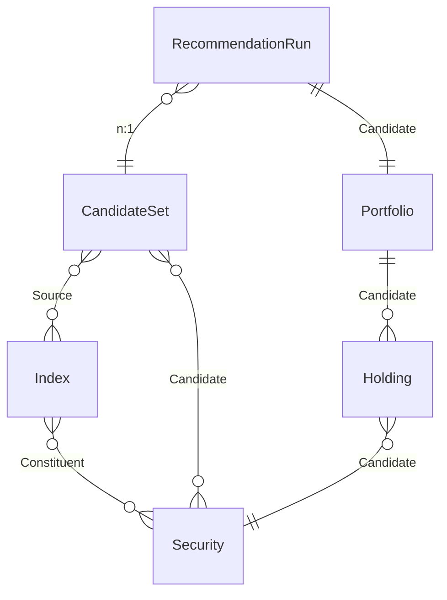
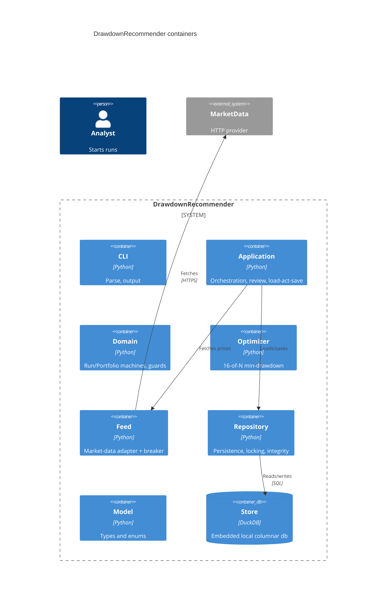

# BUILD: Drawdown Portfolio Recommender

Mode: full (self-contained).

A coding agent with no prior context can implement this system from this document under hard TDD.
It inlines every term, invariant, and contract it uses and references the `design/` files for full
source. The machine JSON (section 5) and the transition tables (section 7) are referenced, never
pasted; those files are what the gates check.

## 1. Purpose and scope

A local command-line tool, written in Python, that recommends a stock portfolio. It draws the top 30
constituents of each configured market index, dedupes them into a candidate universe, collects the
price history for every candidate, and selects exactly 16 stocks minimizing historical maximum
drawdown. A produced portfolio is reviewed by a manager and accepted or rejected. There is no
server; all state lives in a local DuckDB file; the one network dependency is a market-data provider,
reached through a circuit breaker.

In scope: index constituent refresh, candidate deduplication, price collection with bounded retry, the
16-of-N min-drawdown optimization, the run lifecycle, the portfolio review lifecycle, a market-data
circuit breaker, and backup/restore. Out of scope: order execution or trading, real-time streaming,
multi-user servers, and any recommendation objective other than lowest maximum drawdown.

## 2. Glossary

- **Index**: a named market index with a ranked constituent list; only its top 30 by rank are
  eligible candidates.
- **Security**: a tradable stock with a unique ticker.
- **Constituent / Candidate / Source**: a security's membership in an index; a security in the
  optimization universe; an index a candidate set was drawn from.
- **CandidateSet**: the deduped union of the top 30 of every configured index, as of a date.
- **RecommendationRun (Run)**: one optimization job: collect prices, optimize, end Ready or Failed.
- **Portfolio**: a recommended set of exactly 16 holdings with a computed maximum drawdown, reviewed
  by a manager.
- **Holding**: one position: a candidate security and its weight (basis points).
- **Analyst / Manager / Admin**: the roles. An Analyst starts runs; a Manager (or Admin) reviews and
  decides portfolios.
- **maximum drawdown**: the largest peak-to-trough decline of a portfolio's value over the lookback
  window; the objective the optimizer minimizes.

## 3. Domain model (the what)

Source of truth: `design/domain.modelith.yaml` (lints clean, 0/0). Rendered: `design/domain.modelith.md`.

### Entities and relationships

### Data dictionary (the one canonical schema)

Every persisted row also carries a `version` integer for the optimistic lock where the placement
table (section 4) says so.

- **Index**: `id string`, `name string`, `provider string`, `asOf timestamp`; constituents (ranked)
  to Security (n:n).
- **Security**: `ticker string` (unique), `name string`, `sector string`.
- **CandidateSet**: `id string`, `asOf timestamp`, `size integer` (derived: distinct candidate
  count after dedup); Source to Index (n:n), Candidate to Security (n:n).
- **RecommendationRun**: `id string`, `requestedAt timestamp`, `lookbackDays integer`,
  `status RunStatus`; to CandidateSet (n:1), to Portfolio (1:1).
- **Portfolio**: `id string`, `maxDrawdown integer` (basis points), `status PortfolioStatus`,
  `proposedAt timestamp`, `acceptedAt timestamp` (set at Accepted); owns 16 Holdings.
- **Holding**: `id string`, `weight integer` (basis points); to Security (n:1).

Enums: `RunStatus = {Collecting, Optimizing, Ready, Failed}` (Collecting/Optimizing working, Ready/
Failed terminal); `PortfolioStatus = {Proposed, UnderReview, Accepted, Rejected}` (Proposed/
UnderReview open, Accepted/Rejected decided).

### Invariants (non-negotiable rules, by id)

- `index-top-30` (Index): only the top 30 constituents by rank feed a CandidateSet.
- `ticker-unique` (Security): every Security has a ticker unique across all securities.
- `candidate-deduped` (CandidateSet): no Security appears more than once in a CandidateSet.
- `candidate-from-top-30` (CandidateSet): every candidate is a top-30 constituent of some source Index.
- `run-ready-has-portfolio` (RecommendationRun): a Ready run references exactly one produced
  Portfolio; no partial success.
- `run-forward-only` (RecommendationRun): a run only advances Collecting to Optimizing to Ready, or
  fails; never backward.
- `run-terminal-absorbing` (RecommendationRun): a Ready or Failed run accepts no further actions.
- `portfolio-size-16` (Portfolio): a Portfolio holds exactly 16 Holdings.
- `portfolio-holdings-deduped` (Portfolio): no Security appears in more than one Holding.
- `portfolio-from-candidates` (Portfolio): every Holding's Security is in the run's CandidateSet.
- `portfolio-has-drawdown` (Portfolio): every Portfolio records the maxDrawdown it minimized.
- `portfolio-review-forward` (Portfolio): a Portfolio only advances Proposed to UnderReview, decides
  Accepted or Rejected, or is reopened to UnderReview; never otherwise backward.
- `portfolio-accept-role` (Portfolio): only a Manager or Admin may accept or reject a Portfolio.
- `portfolio-reopen-role` (Portfolio): only a Manager or Admin may reopen a decided Portfolio.
- `portfolio-accepted-has-date` (Portfolio): an Accepted Portfolio records an acceptedAt timestamp.
- `holding-weight-nonneg` (Holding): a Holding weight is never negative (no shorts).
- `holding-weights-sum-full` (Holding): a Portfolio's Holding weights sum to 10000 basis points.
- `feed-circuit-breaks` (model-level): repeated market-data failures open the circuit so calls
  fast-fail instead of hanging, and a Collecting run fails cleanly.

## 4. Architecture (the how)

Source: `design/workspace.dsl` and `design/ARCHITECTURE.md`. One Python process; seven code
boundaries plus the embedded store and the external provider.

### Containers and technology

- **pf.cli** (Python): parse, output, exit codes.
- **pf.app** (Python): run orchestration (collect, optimize, persist) and review commands; the
  load-act-save loop.
- **pf.domain** (Python): the RecommendationRun and Portfolio machines as pure transition functions,
  guards, invariant predicates. No I/O.
- **pf.optimizer** (Python): a pure, deterministic transform selecting the 16-of-N min-drawdown
  portfolio. No machine (pure logic gets a contract spec).
- **pf.feed** (Python): the market-data adapter; holds the circuit breaker; the sole importer of the
  provider client.
- **pf.repo** (Python): the sole importer of the DuckDB client; persistence, optimistic version
  checks, integrity check, backup/restore.
- **pf.model** (Python): entity types and enums (section 3's schema); no other layer restates it.
- **store** (DuckDB): the embedded local columnar file. **mkt** (MarketData): the external HTTP
  provider.

### Deployment topology

One process on one machine, one local DuckDB file, one HTTP provider. A `recommend` command runs a
whole run to completion; review commands are separate invocations. `backup` copies the file; `restore`
replaces it. Offline once prices are cached; the provider is only needed while Collecting.

### Architecture Contract (boundaries + dependency rules)

The coding agent must not introduce a cross-boundary dependency outside `allow`. `pf.feed` is the sole
importer of the provider client; `pf.repo` the sole importer of DuckDB. Full contract:
`design/ARCHITECTURE.md` section 5. Allowed edges: cli->app, cli->model; app->{domain, optimizer,
feed, repo, model}; domain->model; optimizer->model; feed->model; feed->external.marketdata;
repo->model; repo->external.duckdb. Everything else denied; the two `pf.* -> external.*` blanket
denies are overridden only by the feed and repo allows.

### Interface contracts, event-contract, persistence and placement, NFR record

See `design/ARCHITECTURE.md` sections 6-10. Summary: interface contracts pin request/response shape,
enumerated errors, and idempotency for each boundary (these are the `onError` branches in section 5).
The event-contract table is N/A (one synchronous process per command; no bus). Persistence: Portfolio
is a versioned row under an optimistic lock (two managers may review at once), realized with the
commit overlay; RecommendationRun is single-writer (no lock overlay); the optimizer is a pure
transform; Index/Security/CandidateSet/Holding are versioned rows without a lifecycle machine. NFR:
role-based authz for portfolio decisions; market-data key from env, never logged; store file 0600;
thousands of securities not millions; correctness over speed; residual failures print a loud, distinct
message with a distinct exit code.

## 5. Behavior: the state machines (the logic)

Three machines. The JSON files are the source; do not paste them.

### RecommendationRun (`design/machines/RecommendationRun.machine.json`)

A forward pipeline: Collecting invokes the price fetch (through the feed breaker); on success it moves
to Optimizing, which invokes the optimizer; success records the portfolio and reaches Ready. A fetch
failure or timeout retries a bounded number of times (collectRetry) then fails; an optimizer failure
or timeout fails directly. Ready and Failed are terminal. Single writer, so no persist overlay on the
run. Named-unit contracts and failure catalog: `design/machines/RecommendationRun.matrix.md`
(1 guard, 4 actions, 2 actors). The `fetchPrices` and `optimize` actors are integration/side-effect
contracts, not derivable from transition tests.

### Portfolio (`design/machines/Portfolio.machine.json`)

A review lifecycle: Proposed advances to UnderReview, then a Manager or Admin accepts or rejects it; a
decided portfolio may be reopened to UnderReview. Every state change is written through the commit
overlay (committing invokes the versioned write; a retriable conflict retries with backoff up to
MaxRetries via commitRetry, then rolls back to the prior stage via reverted). Accepting records
acceptedAt. Named-unit contracts and failure catalog: `design/machines/Portfolio.matrix.md`
(11 guards, 7 actions, 1 actor). `canDecide` enforces `portfolio-accept-role`; `canReopen` enforces
`portfolio-reopen-role`; `recordAccepted` enforces `portfolio-accepted-has-date`.

### MarketDataFeed (`design/machines/MarketDataFeed.machine.json`, `_role: operational`)

A circuit breaker over the provider: closed (calls flow, failures counted), open (calls fast-fail
after a threshold trip), halfOpen (one trial probe recloses or reopens). Enforces `feed-circuit-breaks`.
Named-unit contracts: `design/machines/MarketDataFeed.matrix.md` (2 guards, 3 actions, no actors).

## 6. Traceability matrix

Every invariant from section 3, its enforcement point, its component, its interface contract, and the
test id(s). Machine-enforced rows cite oracle STABLE ids; structural/prose rows cite named property
tests. Gx-trace reports the split (unit-backed vs attested).

| invariant id | enforced by (guard / structural) | in component | interface contract | test id(s) |
|---|---|---|---|---|
| `index-top-30` | structural: only rank <= 30 rows feed a build | pf.app, pf.repo | app->repo build | PROP-index-top-30 |
| `ticker-unique` | structural: upsert keys on ticker | pf.app, pf.repo | app->repo upsert | PROP-ticker-unique |
| `candidate-deduped` | structural: build dedupes by ticker | pf.app | app->repo build | PROP-candidate-deduped |
| `candidate-from-top-30` | structural: build draws only from index top 30 | pf.app | app->repo build | PROP-candidate-from-top-30 |
| `run-ready-has-portfolio` | action `recordPortfolio`; formal `Inv_Complete` | pf.domain | app->optimizer | RECO-d6fcf9 |
| `run-forward-only` | structural: the run graph; formal `Inv_TerminalAbsorbing` and forward chain | pf.domain | app->domain transition | RECO-f89da8, RECO-d6fcf9 |
| `run-terminal-absorbing` | structural: Ready and Failed are `final`; formal `Inv_TerminalAbsorbing` | pf.domain | app->domain transition | RECO-61506b, RECO-ed98c7 |
| `portfolio-size-16` | structural: the optimizer returns exactly 16 holdings | pf.optimizer | app->optimizer | PROP-portfolio-size-16 |
| `portfolio-holdings-deduped` | structural: distinct securities in the selection | pf.optimizer | app->optimizer | PROP-portfolio-holdings-deduped |
| `portfolio-from-candidates` | structural: the optimizer selects only from candidates | pf.optimizer | app->optimizer | PROP-portfolio-from-candidates |
| `portfolio-has-drawdown` | structural: the optimizer records the minimized maxDrawdown | pf.optimizer | app->optimizer | PROP-portfolio-has-drawdown |
| `portfolio-review-forward` | action `commit`/`setPending*` + structural; formal `StageForward` | pf.domain | app->domain transition | PORT-27d66f, PORT-d1647b |
| `portfolio-accept-role` | guard `canDecide` | pf.domain | app->domain accept/reject | PORT-2bf44c, PORT-a41039, PORT-ddb44c, PORT-351dec |
| `portfolio-reopen-role` | guard `canReopen` | pf.domain | app->domain reopen | PORT-db3bb9, PORT-9facf7 |
| `portfolio-accepted-has-date` | action `recordAccepted`; formal `Inv_CloseDate` | pf.domain | app->domain accept | PORT-d1647b |
| `holding-weight-nonneg` | structural: optimizer weights are non-negative | pf.optimizer | app->optimizer | PROP-holding-weight-nonneg |
| `holding-weights-sum-full` | structural: optimizer weights sum to 10000 bps | pf.optimizer | app->optimizer | PROP-holding-weights-sum-full |
| `feed-circuit-breaks` | guard `atThreshold` + action `recordTrip` | pf.feed | app->feed | MARK-acc7d7 |

No invariant is left unenforced. The structural rows are made true by the optimizer contract or the
build/upsert logic rather than a runtime guard; each is property-tested (section 7).

## 7. Test specification (the hard-TDD oracle)

The transition test spec IS the generated `design/machines/<Component>.oracle.md` files:
`RecommendationRun.oracle.md` (8 rows), `Portfolio.oracle.md` (19 rows), `MarketDataFeed.oracle.md`
(6 rows). Do not restate them. Tests key on the STABLE id (e.g. `PORT-d1647b`), never the row number.

### 7.1 Guard-branch completeness (falsifying-clause tests)

The guards here are single-clause or disjunctions, not conjunctions, so there are no A-AND-B-AND-C
falsifying triples; the falsifying tests are:

- `canDecide` = (role is Manager) OR (role is Admin). Falsifying: an Analyst attempts accept or
  reject; the guard is false and the decision does not fire (AuthzError). Covers `portfolio-accept-role`.
- `canReopen` = (role is Manager) OR (role is Admin). Falsifying: an Analyst attempts reopen on a
  decided portfolio; refused. Covers `portfolio-reopen-role`.
- `atThreshold` = (failures + 1 >= threshold). One test just below the threshold stays closed
  (`MARK-9e6205`), one at the threshold trips to open (`MARK-acc7d7`). Covers `feed-circuit-breaks`.
- `retriesExhausted` = (retries >= MaxRetries). One test below the bound retries, one at the bound
  routes to the failure/rollback state (RECO-61506b, PORT-cba032).

### 7.2 Named-unit test plan

Per the matrix files (section 5): guards and pending/prior/commit actions are unit tests over
context; `recordAccepted` uses a fake clock; `canDecide`/`canReopen` use fake roles. The actors are
integration tests: `persistDecision` idempotency (writes once per `(portfolioId, version)`) against a
contract-tested DuckDB fake plus one real-store test; `fetchPrices` against a contract-tested
market-data fake plus a breaker-open fixture; `optimize` runs the real optimizer on a fixed,
deterministic price fixture.

### 7.3 Contract tests and property tests

- Contract tests per boundary (section 4): cli->app result/exit-code mapping; app->repo Save/Load
  under version guards (ConflictError on a stale version); feed->mkt error mapping and breaker
  behavior; app->optimizer shape and InfeasibleError.
- Property tests, one per invariant, named `PROP-<invariant-id>` (section 6): generate random valid
  and invalid inputs and assert the invariant holds or the operation is rejected. Notably
  `portfolio-size-16`, `portfolio-holdings-deduped`, `portfolio-from-candidates`,
  `holding-weight-nonneg`, and `holding-weights-sum-full` are properties of the optimizer output over
  random candidate universes and price matrices. The machine-enforced invariants also carry formal
  proofs: `PortfolioData.tla` (`StageForward`, `Inv_CloseDate`), `RecommendationRunData.tla`
  (`Inv_Complete`, `Inv_TerminalAbsorbing`, `Live_Terminates`), and the control-flow
  `Live_OverlayResolves` for each machine.

## 8. State migration

`Portfolio` persists its `status`, `acceptedAt`, and a `version`; `RecommendationRun` persists its
`status`. This is a greenfield design, so there are **no persisted instances yet**: the first run
starts from an empty store, no migration required.

Protocol for future lifecycle changes: when a `PortfolioStatus` or `RunStatus` value is renamed,
split, or removed, ship a mapping table from each old persisted value to its new state, applied once
on `Open()` over every row, or an explicit drain rule. The overlay states (committing/commitRetry/
reverted for Portfolio; collectRetry for the run) are never persisted (they exist only within a
command's execution), so renaming them needs no migration. Regenerate the oracles after any machine
change; the stable-id diff is the affected-test list.

## 9. (folded into sections 4 and 5)

Architecture and behavior are in sections 4 and 5; not duplicated.

## 10. Language realization notes

Target language: Python.

- The RecommendationRun and Portfolio machines become explicit `status` fields plus pure transition
  functions in `pf.domain`: `run_transition(cur, trigger, ctx) -> (next, actions, err)` and
  `portfolio_transition(cur, event, ctx) -> (next, actions, err)`, each a dispatch over
  `(cur, event)` returning the next state, ordered action names, and a `RejectedError` when no
  guarded branch applies. The Portfolio commit overlay is driven by `pf.app`: it calls the transition
  to compute `pending`, invokes `repo.save` under the version guard, and on `ConflictError` loops
  with backoff up to `MaxRetries` before rolling back.
- The MarketDataFeed breaker is a small object in `pf.feed` holding `failures`/`threshold` and a
  `closed|open|halfOpen` state; the transition function is the one in the machine.
- Persistence uses the explicit persisted-state-plus-optimistic-lock pattern for `Portfolio`
  (`WHERE version = expected`, bump on success). `RecommendationRun` is single-writer.
- The optimizer is a pure function; keep it dependency-injected so tests run it deterministically on
  fixed price fixtures. No state-machine library; the transitions are small dispatch tables.

### Toolchain and versions

- Python 3.12.x, managed with `uv` (commit `uv.lock`).
- `duckdb` (pinned in the lockfile), imported only by `pf.repo`.
- The market-data client (`httpx` plus a thin provider wrapper), imported only by `pf.feed`.
- Numerical work (drawdown, optimization) with `numpy`/`pandas` (pinned), used only inside
  `pf.optimizer`.
- Tests: `pytest`; property tests with `hypothesis`; the transition tests read the oracle rows.
- Lint/type: `ruff` and `mypy` (pin versions in CI).
- Design gates (from the repo root; design in `design/`): `python3 <tools>/oracle_gen.py
  design/machines` (regenerate + commit oracles); `python3 <tools>/machinery_check.py design --impl .`
  (all gates once code exists; needs PyYAML); `bash <tools>/verify_formal.sh design` (regenerate +
  TLC-check; needs Java 11+).

## 11. Hard-TDD protocol (read before writing any code)

1. A test-writer agent reads sections 6 and 7 and writes the suite from the spec, keying transition
   tests on the oracle STABLE id (e.g. `PORT-d1647b`), plus the falsifying-clause tests (7.1), the
   named-unit tests (7.2), and the contract and property tests (7.3).
2. The tests are then LOCKED; the implementer may not modify them to pass.
3. The implementer writes `pf.model`, `pf.repo`, `pf.feed`, `pf.optimizer`, `pf.domain`, `pf.app`,
   `pf.cli` until the locked tests pass, honoring the Architecture Contract (feed is the sole importer
   of the provider client; repo the sole importer of DuckDB; no cross-boundary edge outside `allow`).
4. Every oracle row has a test on its stable id; every guard's falsifying case has a test (7.1); every
   invariant in section 3 is property-tested (7.3). Coverage target: >= 80% combined; integration
   tests use the real store, no mocks.
5. Generated tests live apart from hand-written tests (a `test/generated/` directory), so regeneration
   never clobbers hand-written ones.
6. A wrong test is a design defect: fix the design and this BUILD.md, rerun `oracle_gen.py` and
   `machinery_check.py`, and regenerate the affected tests. Do not adjust a test to pass.

## 12. Open questions and residual risks

- **Objective is single (min drawdown), by design.** The recommender optimizes only for lowest
  maximum drawdown; it ignores return, liquidity, and sector concentration. Named risk: the 16-stock
  minimum-drawdown portfolio may be poorly diversified or low-return. Out of scope to fix here.
- **Optimizer feasibility depends on data coverage.** If fewer than 16 candidates have full price
  history over the lookback, the run ends Failed (InfeasibleError). Residual: a thin candidate
  universe yields no recommendation; the operator sees the infeasibility cause.
- **Market-data provider has no deployable mitigation.** The circuit breaker bounds the damage
  (fast-fail, bounded run retries) but cannot manufacture data; a prolonged outage means no fresh
  recommendation. Cached prices allow offline reruns.
- **DuckDB corruption loses data since the last backup.** Recovery is `restore` from a `backup`; the
  loud `CorruptError` abort prevents silent corruption. Recommend scheduled backups (out of scope).
- **maxDrawdown stored in basis points as an integer** to keep the model integer-typed; if
  sub-basis-point precision is ever needed, widen the unit rather than switching to float in the
  persisted schema.

## 13. Build plan

1. **Walking skeleton (thinnest end-to-end slice through one real boundary).** `pf recommend` over a
   tiny two-index fixture with cached prices: build a `CandidateSet` (dedup), start a
   `RecommendationRun`, fetch prices through the feed (breaker closed), optimize a 16-of-N fixture,
   reach Ready with a `Portfolio`. Prove the topology, one real DuckDB write, and one real optimizer
   run. Done when `RECO-f89da8` then `RECO-d6fcf9` pass against a real store and a forced feed failure
   drives `RECO-040944` then the bounded retry.
2. **Run pipeline slice**: all RecommendationRun transitions, `run-ready-has-portfolio`,
   `run-forward-only`, `run-terminal-absorbing`, and the collectRetry bound; green before the next.
3. **Feed breaker slice**: MarketDataFeed closed/open/halfOpen, `feed-circuit-breaks`.
4. **Optimizer slice**: `portfolio-size-16`, `portfolio-holdings-deduped`, `portfolio-from-candidates`,
   `portfolio-has-drawdown`, `holding-weight-nonneg`, `holding-weights-sum-full` as property tests over
   the pure optimizer.
5. **Portfolio review slice**: all Portfolio transitions, `portfolio-review-forward`,
   `portfolio-accept-role`, `portfolio-reopen-role`, `portfolio-accepted-has-date`, and the commit
   overlay under a forced version conflict.
6. **Reference-data and operations slice**: Index refresh (`index-top-30`), Security upsert
   (`ticker-unique`), CandidateSet build (`candidate-deduped`, `candidate-from-top-30`), then `backup`/
   `restore` and the corruption abort path.

Definition of done per milestone: all its oracle transitions covered, all its invariants
property-tested, its contract tests green, no cross-boundary violation (G4-import clean), and the
formal suite still green.
