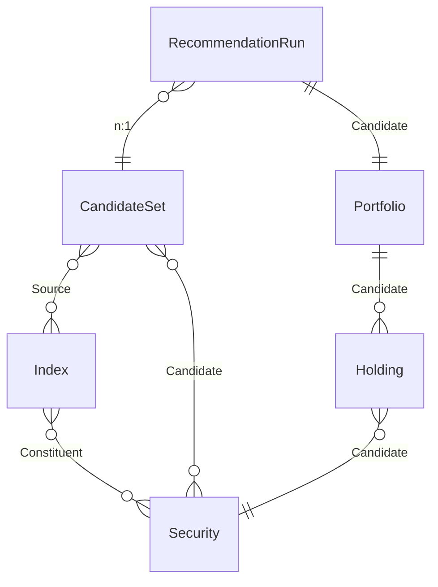

{/* Generated by `modelith render`. Do not edit by hand; edit the .modelith.yaml source and re-render. */}

# Drawdown Portfolio Recommender

A local tool that recommends a stock portfolio. It draws the top 30 constituents of each configured market index, dedupes them into a candidate universe, then runs an optimization that selects exactly 16 stocks minimizing historical maximum drawdown. A run collects price history, optimizes, and produces a portfolio a manager may review and accept or reject.

## Glossary

- **`Admin`** - A person who may perform any action, including manager decisions.
- **`Analyst`** - A person who configures indices and starts recommendation runs.
- **`Candidate`** - A `Security` in the deduped universe a run optimizes over.
- **`Constituent`** - A `Security` that is a member of an `Index`, carrying its rank within that index.
- **`Manager`** - A person who reviews a recommended `Portfolio` and accepts or rejects it.
- **`Source`** - An `Index` a `CandidateSet` was drawn from.

## Enums

### `PortfolioStatus`

The review lifecycle of a `Portfolio`. Proposed and UnderReview are open; Accepted and Rejected are decided.

| Value | Definition |
| --- | --- |
| `Proposed` | Freshly produced by a run, not yet reviewed. |
| `UnderReview` | A manager is reviewing it. |
| `Accepted` | Approved for use. Records when it was accepted. |
| `Rejected` | Declined. |

### `RunStatus`

The lifecycle of a `RecommendationRun`. Collecting and Optimizing are working phases; Ready and Failed are terminal.

| Value | Definition |
| --- | --- |
| `Collecting` | Fetching the price history for every candidate. |
| `Optimizing` | Searching candidate portfolios for the lowest maximum drawdown. |
| `Ready` | Terminal success: a portfolio was produced. |
| `Failed` | Terminal failure: no portfolio was produced. |

## Entities

### `CandidateSet`

The deduped union of the top 30 constituents of every configured `Index`, captured as of a date. It is the exact universe a run optimizes over. A security appears at most once, no matter how many indices list it.

**Relationships**

- `Index` - n:n - `Source` - The indices this universe was drawn from.
- `Security` - n:n - `Candidate` - The deduped candidate securities.

**Attributes**

| Name | Type | Description |
| --- | --- | --- |
| `id` | string | Stable unique identifier. |
| `asOf` | timestamp | When the universe was captured. |
| `size` | integer | Number of distinct candidates. _Derived:_ The count of distinct candidate securities after deduping across all source indices. |

**Actions**

- `build` - actor `Analyst`; preserves candidate-deduped, candidate-from-top-30 - Assemble the deduped universe from the current source indices.

**Invariants**

- **candidate-deduped** - No `Security` appears more than once in a `CandidateSet`.
- **candidate-from-top-30** - Every `Security` in a `CandidateSet` is a top-30 `Constituent` of at least one source `Index`.

### `Holding`

One position in a `Portfolio`: a candidate `Security` and the fraction of the portfolio allocated to it. A holding exists only as part of a portfolio; it is not a standalone record.

**Relationships**

- `Security` - n:1 - `Candidate` - The security held.

**Attributes**

| Name | Type | Description |
| --- | --- | --- |
| `id` | string | Stable unique identifier. |
| `weight` | integer | Allocation in basis points; the weights of a portfolio sum to 10000. |

**Actions**

- `set` - actor `Analyst`; preserves holding-weight-nonneg, holding-weights-sum-full - Set a holding's security and weight when the optimizer commits a portfolio.

**Invariants**

- **holding-weight-nonneg** - A `Holding` `weight` is never negative (no short positions).
- **holding-weights-sum-full** - The `weight`s of a `Portfolio`'s `Holding`s sum to 10000 basis points (100 percent).

### `Index`

A named market index with a ranked list of constituent securities (for example the top names of a large-cap index). Only the top 30 by rank feed a candidate universe. An index is a source of candidates, not something the tool trades.

**Relationships**

- `Security` - n:n - `Constituent` - The securities that belong to this index, by rank.

**Attributes**

| Name | Type | Description |
| --- | --- | --- |
| `id` | string | Stable unique identifier. |
| `name` | string | Index name, for example a large-cap 500 index. |
| `provider` | string | Where the constituent list comes from. |
| `asOf` | timestamp | When the constituent list was captured. |

**Actions**

- `refresh` - actor `Analyst`; preserves index-top-30 - Re-pull the ranked constituent list for this index.

**Invariants**

- **index-top-30** - Only the top 30 constituents of an `Index` by rank are eligible to enter a `CandidateSet`.

### `Portfolio`

A recommended set of exactly 16 holdings with a computed maximum drawdown, produced by a run and reviewed by a manager. It carries a review lifecycle: proposed, under review, then accepted or rejected, and a rejected or accepted portfolio may be reopened for review.

**Relationships**

- `Holding` - 1:n - owned - `Candidate` - The 16 positions that make up the portfolio.

**Attributes**

| Name | Type | Description |
| --- | --- | --- |
| `id` | string | Stable unique identifier. |
| `maxDrawdown` | integer | The largest peak-to-trough decline over the lookback, in basis points; the objective minimized. |
| `status` | PortfolioStatus | Review lifecycle state. This is the lifecycle. |
| `proposedAt` | timestamp | When the run produced it. |
| `acceptedAt` | timestamp | When it was accepted; set on reaching Accepted, unset otherwise. |

**Actions**

- `advance` - actor `Manager`; preserves portfolio-review-forward - Move a Proposed portfolio into UnderReview.
- `accept` - actor `Manager`; preserves portfolio-review-forward, portfolio-accept-role, portfolio-accepted-has-date - Approve the portfolio from an open review stage. Manager or Admin only.
- `reject` - actor `Manager`; preserves portfolio-review-forward, portfolio-accept-role - Decline the portfolio from an open review stage. Manager or Admin only.
- `reopen` - actor `Manager`; preserves portfolio-review-forward, portfolio-reopen-role - Reopen a decided portfolio back to UnderReview. Manager or Admin only.

**Invariants**

- **portfolio-size-16** - A `Portfolio` holds exactly 16 `Holding`s.
- **portfolio-holdings-deduped** - No `Security` appears in more than one `Holding` of a `Portfolio`.
- **portfolio-from-candidates** - Every `Holding`'s `Security` is a member of the run's `CandidateSet`.
- **portfolio-has-drawdown** - Every `Portfolio` records the `maxDrawdown` it was selected to minimize.
- **portfolio-review-forward** - A `Portfolio` only advances Proposed to UnderReview, decides to Accepted or Rejected, or is reopened to UnderReview; it never otherwise moves backward.

- **portfolio-accept-role** - Only a `Manager` or `Admin` may accept or reject a `Portfolio`.
- **portfolio-reopen-role** - Only a `Manager` or `Admin` may reopen a decided `Portfolio`.
- **portfolio-accepted-has-date** - A `Portfolio` in Accepted records an `acceptedAt` timestamp.

### `RecommendationRun`

One optimization job: it takes a `CandidateSet`, collects the price history for every candidate, searches for the 16-stock portfolio with the lowest maximum drawdown, and ends Ready with a `Portfolio` or Failed with none. A run is the process; the `Portfolio` is its result.

**Relationships**

- `CandidateSet` - n:1 - The universe this run optimizes over.
- `Portfolio` - 1:1 - `Candidate` - The portfolio produced, once the run is Ready.

**Attributes**

| Name | Type | Description |
| --- | --- | --- |
| `id` | string | Stable unique identifier. |
| `requestedAt` | timestamp | When the run was started. |
| `lookbackDays` | integer | How many days of price history the drawdown is computed over. |
| `status` | RunStatus | Current lifecycle phase. This is the lifecycle. |

**Actions**

- `start` - actor `Analyst`; preserves run-ready-has-portfolio - Create a run over a candidate set and begin collecting prices.
- `abort` - actor `Analyst`; preserves run-terminal-absorbing - Give up a run that cannot proceed; it ends Failed.

**Invariants**

- **run-ready-has-portfolio** - A `RecommendationRun` in Ready references exactly one produced `Portfolio`; there is no partial success.
- **run-forward-only** - A `RecommendationRun` only advances Collecting to Optimizing to Ready, or fails; it never moves backward.
- **run-terminal-absorbing** - A `RecommendationRun` in Ready or Failed accepts no further lifecycle actions.

### `Security`

A tradable stock identified by a unique ticker. A security may belong to several indices and may appear as a candidate or as a holding. It is the atomic unit the portfolio is built from; it is not itself a portfolio or an index.

**Attributes**

| Name | Type | Description |
| --- | --- | --- |
| `ticker` | string | Unique exchange ticker symbol. |
| `name` | string | Company name. |
| `sector` | string | Sector classification, for diversification context. |

**Actions**

- `upsert` - actor `Analyst` - Create or update a security's reference data.

**Invariants**

- **ticker-unique** - Every `Security` has a ticker that is unique across all securities.

## Relationships

## Invariants

- **feed-circuit-breaks** - When the market-data provider fails repeatedly, the feed circuit opens so calls fast-fail instead of hanging, and a run collecting prices fails cleanly rather than stalling.

## Scenarios

### Recommend a portfolio end to end

The happy path from candidate universe to a produced portfolio.

**Actors:** Analyst

**Steps**

1. An `Analyst` builds a `CandidateSet` from the deduped top 30 of each `Index`.
2. The `Analyst` starts a `RecommendationRun` over that `CandidateSet`.
3. The run collects prices, optimizes, and reaches Ready with a `Portfolio` of exactly 16 `Holding`s.

**Invariants touched**

- **candidate-deduped** - No `Security` appears more than once in a `CandidateSet`.
- **candidate-from-top-30** - Every `Security` in a `CandidateSet` is a top-30 `Constituent` of at least one source `Index`.
- **portfolio-size-16** - A `Portfolio` holds exactly 16 `Holding`s.
- **run-ready-has-portfolio** - A `RecommendationRun` in Ready references exactly one produced `Portfolio`; there is no partial success.
- **portfolio-has-drawdown** - Every `Portfolio` records the `maxDrawdown` it was selected to minimize.

### Price feed is down

Repeated market-data failures trip the circuit and fail the run cleanly.

**Actors:** Analyst

**Steps**

1. A `RecommendationRun` is Collecting prices.
2. The market-data provider fails on every attempt; the feed circuit opens after the threshold.
3. The run exhausts its bounded retries and ends Failed, producing no `Portfolio`.

**Invariants touched**

- **feed-circuit-breaks** - When the market-data provider fails repeatedly, the feed circuit opens so calls fast-fail instead of hanging, and a run collecting prices fails cleanly rather than stalling.

- **run-terminal-absorbing** - A `RecommendationRun` in Ready or Failed accepts no further lifecycle actions.
- **run-forward-only** - A `RecommendationRun` only advances Collecting to Optimizing to Ready, or fails; it never moves backward.

### Manager reviews and accepts

A produced portfolio is reviewed and approved.

**Actors:** Manager

**Steps**

1. A `Portfolio` is Proposed.
2. A `Manager` advances it to UnderReview and then accepts it; its status becomes Accepted and `acceptedAt` is recorded.

**Invariants touched**

- **portfolio-review-forward** - A `Portfolio` only advances Proposed to UnderReview, decides to Accepted or Rejected, or is reopened to UnderReview; it never otherwise moves backward.

- **portfolio-accept-role** - Only a `Manager` or `Admin` may accept or reject a `Portfolio`.
- **portfolio-accepted-has-date** - A `Portfolio` in Accepted records an `acceptedAt` timestamp.

### Only a manager reopens a rejected portfolio

Reopening is role-gated and returns to review.

**Actors:** Analyst, Manager

**Steps**

1. A `Portfolio` is Rejected.
2. An `Analyst` attempts to reopen it and is refused because they are not a manager or admin.
3. A `Manager` reopens it; the `Portfolio` returns to UnderReview.

**Invariants touched**

- **portfolio-reopen-role** - Only a `Manager` or `Admin` may reopen a decided `Portfolio`.
- **portfolio-review-forward** - A `Portfolio` only advances Proposed to UnderReview, decides to Accepted or Rejected, or is reopened to UnderReview; it never otherwise moves backward.

### Candidate universe is deduped

A security listed by two indices appears once.

**Actors:** Analyst

**Steps**

1. Two source `Index` lists both include the same `Security` in their top 30.
2. The built `CandidateSet` contains that `Security` exactly once, drawn from the top 30 of at least one `Index`.

**Invariants touched**

- **candidate-deduped** - No `Security` appears more than once in a `CandidateSet`.
- **candidate-from-top-30** - Every `Security` in a `CandidateSet` is a top-30 `Constituent` of at least one source `Index`.
- **index-top-30** - Only the top 30 constituents of an `Index` by rank are eligible to enter a `CandidateSet`.

### Weights are valid and full

A portfolio's holdings are non-negative and sum to 100 percent.

**Actors:** Analyst

**Steps**

1. The optimizer commits a `Portfolio` of 16 `Holding`s over distinct candidate securities.
2. Each `Holding` `weight` is non-negative and the weights sum to 10000 basis points.

**Invariants touched**

- **holding-weight-nonneg** - A `Holding` `weight` is never negative (no short positions).
- **holding-weights-sum-full** - The `weight`s of a `Portfolio`'s `Holding`s sum to 10000 basis points (100 percent).
- **portfolio-holdings-deduped** - No `Security` appears in more than one `Holding` of a `Portfolio`.
- **portfolio-from-candidates** - Every `Holding`'s `Security` is a member of the run's `CandidateSet`.
- **ticker-unique** - Every `Security` has a ticker that is unique across all securities.

### A security's ticker is unique

Reference data cannot duplicate a ticker.

**Actors:** Analyst

**Steps**

1. An `Analyst` upserts a `Security` with a ticker.
2. Upserting a different security with the same ticker updates the existing one rather than creating a duplicate.

**Invariants touched**

- **ticker-unique** - Every `Security` has a ticker that is unique across all securities.

