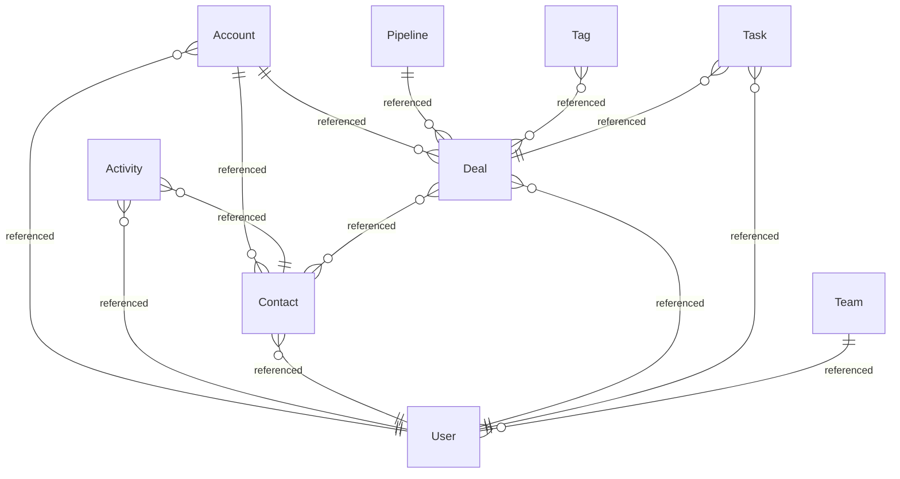
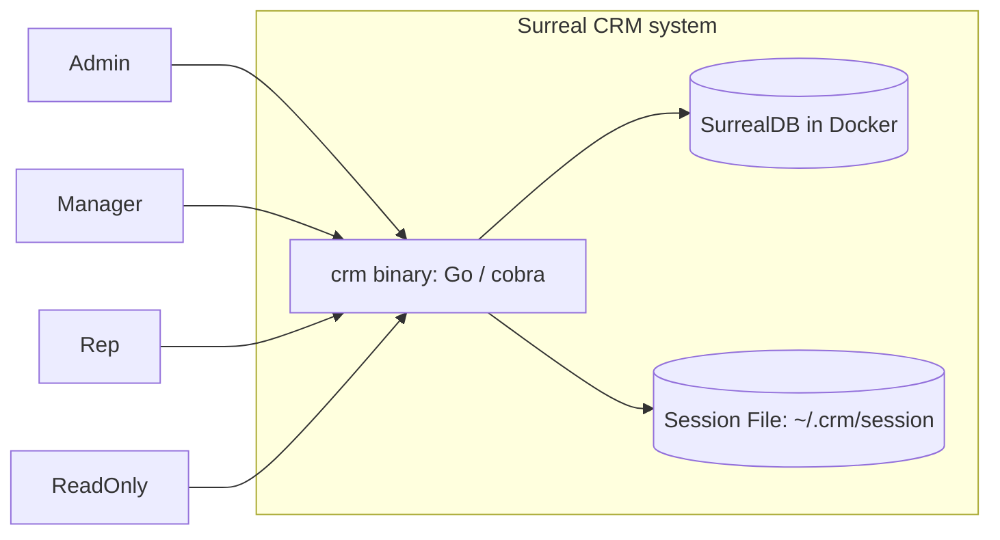
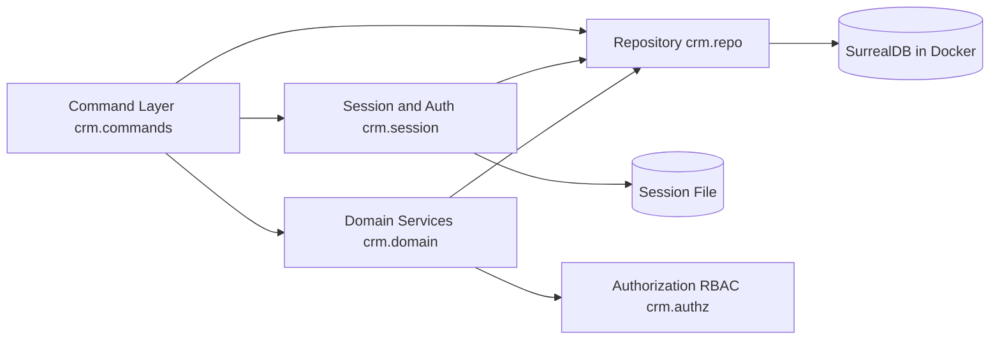

# BUILD: Surreal CRM

Mode: full (self-contained).

> Single deliverable. Self-contained by design: a coding agent with zero prior context builds the
> system from this file alone, under hard TDD (section 11). Source-of-truth files are referenced per
> section for full detail, but you do not need to open them to build. When this document and a source
> file disagree, the source file wins and this document is a defect: stop and fix it.
>
> Sources (under `design/`): `domain.modelith.yaml` / `domain.modelith.md` (domain), `workspace.dsl` /
> `ARCHITECTURE.md` (architecture), `machines/*.machine.json` (XState v5 machines), `machines/*.matrix.md`
> (transition oracles), `machines/README.md` (non-machine catalog).

---

## 1. Purpose and scope

Surreal CRM is the running go-crm system rebuilt over a new persistence foundation: a single statically
linked Go binary, `crm`, that runs one customer-relationship-management command per invocation against a
SurrealDB instance in a local Docker container. Its users are four kinds of operator distinguished only
by role (Admin, Manager, Rep, ReadOnly); the only network surface is the loopback connection to the local
container. The domain, the invariants, and all five state machines carry over unchanged from the legacy
design; the store, its failure classes, and the data migration are what this rebuild delivers, with every
write still applied atomically inside one database transaction.

**In scope**

- CRUD and lifecycle for nine record types (User, Team, Account, Contact, Deal, Pipeline, Activity, Task,
  Tag) via `crm <noun> <verb>` commands.
- Local login/logout with an on-disk session token; argon2id password hashing.
- Role- and ownership-based authorization on every command.
- Deal, Task, and User status lifecycles as explicit state machines.
- Atomic single-transaction writes with bounded retry while the container starts or a transaction
  conflicts, plus the LadybugDB-to-SurrealDB data migration (exporter, importer, parity, cutover).

**Out of scope**

- Any remote or multi-node deployment, replication, or high availability (one local container, one named
  volume; the store binds `127.0.0.1` only).
- Multi-tenant isolation beyond the single local namespace.
- Concurrent multi-user write throughput: concurrent invocations serialize in the store's transaction
  engine; a conflicting transaction is retried bounded, then refused.
- `crm backup` and `crm restore` as subcommands: backup is superseded by the SurrealDB export procedure,
  restore is deferred to the operations iteration (see `legacy/surface.yaml` and section 12).

## Migration implementation plan

The rebuild is implemented from `design/migration.yaml`; this section turns that checked contract into
deliverable work. This is a store swap: every entity disposition is `reuse`, there are no field or
lifecycle mappings, and the deliverables are the SurrealDB schema, the repository adapter, and the data
movement pipeline. The embedded store remains the source of truth until the final cutover phase. The
legacy surface ledger (`design/legacy/surface.yaml`, gate Gs-surface) pins the capability coverage:
every legacy command and node label maps into this design, `crm backup` is dropped, `crm restore` is
deferred.

1. **Characterize and inventory.** The oracle and characterization suites are reused as-is (the machines
   did not change). Capture a volume snapshot and two byte-stable export manifests from the embedded
   store before target work begins.
2. **Build the target store first.** Write the SurrealDB schema DDL (one table per aggregate, record
   links for relationships, uniqueness asserted in schema) and the SurrealQL repository adapter behind
   the unchanged `Repo` interface. The repository contract suite runs against both adapters; every
   intentional delta is reviewed.
3. **Backfill and shadow.** The exporter walks the LadybugDB graph in stable-id order and emits signed
   manifests; the importer is idempotent by record id and safe to replay. Shadow reads compare
   normalized rows and authorization decisions while always serving the legacy result; every mismatch is
   quarantined or explained.
4. **Cut over and retire.** Freeze legacy writes, run the final incremental import, require zero
   unexplained drift and green target suites, then repoint the connection string. Keep the embedded
   store, manifests, and the rollback configuration available for 72 hours. Remove the exporter,
   importer, and comparator (`internal/migrate/**`) only after the exit criteria and owner approval.

Regression proof is layered: schema DDL tests assert every uniqueness and link constraint; import and
replay are idempotent under duplicate, reordered, interrupted, and resumed delivery; reconciliation
fixtures cover missing rows, extra rows, field drift, link drift, and manifest tampering; parity tests
prove shadow reads never serve target results; rollback is rehearsed with live writes; the ordinary
domain, architecture, state-machine, formal, and implementation gates remain mandatory throughout.

## 2. Glossary

The only source for these words.

**Roles and access**

- **Admin** - a `User` role with unrestricted CRUD and visibility across all records.
- **Manager** - a `User` role that reads and writes records owned by any member of the manager's `Team`,
  and may reassign ownership within that team.
- **Rep** - a `User` role that can create records, write records it owns, and read records within its `Team`.
- **ReadOnly** - a `User` role that may read records within its `VisibilityScope` but may not create,
  update, or delete.
- **Owner** - the `User` to whom a record belongs; ownership is the unit of row-level visibility. Set at
  create, changed only by reassign.
- **VisibilityScope** - the set of records a `User` may read: own records for a `Rep`, team records for a
  `Manager`, all records for an `Admin`. `ReadOnly` reads within the same own/team scope but cannot write.
- **Session** - a local expiring credential written to `~/.crm/session` after a successful login that
  identifies the acting `User` for later commands until logout or expiry.

**Records** (defined in section 3): **User**, **Team**, **Account**, **Contact**, **Deal**, **Pipeline**,
**Activity**, **Task**, **Tag**.

**Technical terms**

- **SurrealDB** - the multi-model store, one instance in a local Docker container (bound to
  `127.0.0.1:8000`, data on a named volume). Accessed only through the Repository via SurrealQL.
- **SurrealQL** - SurrealDB's query language; all reads and writes are parameterized SurrealQL statements.
- **LadybugDB** - the legacy embedded property-graph store this rebuild replaces; it remains the source
  of truth until cutover (see the Migration implementation plan).
- **argon2id** - the memory-hard password hashing algorithm (`golang.org/x/crypto/argon2`) used for
  `User.passwordHash`.
- **Aggregate** - a record whose lifecycle is a state machine (Deal, Task, User). Loaded, acted on in
  memory, and saved inside one write transaction (no long-lived in-memory actor).
- **Guard** - a boolean precondition on a transition. If false, the transition does not fire and a
  `record*Denied` action surfaces the reason.
- **Actor (machine sense)** - an invoked side-effecting unit (`saveDeal`, `verifyCredentials`); distinct
  from a person-role actor. In this document the acting person is the **caller** / **acting user**.
- **Transition** - a state change fired by an event, an invoke result (`onDone`/`onError`), an `after`
  delay, or an `always` condition.
- **Write transaction / write Tx** - the one SurrealQL `BEGIN ... COMMIT` an invocation owns; load-act-save
  happens inside it; any error rolls it back with no partial write.
- **ErrLocked (transient store contention)** - the retained transient-retryable error class: the
  container is starting or restarting, or the store briefly refused mid-command; retried up to three
  times (~1.5s) before it is refused. The legacy file-lock meaning is gone; the machine routing is
  unchanged.
- **Walking skeleton** - the thinnest end-to-end slice that exercises one real transition through one real
  boundary, built first to prove the topology before breadth is added.
- **Hard TDD** - a test-writer agent writes tests from sections 6 and 7; tests are locked; the implementer
  makes them pass without editing them (section 11).

## 3. Domain model (the what)

Single canonical schema. Source of truth: `design/domain.modelith.yaml` (lints clean). Later sections
reference these names and types and never restate them.

### 3.1 Entity-relationship diagram



### 3.2 Enums

| enum | values (in order) |
|---|---|
| `UserRole` | `Admin`, `Manager`, `Rep`, `ReadOnly` |
| `UserStatus` | `Active`, `Disabled` |
| `DealStage` | `Lead`, `Qualified`, `Proposal`, `Negotiation`, `Won`, `Lost` |
| `TaskStatus` | `Open`, `InProgress`, `Done`, `Cancelled` |
| `ActivityType` | `Call`, `Meeting`, `Email`, `Note` |

`DealStage` forward order is `Lead < Qualified < Proposal < Negotiation`; `Won`/`Lost` are terminal
outcomes reachable from any non-terminal stage. `next(stage)`: Lead->Qualified, Qualified->Proposal,
Proposal->Negotiation; Negotiation has no forward stage (win/lose only). `TaskStatus` non-terminal:
`Open`, `InProgress`; terminal: `Done`, `Cancelled`.

### 3.3 Data dictionary

Every entity is a row in its aggregate's SurrealDB table with a synthetic string `id` (record id) not listed below. Owned entities
also carry an `ownerId` string referencing the owning `User` (the storage form of the `*-owned` invariants
and the ER `}o--|| User` edges); set at create, changed only by reassign.

| entity | attribute | type | notes |
|---|---|---|---|
| **User** | `username` | string | unique (`username-unique`) |
| | `passwordHash` | string | argon2id encoded hash only (`password-hashed`) |
| | `role` | `UserRole` | |
| | `status` | `UserStatus` | machine state (User aggregate) |
| | `createdAt` | timestamp | |
| | (rel) team | `Team` n:1 | at most one (`single-team`) |
| **Team** | `name` | string | unique (`team-name-unique`) |
| | (rel) members | `User` 1:n | |
| **Account** | `name` | string | |
| | `domain` | string | |
| | `industry` | string | |
| | `ownerId` | string | owning `User` (`account-owned`) |
| | (rel) contacts, deals | `Contact` 1:n, `Deal` 1:n | |
| **Contact** | `fullName` | string | |
| | `email` | string | |
| | `phone` | string | |
| | `title` | string | |
| | `ownerId` | string | owning `User` (`contact-owned`) |
| **Deal** | `title` | string | |
| | `amountCents` | integer | >= 0 (`deal-amount-nonneg`) |
| | `stage` | `DealStage` | machine state (Deal aggregate) |
| | `closeDate` | timestamp | required when `stage == Won` (`deal-won-has-closedate`) |
| | `ownerId` | string | owning `User` (`deal-owned`) |
| | (rel) contacts | `Contact` n:n | |
| **Pipeline** | `name` | string | |
| | `isDefault` | boolean | exactly one true across all pipelines (`one-default-pipeline`) |
| | (rel) deals | `Deal` 1:n | |
| **Activity** | `type` | `ActivityType` | |
| | `subject` | string | |
| | `body` | string | immutable after create (`activity-immutable`) |
| | `occurredAt` | timestamp | immutable after create (`activity-immutable`) |
| | `ownerId` | string | logging `User` (`activity-owned`) |
| | (rel) contact | `Contact` n:1 | |
| **Task** | `title` | string | |
| | `dueDate` | timestamp | |
| | `status` | `TaskStatus` | machine state (Task aggregate) |
| | `ownerId` | string | owning `User` (`task-owned`) |
| | (rel) deal | `Deal` n:1 | optional link |
| **Tag** | `name` | string | unique (`tag-name-unique`) |
| | `color` | string | |
| | (rel) deals | `Deal` n:n | |

### 3.4 Invariants (24, non-negotiable)

Enforcement point, component, and test ids are in the section 6 matrix; not duplicated here.

| id | statement | owner |
|---|---|---|
| `username-unique` | No two `User` records share a username. | User |
| `password-hashed` | A `User` password is persisted only as a hash, never plaintext. | User |
| `disabled-cannot-auth` | A `Disabled` `User` cannot establish a `Session`. | User/Session |
| `single-team` | A `User` belongs to at most one `Team`. | User |
| `manager-has-team` | A `User` with role Manager belongs to exactly one `Team` (team scope is a Manager's entire write authority). | User |
| `team-name-unique` | No two `Team` records share a name. | Team |
| `account-owned` | Every `Account` has exactly one owning `User`. | Account |
| `contact-owned` | Every `Contact` has exactly one owning `User`. | Contact |
| `deal-owned` | Every `Deal` has exactly one owning `User`. | Deal |
| `deal-amount-nonneg` | A `Deal` amount is zero or positive. | Deal |
| `deal-stage-forward` | A `Deal` moves only to a later stage or to Won/Lost; never backward except by explicit reopen. | Deal |
| `deal-terminal` | A `Deal` in Won or Lost is terminal and changes only by reopen. | Deal |
| `deal-won-has-closedate` | A `Deal` in Won has a closeDate. | Deal |
| `one-default-pipeline` | Exactly one `Pipeline` is marked default. | Pipeline |
| `activity-immutable` | An `Activity` body and occurredAt never change after creation. | Activity |
| `activity-owned` | Every `Activity` records the `User` who logged it. | Activity |
| `task-owned` | Every `Task` has exactly one owning `User`. | Task |
| `task-terminal` | A `Task` in Done or Cancelled is terminal. | Task |
| `task-assignee-visible` | A `Task` may be reassigned only to a `User` the assigner can see: Admin to any `User`, Manager to a member of the manager's `Team`. | Task |
| `tag-name-unique` | No two `Tag` records share a name. | Tag |
| `rbac-crud-verbs` | A verb is allowed only if the role grants it: Admin/Manager/Rep may create/read/update/delete; ReadOnly only read. | RBAC |
| `rbac-read-visibility` | Read only within `VisibilityScope`: Admin all; others own or team-owned records. | RBAC |
| `rbac-write-scope` | Update/delete only in scope: Admin any; Manager any team member's record; Rep only its own; ReadOnly none. | RBAC |
| `rbac-reassign-authority` | Only an Admin, or a Manager acting within the manager's `Team`, may change a record's `Owner`; Admin may reassign to any `User`, Manager only to a team member. | RBAC |
| `session-active-user` | A `Session` is valid only while its `User` status is Active. | Session |

## 4. Architecture (the how)

Source of truth: `design/workspace.dsl` and `design/ARCHITECTURE.md`. Data shapes are section 3.

### 4.1 Context and containers



### 4.2 Components inside the `crm` binary



- **Command Layer (`crm.commands`)** owns process lifecycle: parses argv, opens the database, begins and
  commits or rolls back the single write transaction, renders output. Machine: `CommandExecution`.
- **Session and Auth (`crm.session`)** performs login (verify argon2id hash), reads/writes the session
  token, resolves the current `User`. Enforces `disabled-cannot-auth` and `session-active-user`. Machine:
  `Session`.
- **Authorization (`crm.authz`)** is a pure decision function over `(actor, verb, entityType, ownerId,
  teamId)`. Single home of the four `rbac-*` invariants. No I/O, no machine: a contract spec.
- **Domain Services (`crm.domain`)** hold the aggregates whose lifecycles are machines (`Deal`, `Task`,
  `User`); call Authorization before every mutation and Repository to read and persist.
- **Repository (`crm.repo`)** is the only component that imports the SurrealDB driver. Translates domain
  reads and writes to SurrealQL, executes them in the caller's transaction, maps driver and store errors
  to typed domain errors.

### 4.3 Technology stack

| concern | choice | why |
|---|---|---|
| language | Go 1.22+ | single static binary; good CLI ergonomics |
| CLI | cobra | subcommands, flags, help; matches `crm <noun> <verb>` |
| password hash | argon2id (`golang.org/x/crypto/argon2`) | enforces `password-hashed`; memory-hard |
| store | SurrealDB 2.x via `github.com/surrealdb/surrealdb.go` | multi-model; one table per aggregate, record links for relationships |
| store deployment | Docker container: `restart: unless-stopped`, named volume, `127.0.0.1` bind | reproducible local instance; no remote exposure |
| query | SurrealQL over the driver | parameterized statements; transactions via BEGIN/COMMIT |

### 4.4 Deployment topology

One binary invoked per command, plus one long-running SurrealDB container managed by the local Docker
Engine (`docker compose up -d surrealdb`). State lives in the container's named volume and the session
token file (`~/.crm/session`). **HA / replication: N/A by design** - one local container, one volume, no
failover; corruption is fatal-until-restore and is recovered from a volume snapshot or SurrealDB export
per the runbook (section 10). Concurrency: one connection and one transaction per process; concurrent
invocations serialize in the store's transaction engine, a conflicting transaction is retried (bounded)
then refused, treated as a first-class recoverable failure, not a crash. A starting container is
transient (`ErrLocked`, bounded retry); a stopped daemon is fatal for the invocation (`ErrUnavailable`,
message names the daemon check first).

### 4.5 Architecture Contract (boundaries + dependency rules)

The coding agent must not introduce any cross-boundary dependency outside `allow`. Enforced by contract
test **C-ARCH-01** (section 7).

```yaml
contract_version: 1
boundaries:
  - id: crm.commands   # internal/cli/**        exposes internal/cli/root.go
  - id: crm.session    # internal/session/**    exposes internal/session/session.go
  - id: crm.authz      # internal/authz/**      exposes internal/authz/authz.go
  - id: crm.domain     # internal/domain/**     exposes internal/domain/service.go
  - id: crm.repo       # internal/repo/**       exposes internal/repo/repo.go
dependency_rules:
  allow:
    - crm.commands -> crm.session
    - crm.commands -> crm.domain
    - crm.commands -> crm.repo      # open the connection, own the transaction boundary
    - crm.session  -> crm.repo
    - crm.domain   -> crm.authz
    - crm.domain   -> crm.repo
  deny:
    - crm.commands -> crm.authz     # authorization decided inside domain services
    - "crm.* -> external.surrealdb"   # only crm.repo may import the SurrealDB driver
  notes:
    - "All store access goes through crm.repo. Only crm.repo imports surrealdb.go."
    - "Authorization is enforced in crm.domain, never in the command layer, so no command path can skip it."
```

### 4.6 Interface contracts at each boundary

Go-flavored pseudocode; types reference section 3. Each interface is the seam for the section 7 contract
tests (C-REPO-*, C-AUTHZ-*, C-SESS-*).

```go
// crm.repo  (only importer of surrealdb.go; all data methods run inside an open write Tx)
type Repo interface {
  Connect(url, ns, db string) (Tx, error)  // ErrLocked (container starting), ErrCorrupt, ErrUnavailable (daemon down)
  BeginWrite(Tx) error                 // SurrealQL BEGIN TRANSACTION
  Commit(Tx) error
  Rollback(Tx) error                   // idempotent; store guarantees no partial write
  GetUserByName(Tx, name string) (User, error)  // ErrNotFound
  GetDeal(Tx, id string) (Deal, error)          // ErrNotFound
  SaveDeal(Tx, Deal) error                       // ErrConstraint, ErrConflict, ErrDiskFull, ErrTimeout, ErrLocked
  // ... GetTask/SaveTask, GetUser/SaveUser, GetAccount/SaveAccount, GetContact/SaveContact,
  //     SaveActivity (append-only; no update), SavePipeline, SetDefaultPipeline, SaveTag, SaveTeam
}
// Typed errors (mapped from the SurrealDB driver and store; same eight classes as the legacy design):
//   ErrLocked, ErrCorrupt, ErrUnavailable, ErrNotFound, ErrConstraint, ErrConflict, ErrDiskFull, ErrTimeout

// crm.authz  (pure; no I/O)
type Authorizer interface {
  Authorize(actor User, verb Verb, entity EntityType, ownerID, teamID string) Decision
}
type Decision struct { Allowed bool; Reason string }   // Reason set iff !Allowed
// Verb in {create, read, update, delete, reassign}; EntityType is one of the nine record types.

// crm.session
type Sessions interface {
  Login(name, password string) (Session, error)  // ErrBadCredentials, ErrDisabled, ErrLocked
  Current() (User, error)                         // ErrNoSession, ErrExpired
  Logout() error
}
```

**Idempotency and retry (contract-level).** Reads are safe to retry. Writes run in one transaction and are
retried only on `ErrLocked` (the transaction never partially committed, so a retry re-applies the whole
unit exactly once); the invocation envelope additionally retries the whole transaction on `ErrConflict`.
`Login` is not retried on `ErrBadCredentials`. Retry bound everywhere: <= 3 attempts,
~1.5s total (backoff ~500ms).

### 4.7 Persistence and placement

CLI invocations are short-lived and single-process, so **there are no in-memory actors**. Every stateful
aggregate is loaded, acted on, and saved inside the one write transaction the Command Layer owns. This is a
hard constraint the section 10 Go realization must honor.

| component | placement | persistence | concurrency serialization |
|---|---|---|---|
| Deal aggregate | ephemeral in-process; load-act-save in the Tx | `deal` table `stage` field | read-modify-write in one write Tx; cross-process by the store's transaction engine |
| Task aggregate | ephemeral in-process; load-act-save in the Tx | `task` table `status` field | as above |
| User aggregate | ephemeral in-process; load-act-save in the Tx | `user` table `status` field | as above |
| Session | in-process during a command; token on disk | `~/.crm/session` (user id + expiry, HMAC-signed) | last write wins; single local user |
| Command execution | ephemeral per invocation (the envelope) | none | one invocation owns the write Tx |

## 5. Behavior: the state machines (the logic)

Five machines, one per stateful component (source: `design/machines/*.machine.json`, XState v5,
JSON-serializable; guards/actions/actors are string names the coding agent implements; delays are named).
For each: a plain-language lifecycle, the state list and key transitions, the named-unit contract table
(the units to implement), and the failure catalog. The full transition oracle (every transition and guard
branch) is section 7.

**Shared persist overlay (Deal, Task, User).** The domain transition is wrapped by
`persisting -> {persistRetry | rolledBack}`. `persisting` invokes the repo `saveX` actor; `onDone` routes
by `pendingIsX` to the committed state; `onError` classifies the typed repo error; `isErrLocked` goes to
`persistRetry` (backoff 500ms, back to `persisting`, until `retriesExhausted` at 3 ~1.5s -> `rolledBack`);
every other error and `after persistTimeout` (10s) go to `rolledBack`, which routes by `priorIsX` back to
the pre-transition state. The persist is atomic, so any failure leaves the store and the aggregate at
`priorStage`/`priorStatus`.

### 5.1 Deal aggregate (`crm.domain`) - `machines/Deal.machine.json`

States trace to `DealStage`; events to `Deal` actions.

**Lifecycle.** A Deal is created at `Lead` owned by its creator. Its owner advances it one stage forward at
a time (Lead -> Qualified -> Proposal -> Negotiation), never backward. From any non-terminal stage the owner
may win it (requires a closeDate) or lose it, reaching terminal `Won`/`Lost`. Terminal deals accept nothing
but `reopen`, which only a Manager or Admin in scope may fire and which returns the deal to `Negotiation`
(the one sanctioned backward move). Every accepted move is persisted atomically inside the command's write
Tx before the in-memory stage changes; a persist failure leaves the deal in its prior stage.

**States.** Resting: `Lead`, `Qualified`, `Proposal`, `Negotiation`, `Won`, `Lost`. Overlay (transient):
`persisting`, `persistRetry`, `rolledBack`.

**Key transitions.** `Lead/Qualified/Proposal --advanceStage[guardCanAdvance]--> persisting -> next`;
`nonterminal --win[guardCanWin]--> persisting -> Won (+commitCloseDate)`;
`nonterminal --lose[guardCanLose]--> persisting -> Lost`;
`Negotiation --advanceStage--> recordAdvanceDenied` (no forward stage; structural `deal-stage-forward`);
`Won/Lost --reopen[guardCanReopen]--> persisting -> Negotiation`;
`Won/Lost --advanceStage|win|lose--> recordTerminalRejected` (structural `deal-terminal`).

**Named-unit contract table.**

| name | kind | signature | pre / post | maps to |
|---|---|---|---|---|
| `saveDeal` | actor | `(input{dealId,stage,amountCents,closeDate,ownerId,actor}) -> DealRow \| err{ErrConstraint,ErrConflict,ErrDiskFull,ErrTimeout,ErrLocked}` | pre: guard passed, tx open. post: row `stage`=pendingStage atomically, else store unchanged | `crm.domain -> crm.repo -> store` (SaveDeal) |
| `guardCanAdvance` | guard | `(ctx,evt)->bool` | true iff pendingStage is next forward AND caller may write AND amountCents>=0 | `deal-stage-forward`,`rbac-write-scope`,`deal-amount-nonneg` |
| `guardCanWin` | guard | `(ctx,evt)->bool` | true iff evt supplies closeDate AND caller may write AND amountCents>=0 | `deal-won-has-closedate`,`rbac-write-scope`,`deal-amount-nonneg` |
| `guardCanLose` | guard | `(ctx,evt)->bool` | true iff caller may write AND amountCents>=0 | `rbac-write-scope`,`deal-amount-nonneg` |
| `guardCanReopen` | guard | `(ctx,evt)->bool` | true iff caller is Manager/Admin in scope | `rbac-reassign-authority`,`rbac-write-scope`; exception to `deal-stage-forward` |
| `pendingIsQualified/Proposal/Negotiation/Won/Lost` | guard | `(ctx)->bool` | true iff `pendingStage` equals that stage | persist success routing |
| `priorIsLead/Qualified/Proposal/Negotiation/Won/Lost` | guard | `(ctx)->bool` | true iff `priorStage` equals that stage | rollback routing |
| `isErrLocked/isErrConstraint/isErrDiskFull/isErrTimeout` | guard | `(ctx,evt)->bool` | true iff `evt.error` is that typed repo error | section 4.6 classes |
| `retriesExhausted` | guard | `(ctx)->bool` | true iff `retries>=3` | retry bound |
| `setPendingAdvance` | action | `(ctx,evt)->ctx` | `priorStage:=stage; pendingStage:=next(stage)` | - |
| `setPendingWin` | action | `(ctx,evt)->ctx` | `priorStage:=stage; pendingStage:=Won; pendingCloseDate:=evt.closeDate` | - |
| `setPendingLose` | action | `(ctx,evt)->ctx` | `priorStage:=stage; pendingStage:=Lost` | - |
| `setPendingReopen` | action | `(ctx,evt)->ctx` | `priorStage:=stage; pendingStage:=Negotiation` | - |
| `commitStage` | action | `(ctx)->ctx` | `stage:=pendingStage` | - |
| `commitCloseDate` | action | `(ctx)->ctx` | `closeDate:=pendingCloseDate` | `deal-won-has-closedate` |
| `incrementRetries` | action | `(ctx)->ctx` | `retries:=retries+1` | - |
| `recordError/recordConstraint/recordDiskFull/recordTimeout/recordUnknownError/recordRetriesExhausted/recordRoutingError` | action | `(ctx,evt)->ctx` | `lastError:=classified error` | maps repo errors to a domain error |
| `recordAdvanceDenied/recordWinDenied/recordLoseDenied/recordReopenDenied/recordReopenNotTerminal/recordTerminalRejected` | action | `(ctx,evt)->ctx` | set rejection reason; no state change | surfaces the violated invariant |

**Failure catalog.**

| failure | detection | transition | recovery | bound / residual |
|---|---|---|---|---|
| Constraint violation | `saveDeal` onError `isErrConstraint` | persisting->rolledBack->priorStage | surface validation error; store unchanged | one write Tx. Residual: none |
| Disk full | `saveDeal` onError `isErrDiskFull` | persisting->rolledBack->priorStage | fail loudly; DB consistent | atomic. Residual: free disk |
| Timeout | `saveDeal` onError `isErrTimeout` OR after persistTimeout 10s | persisting->rolledBack->priorStage | abort, surface, roll back | SetTimeout 10s. Residual: none |
| Store locked | `saveDeal` onError `isErrLocked` | persisting->persistRetry->persisting, then rolledBack when retriesExhausted | bounded retry then surface | retry <=3 ~1.5s. Residual: refused after 3 |
| Conflict / unknown | `saveDeal` onError catch-all | persisting->rolledBack->priorStage | surface; re-run | Residual: envelope also retries `ErrConflict` |
| Illegal move (backward/terminal/unauthorized/neg amount/missing closeDate) | guard false or terminal reject | internal, `record*Denied`/`recordTerminalRejected` | reject with invariant id; no write | structural. Residual: none |

### 5.2 Task aggregate (`crm.domain`) - `machines/Task.machine.json`

States trace to `TaskStatus`; events to `Task` actions.

**Lifecycle.** A Task is created at `Open` owned by its creator, optionally linked to a Deal. The owner
starts it (Open -> InProgress), completes it (-> Done), or cancels it (-> Cancelled). Done and Cancelled are
`final`: they accept no events, which enforces `task-terminal` structurally (there is no reopen for a Task,
unlike a Deal). A Manager/Admin in scope may reassign the task to another user inside the assigner's
VisibilityScope; reassign changes the owner but keeps the status, so the persist lands on the same state.

**States.** Resting: `Open`, `InProgress`; terminal (`final`): `Done`, `Cancelled`. Overlay: `persisting`,
`persistRetry`, `rolledBack`.

**Key transitions.** `Open --start[guardCanStart]--> persisting -> InProgress`;
`Open/InProgress --complete[guardCanComplete]--> persisting -> Done`;
`Open/InProgress --cancel[guardCanCancel]--> persisting -> Cancelled`;
`Open/InProgress --reassign[guardCanReassign]--> persisting -> same status`;
`InProgress --start--> recordAlreadyStarted` (idempotent); `Done/Cancelled --any--> final, no transition`.

**Named-unit contract table.**

| name | kind | signature | pre / post | maps to |
|---|---|---|---|---|
| `saveTask` | actor | `(input{taskId,status,ownerId,newAssigneeId,actor}) -> TaskRow \| err{...}` | pre: guard passed, tx open. post: row `status`(+`owner` on reassign) atomically, else unchanged | `crm.domain -> crm.repo -> store` (SaveTask) |
| `guardCanStart` | guard | `(ctx,evt)->bool` | true iff caller may write (owner/manager/admin in scope) | `rbac-write-scope` |
| `guardCanComplete` | guard | `(ctx,evt)->bool` | true iff source non-terminal AND caller may write | `task-terminal`,`rbac-write-scope` |
| `guardCanCancel` | guard | `(ctx,evt)->bool` | true iff source non-terminal AND caller may write | `task-terminal`,`rbac-write-scope` |
| `guardCanReassign` | guard | `(ctx,evt)->bool` | true iff new assignee is reassignable by the caller (Admin: any User; Manager: a member of the caller's Team) AND caller Manager/Admin in scope | `task-assignee-visible`,`rbac-reassign-authority`,`rbac-write-scope` |
| `pendingIsOpen/InProgress/Done/Cancelled` | guard | `(ctx)->bool` | true iff `pendingStatus` equals that status | persist success routing |
| `priorIsOpen/InProgress` | guard | `(ctx)->bool` | true iff `priorStatus` equals that status | rollback routing |
| `isErrLocked/isErrConstraint/isErrDiskFull/isErrTimeout`, `retriesExhausted` | guard | as Deal | typed error / retry bound | section 4.6 |
| `setPendingStart/Complete/Cancel` | action | `(ctx)->ctx` | `priorStatus:=status; pendingStatus:=InProgress/Done/Cancelled` | - |
| `setPendingReassign` | action | `(ctx,evt)->ctx` | `priorStatus:=status; pendingStatus:=status; newAssigneeId:=evt.assigneeId` | `task-owned` |
| `commitStatus` | action | `(ctx)->ctx` | `status:=pendingStatus` (owner if reassign) | - |
| `incrementRetries`, error `record*`, `recordStartDenied/CompleteDenied/CancelDenied/ReassignDenied/AlreadyStarted` | action | `(ctx,evt)->ctx` | classified error, or rejection reason with no state change | surfaces invariant |
| `recordTaskClosed` | action | `(ctx)->ctx` | entry marker on a terminal status | - |

**Failure catalog.**

| failure | detection | transition | recovery | bound / residual |
|---|---|---|---|---|
| Constraint/disk-full/timeout/locked on write | `saveTask` onError classes, after persistTimeout | persisting->rolledBack->priorStatus (locked via persistRetry) | as Deal 5.1 | as Deal 5.1 |
| Reassign to out-of-scope user | `guardCanReassign` false | Open/InProgress internal, `recordReassignDenied` | reject; no write | `task-assignee-visible` (Admin: any; Manager: team member only) before invoke. Residual: none |
| Mutate a terminal task | event at Done/Cancelled (`final`) | none (structurally rejected) | closed; no-op | `task-terminal` structural. Residual: none |

### 5.3 User aggregate (`crm.domain`) - `machines/User.machine.json`

Status lifecycle only. States trace to `UserStatus`; events to `disable`/`enable` (both actor Admin).

**Lifecycle.** This machine covers only the Active <-> Disabled status transitions driven by the Admin-only
`disable`/`enable` actions. An Active user may be disabled by an Admin; a Disabled user may be re-enabled by
an Admin; the redundant direction is an idempotent no-op. `register`/`changePassword`/`assignRole` are
create/update paths owned by `crm.session` and the repo, and `login`/`logout` belong to the Session machine,
not here. Disabling a user has a downstream effect on live sessions, enforced by `session-active-user` in
the Session machine.

**States.** Resting: `Active`, `Disabled`. Overlay: `persisting`, `persistRetry`, `rolledBack`.

**Key transitions.** `Active --disable[guardAdminAuthority]--> persisting -> Disabled`;
`Disabled --enable[guardAdminAuthority]--> persisting -> Active`;
`Active --enable--> recordAlreadyActive`; `Disabled --disable--> recordAlreadyDisabled` (idempotent);
non-admin `disable`/`enable` -> `recordAuthorityDenied`.

**Named-unit contract table.**

| name | kind | signature | pre / post | maps to |
|---|---|---|---|---|
| `saveUser` | actor | `(input{userId,status,actor}) -> UserRow \| err{...}` | pre: guard passed, tx open. post: row `status` atomically, else unchanged | `crm.domain -> crm.repo -> store` (SaveUser) |
| `guardAdminAuthority` | guard | `(ctx,evt)->bool` | true iff `actor.role==Admin` | `rbac-crud-verbs` (disable/enable are Admin verbs) |
| `pendingIsActive/Disabled`, `priorIsActive/Disabled` | guard | `(ctx)->bool` | true iff pending/prior status equals that value | persist / rollback routing |
| `isErrLocked/isErrConstraint/isErrDiskFull/isErrTimeout`, `retriesExhausted` | guard | as Deal | typed error / retry bound | section 4.6 |
| `setPendingDisable/Enable` | action | `(ctx)->ctx` | `priorStatus:=status; pendingStatus:=Disabled/Active` | - |
| `commitStatus`, `incrementRetries`, error `record*` | action | `(ctx,evt)->ctx` | as Deal | - |
| `recordAuthorityDenied/recordAlreadyActive/recordAlreadyDisabled` | action | `(ctx,evt)->ctx` | rejection or idempotent no-op reason; no state change | surfaces `rbac-crud-verbs` denial |

**Failure catalog.**

| failure | detection | transition | recovery | bound / residual |
|---|---|---|---|---|
| Constraint/disk-full/timeout/locked on write | `saveUser` onError classes, after persistTimeout | persisting->rolledBack->priorStatus (locked via persistRetry) | as Deal 5.1 | as Deal 5.1 |
| Non-admin attempts disable/enable | `guardAdminAuthority` false | Active/Disabled internal, `recordAuthorityDenied` | reject; no write | `rbac-crud-verbs`. Residual: none |

### 5.4 Session (`crm.session`) - `machines/Session.machine.json`

Operational/auth machine (Session is not a Modelith entity; it is the credential from the glossary).
Enforces `disabled-cannot-auth` (login) and `session-active-user` (resume) as guards.

**Lifecycle.** From `Anonymous`, a `login` verifies credentials (`verifyCredentials` against the repo,
argon2id). If the verified user is Disabled, the machine denies (`AuthDenied`); otherwise it writes the
signed token (`WritingSession`) and becomes `Active`. A `resume` reads the token file (`Resolving`); an
expired token goes to `Expired`, a valid token loads the user (`CheckingUser`) and requires the user still
be Active (`session-active-user`) to reach `Active`, else `Invalidated`. `Active` handles `useSession`
(command proceeds), `logout` (clears token -> `LoggedOut`), and expires after `sessionTTL` (8h). Bad
password -> `AuthFailed` (never auto-retried); store-locked verify/load -> `VerifyRetry` (bounded);
file/verify/load errors and timeouts -> `SessionUnavailable`. Every terminal-ish state handles every event
explicitly (a no-session state rejects `useSession`/`logout` rather than silently ignoring).

**States.** `Anonymous`, `Authenticating`, `VerifyRetry`, `WritingSession`, `Resolving`, `CheckingUser`,
`Active`, `LoggingOut`, `Expired`, `LoggedOut`, `AuthFailed`, `AuthDenied`, `Invalidated`,
`SessionUnavailable`.

**Named-unit contract table.**

| name | kind | signature | pre / post | maps to |
|---|---|---|---|---|
| `verifyCredentials` | actor | `(input{username,password}) -> User \| err{ErrBadCredentials,ErrDisabled,ErrLocked,ErrUnavailable}` | pre: username present. post: returns User iff argon2id hash matches; never on bad credentials | `crm.session -> crm.repo` |
| `writeSessionFile` | actor | `(input{userId,expiresAt}) -> ok \| err` | post: HMAC-signed token written to `~/.crm/session` | `crm.session -> crm.sessionfile` |
| `readSessionFile` | actor | `() -> {userId,expiresAt} \| err{ErrNoSession,ErrExpired,ErrUnreadable}` | post: parsed token or typed error | `crm.session -> crm.sessionfile` |
| `loadUser` | actor | `(input{userId}) -> User \| err{ErrNotFound,ErrLocked,ErrUnavailable}` | post: returns User with current status | `crm.session -> crm.repo` |
| `clearSessionFile` | actor | `() -> ok \| err` | post: token removed/truncated (best-effort) | `crm.session -> crm.sessionfile` |
| `guardUserDisabled` | guard | `(ctx,evt)->bool` | true iff verified user status==Disabled (deny path) | `disabled-cannot-auth` |
| `guardSessionUserActive` | guard | `(ctx,evt)->bool` | true iff loaded user status==Active | `session-active-user` |
| `guardSessionExpired` | guard | `(ctx,evt)->bool` | true iff token `expiresAt<=now` | expiry window for `session-active-user` |
| `isErrBadCredentials/isErrDisabled/isErrLocked/isErrNoSession/isErrExpired/isErrNotFound` | guard | `(ctx,evt)->bool` | true iff `evt.error` is that typed error | section 4.6 error types |
| `retriesExhausted` | guard | `(ctx)->bool` | true iff `retries>=3` | retry bound |
| `setCredentials` | action | `(ctx,evt)->ctx` | `username:=evt.username` (password held transiently for the invoke, never stored) | `password-hashed` |
| `captureUser` | action | `(ctx,evt)->ctx` | `userId,role,teamId,userStatus := verified/loaded user` | - |
| `captureToken` | action | `(ctx,evt)->ctx` | `userId,expiresAt := token` | - |
| `incrementRetries` | action | `(ctx)->ctx` | `retries:=retries+1` | - |
| `recordExpired` | action | `(ctx)->ctx` | mark expired; drop in-memory identity | `session-active-user` |
| `recordDisabled/recordBadCredentials/recordUserNotActive/recordUserMissing` | action | `(ctx,evt)->ctx` | set auth-denial reason | `disabled-cannot-auth`/`session-active-user` |
| `recordError/recordVerifyError/recordFileError/recordLoadError/recordTimeout/recordRetriesExhausted` | action | `(ctx,evt)->ctx` | `lastError:=classified error` | maps repo/file errors |
| `recordLogoutWarning` | action | `(ctx,evt)->ctx` | note best-effort logout (token may remain) | residual-risk marker |
| `recordSessionUsed/recordAlreadyActive/recordAlreadyResolved/recordNoSession/recordNoSessionToLogout/recordNoActiveSession/recordExpiredNeedsLogin/recordSessionExpired` | action | `(ctx,evt)->ctx` | no-op/reject reason; no state change | explicit event handling |

**Failure catalog.**

| failure | detection | transition | recovery | bound / residual |
|---|---|---|---|---|
| Bad password | `verifyCredentials` onError `isErrBadCredentials` | Authenticating->AuthFailed | user re-runs `crm login` (NOT auto-retried) | brute-force slowed by argon2id. Residual: none |
| Disabled user logs in | onDone `guardUserDisabled` or onError `isErrDisabled` | Authenticating->AuthDenied | admin must `enable` | `disabled-cannot-auth`. Residual: none |
| Store locked during verify | `verifyCredentials` onError `isErrLocked` | Authenticating->VerifyRetry->Authenticating, then SessionUnavailable when retriesExhausted | bounded retry then surface | retry <=3. Residual: refused after 3 |
| Store unavailable/corrupt during verify | onError catch-all / after verifyTimeout 5s | Authenticating->SessionUnavailable | surface; envelope reports DBError/Corrupt | Corrupt fatal at envelope. Residual: restore from backup |
| Token write fails | `writeSessionFile` onError / after fileIoTimeout 2s | WritingSession->SessionUnavailable | verify passed but no token; retry login | fail closed. Residual: no session established |
| No session on resume | `readSessionFile` onError `isErrNoSession` | Resolving->Anonymous | require `crm login` | Residual: none |
| Token expired | onDone `guardSessionExpired` / onError `isErrExpired` / after sessionTTL | -> Expired | require `crm login` | signed expiry authoritative. Residual: none |
| Token unreadable | onError catch-all / after fileIoTimeout | Resolving->SessionUnavailable | surface; delete + re-login | Residual: corrupt token |
| User no longer Active on resume | `loadUser` onDone `!guardSessionUserActive` / onError `isErrNotFound` | CheckingUser->Invalidated | re-auth (denied if still disabled) | `session-active-user`. Residual: none |
| Store locked/timeout on resume load | `loadUser` onError `isErrLocked`->VerifyRetry / after loadUserTimeout 10s | as noted | bounded retry / surface | retry <=3, timeout 10s |
| Logout cannot clear token | `clearSessionFile` onError / after fileIoTimeout | LoggingOut->LoggedOut (best-effort) | in-memory identity dropped regardless | Residual: stale token; mitigated by HMAC + expiry + resume re-validation |

### 5.5 CommandExecution (`crm.commands`) - `machines/CommandExecution.machine.json`

Operational-envelope machine: the per-invocation lifecycle of the `crm` binary. Owns the single write Tx.
Home of the SurrealDB connect/write/timeout failures from ARCHITECTURE.md section 6. `Parsing`, `Authorizing`,
and `Rendering` are pure (no I/O) so they use `always`; `Authorizing` is the single call site of the pure
`crm.authz` decision (the four `rbac-*` invariants).

**Lifecycle.** `Parsing` validates argv; `Opening` connects to the store (container starting ->
`DBLocked` bounded retry; corrupt volume -> `Corrupt` fatal; daemon down/timeout -> `DBError`). `ResolvingSession` resolves the caller (delegates to
the Session machine; no-session/expired -> `Denied`; locked -> `DBLocked`). `Authorizing` calls authz; deny
-> `Denied`. `Executing` runs the domain mutation inside the Tx (BEGIN -> aggregate machine + SaveX ->
COMMIT); constraint -> `ValidationFailed`; locked/conflict -> `DBLocked` (retry whole Tx); disk-full/timeout
-> `DBError`; all with `ensureRolledBack`. `Rendering` prints and reaches `Done`. Five terminal states set
the process exit code.

**States.** `Parsing`, `Opening`, `DBLocked`, `ResolvingSession`, `Authorizing`, `Executing`, `Rendering`;
terminal (`final`): `Done`, `Denied`, `ValidationFailed`, `DBError`, `Corrupt`.

**Named-unit contract table.**

| name | kind | signature | pre / post | maps to |
|---|---|---|---|---|
| `openDatabase` | actor | `(input{storeUrl}) -> Tx \| err{ErrLocked,ErrCorrupt,ErrUnavailable}` | post: connection open for writing, or typed error | `crm.commands -> crm.repo -> store` (Repo.Connect) |
| `resolveSession` | actor | `(input{argv}) -> Actor \| err{ErrNoSession,ErrExpired,ErrLocked,ErrUnavailable}` | post: current User resolved (delegates to Session machine) | `crm.commands -> crm.session` (Sessions.Current) |
| `executeInTx` | actor | `(input{verb,entityType,actor}) -> Result \| err{ErrConstraint,ErrConflict,ErrDiskFull,ErrTimeout,ErrLocked}` | pre: authorized, tx begun. post: BEGIN -> domain mutation -> COMMIT atomically; on err rolled back, no partial write | `crm.commands -> crm.repo` (Tx) with `crm.domain -> crm.repo -> store` |
| `guardParseOk` | guard | `(ctx,evt)->bool` | true iff argv parses to a valid (verb, entity, flags) | input validation |
| `guardAuthorized` | guard | `(ctx,evt)->bool` | true iff pure authz `Decision.Allowed` for (actor,verb,entityType,ownerId,teamId) | `rbac-crud-verbs`,`rbac-read-visibility`,`rbac-write-scope`,`rbac-reassign-authority` |
| `phaseIsOpen/phaseIsExecute` | guard | `(ctx)->bool` | true iff `ctx.phase` is that phase (routes retry to the right step) | - |
| `isErrLocked/isErrCorrupt/isErrUnavailable/isErrNoSession/isErrExpired/isErrConstraint/isErrConflict/isErrDiskFull/isErrTimeout` | guard | `(ctx,evt)->bool` | true iff `evt.error` is that typed error | section 4.6 error types |
| `retriesExhausted` | guard | `(ctx)->bool` | true iff `retries>=3` | retry bound |
| `captureArgs` | action | `(ctx,evt)->ctx` | `verb,entityType,targetOwnerId,targetTeamId := parsed argv` | - |
| `setPhaseOpen/setPhaseExecute` | action | `(ctx)->ctx` | `phase := open \| execute` (entry action) | - |
| `captureTx/captureActor/captureResult` | action | `(ctx,evt)->ctx` | record tx handle / resolved actor / result | - |
| `incrementRetries` | action | `(ctx)->ctx` | `retries:=retries+1` | - |
| `ensureRolledBack` | action | `(ctx)->ctx` | roll back the write Tx (idempotent; store guarantees no partial write) | atomicity |
| `renderOutput` | action | `(ctx)->ctx` | format tables/JSON to stdout (entry of Rendering) | - |
| `recordAllowed/recordDenyReason` | action | `(ctx,evt)->ctx` | record authz outcome | `rbac-*` surfacing |
| `recordError/recordCorrupt/recordUnavailable/recordOpenError/recordNeedLogin/recordSessionError/recordConstraint/recordConflict/recordDiskFull/recordTimeout/recordExecuteError/recordLockExhausted` | action | `(ctx,evt)->ctx` | `lastError:=classified error` | maps repo/session errors |
| `recordSuccessExit/recordDeniedExit/recordValidationExit/recordDBErrorExit/recordCorruptExit` | action | `(ctx)->ctx` | set process `exitCode` (entry of each terminal state) | CLI exit contract |

**Failure catalog** (every ARCHITECTURE.md section 6 row lands here or in Session 5.4).

| failure (section 6 row) | detection | transition | recovery | bound / residual |
|---|---|---|---|---|
| Store connect: container starting/restarting | `openDatabase` onError `isErrLocked` | Opening->DBLocked->Opening, then DBError when retriesExhausted | bounded retry then a clear message naming the container | retry <=3 ~1.5s. Residual: exit "store busy" |
| Store volume corrupt / image-incompatible | onError `isErrCorrupt` | Opening->Corrupt (final) | fail loudly; direct the user to the restore runbook | fatal, no auto-recovery. Residual: restore from snapshot/export |
| Store connect: daemon down / open timeout | onError `isErrUnavailable` / after openTimeout 5s | Opening->DBError (final) | fail loudly, name the daemon check | Residual: user starts the daemon |
| Session missing / expired | `resolveSession` onError `isErrNoSession`/`isErrExpired` | ResolvingSession->Denied (final) | require `crm login` | Residual: none |
| Store locked during session resolve | onError `isErrLocked` | ResolvingSession->DBLocked (phase=open) | bounded retry | Residual: as open-lock |
| Session resolve unavailable / timeout | onError catch-all / after sessionResolveTimeout 5s | ResolvingSession->DBError (final) | fail loudly | Residual: none |
| Authorization denied | `guardAuthorized` false | Authorizing->Denied (final) | none; caller lacks verb/scope | `rbac-*`. Residual: none |
| DB write: constraint / SurrealQL violation | `executeInTx` onError `isErrConstraint` | Executing->ValidationFailed (final), ensureRolledBack | surface validation error | one write Tx. Residual: none |
| DB write: disk full | onError `isErrDiskFull` | Executing->DBError (final), ensureRolledBack | fail loudly; DB consistent | atomic. Residual: free disk |
| DB query/write: runaway / timeout | onError `isErrTimeout` / after queryTimeout 10s | Executing->DBError (final), ensureRolledBack | abort, surface, roll back | per-query timeout 10s. Residual: none |
| DB write: locked / conflict mid-Tx | onError `isErrLocked`/`isErrConflict` | Executing->DBLocked (phase=execute)->retry Executing | bounded retry of whole Tx | retry <=3. Residual: refused after 3 |
| Bad CLI args | `guardParseOk` false | Parsing->ValidationFailed (final) | show usage/help | Residual: none |

### 5.6 Non-machines (records and the pure authz function)

Source: `design/machines/README.md`. These have no lifecycle machine and are built to a contract, not a
transition oracle.

**Six pure-record entities** (CRUD over the graph + invariant checks; no status enum, no transitions):

- **Contact** - owner fixed at create (`contact-owned`, structural). CRUD only.
- **Account** - owner fixed at create (`account-owned`, structural); groups Contacts/Deals but does not
  transition.
- **Pipeline** - a namespace for Deals; its only rule, `one-default-pipeline`, is a cross-record invariant
  enforced transactionally by the `setDefault` operation (not a per-record lifecycle).
- **Activity** - append-only log (`activity-immutable`); only `log` and `delete` (correction). No status.
- **Tag** - freeform label with no lifecycle; `tag-name-unique` is a DB uniqueness constraint; create/apply/
  remove are plain CRUD.
- **Team** - grouping record for visibility scope; `team-name-unique` is a DB uniqueness constraint;
  create/rename are plain CRUD.

**Authorization is a pure decision function, not a machine.** `crm.authz` is a pure
`(actor, verb, entityType, ownerId, teamId) -> Decision` with no I/O. Its four invariants (`rbac-crud-verbs`,
`rbac-read-visibility`, `rbac-write-scope`, `rbac-reassign-authority`) are enforced at a single call site:
the `guardAuthorized` guard on `CommandExecution.Authorizing`, with domain-level re-checks in the
Deal/Task/User guards (`guardCanReopen`, `guardCanReassign`, `guardAdminAuthority`) per the "authorization
is enforced in crm.domain, never in the command layer" rule. It gets a contract spec and contract tests
(C-AUTHZ-*), not a machine.

## 6. Traceability matrix

Every one of the 24 invariants, with its enforcement point (machine guard / structural / DB-constraint /
operation-level), owning component, the interface contract that carries it (section 4.6), and its test ids
(section 7). No invariant is dropped. The one invariant enforced by neither a guard nor a structural
guarantee (`one-default-pipeline`) is called out as a named residual (also section 12).

| invariant | enforced by (class) | in component | interface contract | test id(s) |
|---|---|---|---|---|
| `username-unique` | DB-constraint (unique index on `username`) | crm.repo | `Repo.SaveUser` -> ErrConstraint | P-username-unique, C-REPO-17 |
| `password-hashed` | structural (only argon2id hashes ever written; no action stores plaintext) | crm.session | `Sessions.Login` / `verifyCredentials`, `setCredentials` | P-password-hashed, C-SESS-10 |
| `disabled-cannot-auth` | machine guard (`guardUserDisabled`; `isErrDisabled`) | crm.session | `Sessions.Login` -> ErrDisabled | T-SESS-05, T-SESS-08, P-disabled-cannot-auth, C-SESS-03 |
| `single-team` | structural (data model: User has at most one Team relationship) | crm.repo / crm.domain | `Repo.SaveUser` (write discipline) | P-single-team |
| `manager-has-team` | design-time: relational policy model (solver-checked, `formal/Policy.als`); runtime: write discipline in `Repo.SaveUser`/`assignRole` | crm.repo / crm.domain | `Repo.SaveUser`, `assignRole` refuse role Manager with no team | P-manager-has-team (revision: impl predates this invariant) |
| `team-name-unique` | DB-constraint (unique index on `Team.name`) | crm.repo | `Repo.SaveTeam` -> ErrConstraint | P-team-name-unique, C-REPO-18 |
| `account-owned` | structural (owner set at create; required n:1) | crm.domain / crm.repo | `Repo.SaveAccount` | P-account-owned |
| `contact-owned` | structural (owner set at create; required n:1) | crm.domain / crm.repo | `Repo.SaveContact` | P-contact-owned |
| `deal-owned` | structural (owner set at create; immutable under advance/win/lose/reopen) | crm.domain | `saveDeal` / `Repo.SaveDeal` | P-deal-owned |
| `deal-amount-nonneg` | machine guard (`guardCanAdvance`/`guardCanWin`/`guardCanLose`) | crm.domain | `saveDeal` | T-DEAL-01..06,10..13,17..20,23..26, P-deal-amount-nonneg |
| `deal-stage-forward` | machine guard + structural (`guardCanAdvance`; Negotiation no forward; reopen exception) | crm.domain | `saveDeal` | T-DEAL-01,02,08,09,15,16,22,28,33, P-deal-stage-forward |
| `deal-terminal` | structural (Won/Lost expose only reopen; others rejected) | crm.domain | `saveDeal` | T-DEAL-30,31,32,35,36,37, P-deal-terminal |
| `deal-won-has-closedate` | machine guard (`guardCanWin`; `commitCloseDate`) | crm.domain | `saveDeal` | T-DEAL-03,04,10,11,17,18,23,24,41, P-deal-won-has-closedate |
| `one-default-pipeline` | **operation-level** (setDefault atomic read-modify-write; NOT a guard, NOT structural) | crm.domain setDefault op / crm.repo | `Repo.SetDefaultPipeline` | P-one-default-pipeline, C-REPO-20 |
| `activity-immutable` | structural (no update action exists; append-only) | crm.domain / crm.repo | `Repo.SaveActivity` (no update path) | P-activity-immutable, C-REPO-23 |
| `activity-owned` | structural (`log` records the acting User) | crm.domain | `Repo.SaveActivity` | P-activity-owned |
| `task-owned` | structural + machine guard (owner set at create; `guardCanReassign` admits one in-scope owner) | crm.domain | `saveTask` | T-TASK-07,08,14,15, P-task-owned |
| `task-terminal` | structural (Done/Cancelled are `final`; no reopen) | crm.domain | `saveTask` | T-TASK-16,17, P-task-terminal |
| `task-assignee-visible` | machine guard (`guardCanReassign` via `authz.AuthorizeReassign`, the complete reassign decision) + generated authz oracle rows (design/formal/Policy.oracle.md) | crm.authz + crm.domain | `Authorizer.AuthorizeReassign` | T-TASK-07,08,14,15, P-task-assignee-visible, P-authz-oracle |
| `tag-name-unique` | DB-constraint (unique index on `Tag.name`) | crm.repo | `Repo.SaveTag` -> ErrConstraint | P-tag-name-unique, C-REPO-19 |
| `rbac-crud-verbs` | machine guard (`guardAuthorized`; User `guardAdminAuthority`) + generated authz oracle rows | crm.authz + crm.domain | `Authorizer.Authorize` | T-CMD-18,19, T-USER-01,02,04,05, C-AUTHZ-01..03, P-rbac-crud-verbs, P-authz-oracle |
| `rbac-read-visibility` | machine guard (`guardAuthorized`, reads authorized too) + generated authz oracle rows | crm.authz | `Authorizer.Authorize` | T-CMD-18,19, C-AUTHZ-04..07, P-rbac-read-visibility, P-authz-oracle |
| `rbac-write-scope` | machine guard (`guardAuthorized`; domain `guardCan*` re-checks) + generated authz oracle rows | crm.authz + crm.domain | `Authorizer.Authorize` | T-CMD-18,19, C-AUTHZ-08,09, P-rbac-write-scope, P-authz-oracle |
| `rbac-reassign-authority` | machine guard (`guardAuthorized`; Deal `guardCanReopen`; Task `guardCanReassign`) + `Authorizer.AuthorizeReassign` (authority AND target rule) + generated authz oracle rows | crm.authz + crm.domain | `Authorizer.Authorize`, `Authorizer.AuthorizeReassign` | T-CMD-18,19, T-DEAL-28,29,33,34, T-TASK-07,08,14,15, C-AUTHZ-10..12, P-rbac-reassign-authority, P-authz-oracle |
| `session-active-user` | machine guard (`guardSessionUserActive`) | crm.session | `Sessions.Current` | T-SESS-23,24, P-session-active-user, C-SESS-08 |

**Known / named risk.** `one-default-pipeline` is the only invariant with no enforcing machine guard and no
structural guarantee: Pipeline has no lifecycle machine, and nothing in any state graph prevents zero or two
defaults. It is enforced solely by the `setDefault` operation as an atomic read-modify-write inside the one
write Tx (unset the prior default, set the new one). Coverage is the operation-level property test
**P-one-default-pipeline** asserting the post-condition `count(isDefault==true) == 1`, plus the repo-level
check **C-REPO-20**. Carried explicitly in section 12.

## 7. Test specification (the hard-TDD oracle)

This section is the input to the test-writer agent (section 11). It writes tests from here; it does not
invent them. Sources: the five generated `design/machines/<M>.oracle.md` transition oracles (7.1), the
five `design/machines/*.matrix.md` named-unit tables, the section 4.6 interface contracts, and the
section 3.4 invariants.

**Test id scheme.** Transition tests key on the oracle's STABLE id column (e.g. `DEAL-eb0c40`), never on
a row number: row numbers renumber whenever the design changes, stable ids do not. The oracle also emits
a sequential `T-<MACHINE>-NN` id per row (MACHINE in DEAL, TASK, USER, SESS, CMD); those names are how
sections 6 and 9 of this document cite individual rows. `C-<BOUNDARY>-NN` = a contract test
at a section-4.6 boundary (REPO, AUTHZ, SESS) plus `C-ARCH-01` for the dependency contract. `P-<invariant>`
= a property test, one per invariant.

**Guard-branch completeness note.** Each guard-false row whose guard is a conjunction (for example
`guardCanAdvance` = next-stage AND may-write AND amount>=0) must be instantiated once per falsifying clause
(a/b/c). The property tests (7.3) pin the invariant-level clauses; the transition rows pin the routing. A
row is not "covered" until every falsifying clause of its guard has a case.

**Covering-path completeness.** Because the machines are XState v5 JSON, the test-writer may load each
`machines/<M>.machine.json` into `@xstate/graph` and call `getShortestPaths` / `getSimplePaths` /
`getAdjacencyMap` to enumerate every edge (event + guard branch) and confirm the generated oracle rows
cover the full adjacency map with no transition or guard branch dropped. The generated oracle files are
the canonical spec; the covering paths are the completeness check. Test-writer procedure: (1) generate the
adjacency map per machine, (2) assert one oracle row (by stable id) exists per edge, (3) fail the suite
build if any edge lacks a row.

### 7.1 Transition tests (the generated oracles)

The per-transition test spec is not pasted here. For every machine the canonical spec is its
generated oracle file, `design/machines/<M>.oracle.md`: one row per transition and guard branch,
keyed by the oracle's STABLE id column. Row numbers renumber when the design changes; stable ids do
not. Regenerate with `machinery oracle design/machines` after any machine change; the stable-id
diff is the affected-test list.

**Deal (`crm.domain`).** `machines/Deal.oracle.md` (57 transition rows) is the canonical
per-transition test spec for the Deal aggregate, keyed by stable id (e.g. `DEAL-eb0c40`).

**Task (`crm.domain`).** `machines/Task.oracle.md` (30 transition rows) is the canonical
per-transition test spec for the Task aggregate, keyed by stable id. Done and Cancelled are `final`,
so their structural rejections appear as the absence of outgoing rows, not as extra rows.

**User (`crm.domain`).** `machines/User.oracle.md` (19 transition rows) is the canonical
per-transition test spec for the User status lifecycle, keyed by stable id.

**Session (`crm.session`).** `machines/Session.oracle.md` (60 transition rows) is the canonical
per-transition test spec for the Session machine, keyed by stable id.

**CommandExecution (`crm.commands`).** `machines/CommandExecution.oracle.md` (28 transition rows) is
the canonical per-transition test spec for the invocation envelope, keyed by stable id; the exit-code
actions of the five terminal states live in the oracle's state entry/exit table.

**Provenance note.** The oracles are byte-identical to the legacy design's: the machines did not
change in this rebuild, which is exactly why the reused oracle and characterization suites are valid
migration evidence (migration.yaml asset: oracle and characterization test suites).

### 7.2 Contract tests (per boundary, from section 4.6)

One test per interface method x outcome. Repo tests run against a real disposable SurrealDB container
(integration; no mocks). Authz tests are pure. Session tests use a real token file and a real (temp) repo.

**Architecture contract.**

- **C-ARCH-01** - static import check: only `internal/repo/**` imports `github.com/surrealdb/surrealdb.go`;
  `internal/cli/**` does not import `internal/authz`; every import edge is in the section 4.5 `allow` list.
  (ast-grep/go list based; fails the build on any violation.)

**Repo boundary (`crm.repo`).**

| test id | method / scenario | expected |
|---|---|---|
| C-REPO-01 | Connect to a healthy instance | returns Tx, no error |
| C-REPO-02 | Connect while the container is starting | ErrLocked |
| C-REPO-03 | Connect to a corrupt / image-incompatible volume | ErrCorrupt |
| C-REPO-04 | Connect with the daemon down or a wrong address | ErrUnavailable |
| C-REPO-05 | BeginWrite then a write, no Commit | change not visible to a fresh Connect |
| C-REPO-06 | BeginWrite, write, Commit | change durable and visible to a fresh Connect |
| C-REPO-07 | BeginWrite, write, Rollback | store logically unchanged (no partial write) |
| C-REPO-08 | GetUserByName existing | returns User row |
| C-REPO-09 | GetUserByName missing | ErrNotFound |
| C-REPO-10 | GetDeal existing | returns Deal with stage |
| C-REPO-11 | GetDeal missing | ErrNotFound |
| C-REPO-12 | SaveDeal then GetDeal | persisted stage equals written stage |
| C-REPO-13 | SaveDeal violating a schema/uniqueness constraint | ErrConstraint |
| C-REPO-14 | SaveDeal under a write conflict | ErrConflict |
| C-REPO-15 | SaveDeal with the disk full | ErrDiskFull |
| C-REPO-16 | SaveDeal exceeding query timeout | ErrTimeout |
| C-REPO-17 | SaveUser with a duplicate username | ErrConstraint (username-unique) |
| C-REPO-18 | SaveTeam with a duplicate name | ErrConstraint (team-name-unique) |
| C-REPO-19 | SaveTag with a duplicate name | ErrConstraint (tag-name-unique) |
| C-REPO-20 | SetDefaultPipeline(p) over N pipelines | post-condition count(isDefault==true)==1 (one-default-pipeline) |
| C-REPO-21 | Two SaveActivity of the same logical event | two immutable nodes; no in-place update path exists |
| C-REPO-22 | Idempotency: SaveDeal retried after ErrLocked | applied exactly once (no double node/edge) |
| C-REPO-23 | Attempt to mutate an existing Activity body/occurredAt | no repo method exists to do so (compile/contract) (activity-immutable) |

**Authorizer boundary (`crm.authz`, pure).**

| test id | scenario | expected |
|---|---|---|
| C-AUTHZ-01 | ReadOnly + create | Denied, Reason set (rbac-crud-verbs) |
| C-AUTHZ-02 | Rep/Manager/Admin + create | Allowed |
| C-AUTHZ-03 | ReadOnly + read in scope -> Allowed; ReadOnly + update/delete -> Denied | as stated (rbac-crud-verbs) |
| C-AUTHZ-04 | Admin + read any record | Allowed (all records) |
| C-AUTHZ-05 | Rep + read own record | Allowed (rbac-read-visibility) |
| C-AUTHZ-06 | Rep + read same-team record | Allowed |
| C-AUTHZ-07 | Rep + read other-team record | Denied (rbac-read-visibility) |
| C-AUTHZ-08 | Manager + update/delete team member's record | Allowed (rbac-write-scope) |
| C-AUTHZ-09 | Rep + update/delete a not-owned record | Denied (rbac-write-scope) |
| C-AUTHZ-10 | Manager + reassign within own team | Allowed (rbac-reassign-authority) |
| C-AUTHZ-11 | Rep/ReadOnly + reassign | Denied (rbac-reassign-authority) |
| C-AUTHZ-12 | Admin + reassign any record | Allowed |
| C-AUTHZ-13 | Any denied decision | Decision.Reason non-empty; empty when Allowed |
| C-AUTHZ-14 | Same inputs twice | identical Decision; no I/O performed (purity) |

**Session boundary (`crm.session`).**

| test id | scenario | expected |
|---|---|---|
| C-SESS-01 | Login with valid credentials | Session with future expiry; token written |
| C-SESS-02 | Login with a wrong password | ErrBadCredentials; NOT retried |
| C-SESS-03 | Login as a Disabled user | ErrDisabled (disabled-cannot-auth) |
| C-SESS-04 | Login while the store is locked | ErrLocked then bounded retry <=3 |
| C-SESS-05 | Current with a valid token | returns the User |
| C-SESS-06 | Current with no token file | ErrNoSession |
| C-SESS-07 | Current with an expired token | ErrExpired |
| C-SESS-08 | Current when the user is now Disabled | invalidated / not Active (session-active-user) |
| C-SESS-09 | Logout then Current | token cleared; Current -> ErrNoSession |
| C-SESS-10 | Inspect stored credential after register/login | only an argon2id encoded hash on disk; no plaintext (password-hashed) |

### 7.3 Property tests (one per invariant, 24)

Each is a randomized/generative property over the relevant operation. Format: `P-<invariant>` - property.

| test id | property |
|---|---|
| P-username-unique | For any two register attempts with the same username, the second fails; the store never holds two Users with one username. |
| P-password-hashed | For any non-degenerate password, the persisted `passwordHash` is a valid argon2id PHC encoding, never equals the plaintext, and the plaintext does not appear in the credential material (the salt and derived-key segments); the fixed algorithm and parameter prefix is metadata and is excluded from the leak check. |
| P-disabled-cannot-auth | For any Disabled user and any password, Login never yields a Session (ErrDisabled). |
| P-single-team | For any sequence of team assignments, a User is a member of at most one Team. |
| P-team-name-unique | For any two Team creates with the same name, the second fails; never two Teams with one name. |
| P-account-owned | Every persisted Account has exactly one non-empty ownerId. |
| P-contact-owned | Every persisted Contact has exactly one non-empty ownerId. |
| P-deal-owned | Every persisted Deal has exactly one ownerId, unchanged by advance/win/lose/reopen. |
| P-deal-amount-nonneg | No accepted Deal transition ever persists amountCents < 0; a create/transition with amount<0 is rejected. |
| P-deal-stage-forward | For any accepted non-reopen transition, the new stage index is strictly greater than the old, or is Won/Lost; reopen is the only backward move and only from Won/Lost. |
| P-deal-terminal | From Won/Lost, no event other than reopen changes the deal. |
| P-deal-won-has-closedate | Every Deal in Won has a non-null closeDate. |
| P-one-default-pipeline | After any sequence of pipeline create/setDefault operations, `count(isDefault==true) == 1` (named residual; operation-level). |
| P-activity-immutable | For any logged Activity, its body and occurredAt equal their create-time values across all later reads; no operation mutates them. |
| P-activity-owned | Every persisted Activity has a non-empty ownerId equal to the logging user. |
| P-task-owned | Every persisted Task has exactly one ownerId; reassign changes it to exactly one in-scope user. |
| P-task-terminal | From Done/Cancelled, no event changes the task. |
| P-task-assignee-visible | Any accepted reassign lands on a user inside the assigner's VisibilityScope; out-of-scope targets are rejected. |
| P-tag-name-unique | For any two Tag creates with the same name, the second fails; never two Tags with one name. |
| P-rbac-crud-verbs | For any (role, verb): ReadOnly is Allowed only for read; Admin/Manager/Rep Allowed for create/read/update/delete (subject to scope). |
| P-rbac-read-visibility | For any read: Admin Allowed for all; others Allowed only for own or same-team records. |
| P-rbac-write-scope | For any update/delete: Admin any; Manager only team members' records; Rep only own; ReadOnly none. |
| P-rbac-reassign-authority | For any reassign: Allowed only for Admin, or Manager acting within the manager's team. |
| P-authz-oracle | The pure Authorizer agrees with every reachable row of the generated decision table `design/formal/Policy.oracle.md` (every owner-case variant, every resource entity type); regenerated by `machinery alloy`, keyed on stable AUTHZ-* ids. |
| P-session-active-user | For any resume, the session resolves to Active only while the user's status is Active; a status flip to Disabled invalidates it. |

## 8. State migration

Four placement rows persist machine state (ARCHITECTURE.md section 7): `Deal` persists `stage`,
`Task` and `User` persist `status` as table fields, and `Session` persists its token (`userId` plus
`expiresAt`, HMAC-signed) in `~/.crm/session`. Production data exists in the legacy store and crosses
during the migration under identity state mappings: every persisted lifecycle value carries over
unchanged (the enums did not change), and the importer fails loudly on any stray value it cannot map
to a modeled state. The protocol below binds per machine from cutover onward.

- **Deal.** When a `DealStage` value is renamed, split, or removed, the revision MUST ship a
  mapping table from every old persisted `stage` value to its new stage, applied once over all Deal
  rows before the new binary takes writes, or an explicit drain rule for deals stranded in a
  removed stage. Migrated instances persist from cutover onward; the protocol applies to every later revision.
- **Task.** Same protocol for `TaskStatus`: a mapping table from every old persisted `status` value
  to its new status, or an explicit drain rule (Done/Cancelled rows are terminal and must map into
  the new terminal set). Migrated instances persist from cutover onward; the protocol applies to every later revision.
- **User.** Same protocol for `UserStatus` (`Active`/`Disabled`): a mapping table from old persisted
  values to new states, or an explicit drain rule. A mapping that leaves any user without a valid
  status is a defect (`session-active-user` depends on it). Migrated instances persist from
  cutover onward; the protocol applies to every later revision.
- **Session.** The token persists identity and expiry (`userId`, `expiresAt`), not a machine-state
  value, so renaming Session states needs no data migration. The drain rule for token-format or
  signing-key changes: outstanding tokens fail the signature or parse check (`ErrUnreadable`) or
  expire within `sessionTTL` (8h), forcing re-login; a mapping table is never required. Tokens
  are not migrated: cutover invalidates outstanding sessions and users log in again.

The transient persist-overlay states (`persisting`, `persistRetry`, `rolledBack`) and the whole
CommandExecution envelope are never persisted (they live only inside one invocation), so renaming
them needs no migration. Regenerate the oracles after any machine change; the stable-id diff is the
affected-test list.

## 9. Build plan

Walking skeleton first (prove the topology through one real boundary), then one aggregate lifecycle per
vertical slice, each slice fully green before the next. Definition of done (DoD) is stated per milestone;
the global gates are section 11 (all transitions have a T-row test, all invariants a P-test, all boundaries
a C-test, no cross-boundary violation, >= 80% combined coverage).

**M0 - Walking skeleton (thinnest end-to-end thread).** Implement exactly the path
`crm login -> crm deal create -> crm deal advance`, exercising one real SurrealDB transaction against
the Docker container end to end through every boundary once. This crosses `crm.commands` (CommandExecution Parsing->Opening->
ResolvingSession->Authorizing->Executing->Rendering->Done), `crm.session` (login: Anonymous->Authenticating
->WritingSession->Active; resume: Resolving->CheckingUser->Active), `crm.authz` (one Allowed decision),
`crm.domain` (Deal create at Lead; advanceStage Lead->persisting->Qualified), and `crm.repo` (Connect,
BeginWrite, SaveDeal, Commit against a disposable container). DoD: green for T-CMD-01,03,12,18,20,28,29;
T-SESS-01,06,14,02,18,23; T-DEAL-01,38; contract C-REPO-01,05,06,12, C-SESS-01,05, C-AUTHZ-02, C-ARCH-01;
the login token is written and re-resolved on the next command; the advance is durably persisted (a fresh Connect
sees Qualified); one real write Tx is opened and committed.

**M1 - Deal aggregate slice.** Complete the Deal lifecycle and its persist overlay end to end via
`crm deal create/advance/win/lose/reopen/reassign`. DoD: all 57 T-DEAL rows green; P-deal-owned,
P-deal-amount-nonneg, P-deal-stage-forward, P-deal-terminal, P-deal-won-has-closedate green; C-REPO-10..16,22
green; DBLocked bounded retry and rolledBack-to-priorStage verified; no cross-boundary violation.

**M2 - Task aggregate slice.** `crm task create/start/complete/cancel/reassign`. DoD: all 32 T-TASK rows
green; P-task-owned, P-task-terminal, P-task-assignee-visible green; reassign scope enforced via authz +
`guardCanReassign`.

**M3 - User + Session slice (auth lifecycle).** `crm user disable/enable`, `crm login/logout/whoami`, plus
`register/changePassword/assignRole` create/update paths. DoD: all 19 T-USER and 60 T-SESS rows green;
P-disabled-cannot-auth, P-session-active-user, P-password-hashed, P-username-unique, P-single-team green;
C-SESS-01..10 green; argon2id verified (C-SESS-10).

**M4 - CommandExecution failure envelope + migration pipeline.** Harden every section 6 failure row and
build the migration deliverables (exporter, importer, shadow comparator, cutover rehearsal) per the
Migration implementation plan. DoD: all 33 T-CMD rows green including DBLocked connect- and execute-phase
retry (container stopped and restarted mid-suite), Corrupt fatal exit that directs the user to the
restore runbook, disk-full/timeout rollback; import replay idempotent under duplicate, reordered, and
interrupted delivery; parity harness green on seeded fixtures; rollback rehearsed to the shadow phase;
exit codes per terminal state asserted.

**M5 - Authz/RBAC breadth + pure records + one-default-pipeline.** Complete `crm.authz` for all
(role, verb, entity, scope) combinations and the six pure-record CRUD paths (Account, Contact, Pipeline,
Activity, Tag, Team). DoD: C-AUTHZ-01..14 green; all four P-rbac-* green; DB-uniqueness constraints
(C-REPO-17,18,19) green; P-account-owned, P-contact-owned, P-activity-owned, P-activity-immutable,
P-tag-name-unique, P-team-name-unique green; **P-one-default-pipeline and C-REPO-20 green** (the named
residual); C-ARCH-01 still green across the whole tree.

## 10. Language realization notes

Target language: **Go 1.22+**. How the machines and contracts become code.

**Machines as explicit state + transition switch (no XState runtime, no in-memory actors).** Per
ARCHITECTURE.md section 7, invocations are ephemeral and single-process. Each aggregate (Deal, Task, User)
is a Go struct with an explicit state field typed as a Go enum (`DealStage`, `TaskStatus`, `UserStatus`).
The machine JSON is the spec, not the runtime: implement one `func (a *Aggregate) Fire(evt Event, ctx
Ctx) (Effect, error)` that switches on the current state and then on the event, mirroring the matrix rows.
Guards become boolean methods (`guardCanAdvance` etc.); actions become in-memory context mutations
(`setPendingAdvance` etc.); the `record*Denied`/`recordTerminalRejected` actions return a typed rejection
carrying the violated invariant id. The transient `persisting`/`persistRetry`/`rolledBack` overlay is NOT a
resident state object: it is realized as the load-act-save control flow in the Command Layer (below). The
in-memory state field is advanced to `pendingX` (via `commitStage`/`commitStatus`) only after the repo save
commits; on any save error the struct keeps `priorX`.

**Load-act-save inside one write transaction.** The Command Layer (cobra `RunE`) implements the
CommandExecution envelope as straight-line Go with a bounded retry loop, not a resident interpreter:
open DB (`Repo.Open`, retry on ErrLocked up to 3, backoff 500ms, else Corrupt/DBError); resolve session
(`Sessions.Current`); authorize (`Authorizer.Authorize`, deny -> exit Denied); then `Repo.BeginWrite`,
load the aggregate (`Repo.GetX`), `Fire` the event in memory, `Repo.SaveX`, and `Repo.Commit`; classify any
error and `Repo.Rollback` (idempotent) mapping to ValidationFailed/DBError/DBLocked; render; set the exit
code per terminal state. The whole read-modify-write is inside the single write Tx; there is no second
connection and no goroutine sharing the connection.

**Password hashing.** `crm.session` hashes with argon2id (`golang.org/x/crypto/argon2` `IDKey`) using tuned
memory/time/parallelism parameters, stores only the encoded hash string (`$argon2id$...`), and verifies with
a constant-time comparison. `setCredentials` holds the plaintext only transiently for the verify invoke and
never writes it (enforces `password-hashed`; test C-SESS-10, P-password-hashed).

**surrealdb.go isolation.** `github.com/surrealdb/surrealdb.go` is imported **only** by
`internal/repo/**`. The Repo maps driver and store errors to the typed domain errors in section 4.6
(`ErrLocked`, `ErrCorrupt`, `ErrUnavailable`, `ErrNotFound`, `ErrConstraint`, `ErrConflict`,
`ErrDiskFull`, `ErrTimeout`; the mapping table is the store-swap surface: container starting maps to
`ErrLocked`, daemon down to `ErrUnavailable`, commit conflict to `ErrConflict`) and applies a per-query
timeout of 10s. The import boundary is enforced by C-ARCH-01 (ast-grep or `go list -deps`).

**Named delays as Go durations.** persistRetryBackoff/dbRetryBackoff/verifyRetryBackoff = 500ms;
retriesExhausted at 3; persistTimeout/queryTimeout/loadUserTimeout = 10s; openTimeout/verifyTimeout/
sessionResolveTimeout = 5s; fileIoTimeout = 2s; sessionTTL = 8h (the HMAC-signed expiry is authoritative,
the delay is its declarative representation).

**Session token.** `~/.crm/session` holds `userId + expiresAt`, HMAC-signed with a machine-local key,
written with `0600` permissions. `readSessionFile` verifies the signature and expiry; a bad signature or
parse is `ErrUnreadable`.

**cobra command tree.** `crm login`, `crm logout`, `crm whoami`; `crm user register|disable|enable|assign-role|change-password`;
`crm team create|rename`; `crm account create|update|reassign|delete`; `crm contact create|update|reassign|delete`;
`crm deal create|advance|win|lose|reopen|reassign`; `crm pipeline create|set-default`;
`crm activity log|delete`; `crm task create|start|complete|cancel|reassign`; `crm tag create|apply|remove`.
The legacy operational pair is not carried: `crm backup` is dropped and `crm restore` deferred (see
`legacy/surface.yaml` and section 12). Output defaults to a table; `--json` renders JSON (the
`renderOutput` action).

**Backup and restore (runbook, not subcommands).** ARCHITECTURE.md section 6 makes `ErrCorrupt`
fatal-until-restore, so recovery depends on the documented runbook: a volume snapshot before image
upgrades plus a scheduled `SURREAL EXPORT` to a local archive; restore is stop container, replace the
volume (or `SURREAL IMPORT`), start container. The Corrupt terminal state's message must direct the
user to that runbook (T-CMD-33). The legacy `crm backup` subcommand is dropped (superseded by the
export procedure); `crm restore` is deferred to the operations iteration and tracked in section 12 and
`legacy/surface.yaml`.

### Toolchain and versions

Pin the environment so two implementing agents cannot diverge. The source of truth for pins is the
implementation `go.mod` and the compose file.

- Go 1.26 (`go 1.26` in the implementation `go.mod`); one statically linked binary.
- `github.com/surrealdb/surrealdb.go`, pinned at implementation start and recorded in `go.mod`,
  imported only by `internal/repo/**` (C-ARCH-01).
- SurrealDB 2.x, image tag pinned in the compose file; the same tag runs in tests and production.
- `golang.org/x/crypto` v0.53.0 for argon2id (`golang.org/x/crypto/argon2`).
- Tests: the Go stdlib `testing` package only (no assertion or mocking libraries); integration
  tests run against a real disposable SurrealDB container, no mocks.
- The two design-gate commands an implementer runs, from the example root:
  `machinery oracle design/machines` (regenerate and commit the oracles after any machine change)
  and `machinery check design --impl <impl-dir>` (all gates against the implementation).

## 11. Hard-TDD protocol (read this before writing any code)

1. **Test-writer agent** reads sections 6 and 7 only and writes the full test suite from the spec: one test
   per T-row (7.1), one per C-row (7.2), one property test per P-row (7.3). It does not invent behavior; if
   a needed fact is absent from sections 6-7, that is a spec gap to fix in this document, not a guess.
2. **The tests are then LOCKED.** The implementer agent may not modify, weaken, skip, or delete them to make
   them pass. Locking is structural (the test files are owned by the test-writer; changes require a design
   round-trip).
3. **The implementer agent** writes production code until the locked tests pass, honoring the section 4.5
   Architecture Contract (C-ARCH-01) and the section 10 realization rules.
4. **Completeness gates.** Every transition in section 5/7.1 has a T-test; every invariant in section 3.4 is
   property-tested (7.3); every boundary in section 4.6 has contract tests (7.2). Coverage target and gates
   per project conventions (>= 80% combined; integration tests use a real SurrealDB container and no mocks; unit
   tests may mock a single collaborator). Use `@xstate/graph` covering paths (7 intro) to prove no edge was
   dropped.
5. **A wrong test is a design defect, not a test to adjust.** If a locked test is wrong, stop: fix the design
   (the machine JSON / matrix / this BUILD.md), then regenerate the affected tests from the corrected spec.
   Never "adjust" a test to pass, and never edit a test to match code that drifted from the spec. The
   round-trip is design -> BUILD.md -> tests -> code, always in that direction.

## 12. Open questions and residual risks

Named risks are cheaper than surprises. Each is either accepted-by-design or covered by a specific test.

1. **`one-default-pipeline` has no guard and no structural guarantee (named residual).** Enforced only by
   the `setDefault` atomic read-modify-write inside the one write Tx. Risks: a direct repo write bypassing
   `setDefault`; a seed step that creates zero defaults. Mitigations: `setDefault` is the only write path to
   `isDefault`; seeding must create exactly one default pipeline; covered by P-one-default-pipeline
   (post-condition `count(isDefault==true)==1`) and C-REPO-20. Pipeline has no delete action, so the sole
   default cannot be removed to reach zero. Accepted with test coverage.
2. **Structural ownership/immutability invariants rely on repo write discipline, not a DB cardinality
   constraint.** `deal-owned`, `account-owned`, `contact-owned`, `task-owned`, `activity-owned`,
   `single-team`, and `activity-immutable` are "structural" because the write paths set the owner at create
   and expose no mutation, not because SurrealDB enforces the cardinality. A buggy repo write could violate
   them. Mitigation: property tests P-*-owned, P-single-team, P-activity-immutable, and C-REPO-21,23 pin the
   discipline. Residual: a new repo method that mutates an owner/immutable field would need a new test;
   flagged for review gate.
3. **Corruption is fatal-until-restore.** If no volume snapshot or export exists, an `ErrCorrupt`
   connect is unrecoverable data loss. Mitigation: the pinned image tag, the snapshot-before-upgrade
   rule, the scheduled `SURREAL EXPORT` (section 10 runbook), and the Corrupt-state message directing
   the user to the runbook. Residual: backup cadence is a user responsibility, not enforced by the
   binary; the deferred `crm restore` subcommand (open question 11) would narrow this.
4. **`ErrConflict` retried as if locked.** CommandExecution routes `isErrConflict` to DBLocked and
   retries the whole Tx (T-CMD-23). Under a client-server store, concurrent invocations make conflicts
   real rather than rare; three retries then a DBError is the bound, and the property suite must include
   a two-invocation conflict case. Accepted.
5. **Stale session token after a failed logout.** `clearSessionFile` is best-effort (T-SESS-35,36); a
   leftover token is mitigated by the HMAC signature, the signed expiry, and resume-time re-validation
   (`session-active-user`, T-SESS-23,24). Residual: token file readable by another local user if perms are
   wrong; realization mandates `0600`.
6. **Session TTL vs clock skew.** `sessionTTL` (8h) is a declarative delay; the signed `expiresAt` is
   authoritative and compared to local time. Large clock changes could expire early or late. Minor,
   accepted.
7. **VisibilityScope drift between authz and repo.** `task-assignee-visible` and the `rbac-read-visibility`
   scope depend on authz computing team membership consistently with what the repo stores. If the two drift,
   a reassign or read could leak. Mitigation: authz is pure and fed owner/team ids resolved by the repo in
   the same Tx; C-AUTHZ-05..11 and P-task-assignee-visible cover it. Residual: integration tests must feed
   authz from real repo reads, not fixtures, for the scope cases.
8. **Concurrency is refuse-after-retry, by design.** Two conflicting `crm` writers: the loser retries
   3x (~1.5s) then is refused (`ErrConflict`/`ErrLocked` -> DBError "store busy"). A burst of conflicting
   invocations will show user-visible failures. This is the accepted local-CLI posture, not a bug
   (section 4.4).
9. **Spec-to-code drift on the machines.** The machine JSON is the oracle; the Go transition switch is the
   implementation. Drift is prevented by hard TDD (locked T-tests) plus the `@xstate/graph` covering-path
   check that every edge has a T-row. Residual: if the JSON changes, tests regenerate before code (section
   11 rule 5).
10. **Deferred / not modeled.** Deal `reassign` and the Account/Contact/Tag/Activity CRUD verbs are covered
    by authz + repo contract tests, not by a lifecycle machine (they are pure records, section 5.6). Deal
    `update` of non-stage fields (title/amount) is a plain write guarded by `rbac-write-scope`; if amount is
    edited it must re-check `deal-amount-nonneg` (P-deal-amount-nonneg applies). Flagged so it is not assumed
    to be machine-driven.
11. **`crm restore` is deferred (surface-ledger deferred row).** The target restore path is the runbook,
    not a subcommand, until the operations iteration delivers the SurrealDB backup/import runbook and the
    subcommand is designed against it. Tracked in `legacy/surface.yaml`; the deferral is deliberate, not
    an opening placeholder.
12. **The Docker Engine is a new standing dependency.** The embedded legacy design ran with zero daemons;
    this one fails every command while the daemon is stopped (`ErrUnavailable`, fatal per invocation).
    Mitigation: the restart policy covers container crashes, the rendered error names the daemon check
    first, and the mitigation table carries the posture. Residual: a machine that never starts Docker
    cannot run the CRM; accepted for a local developer-tool deployment.
