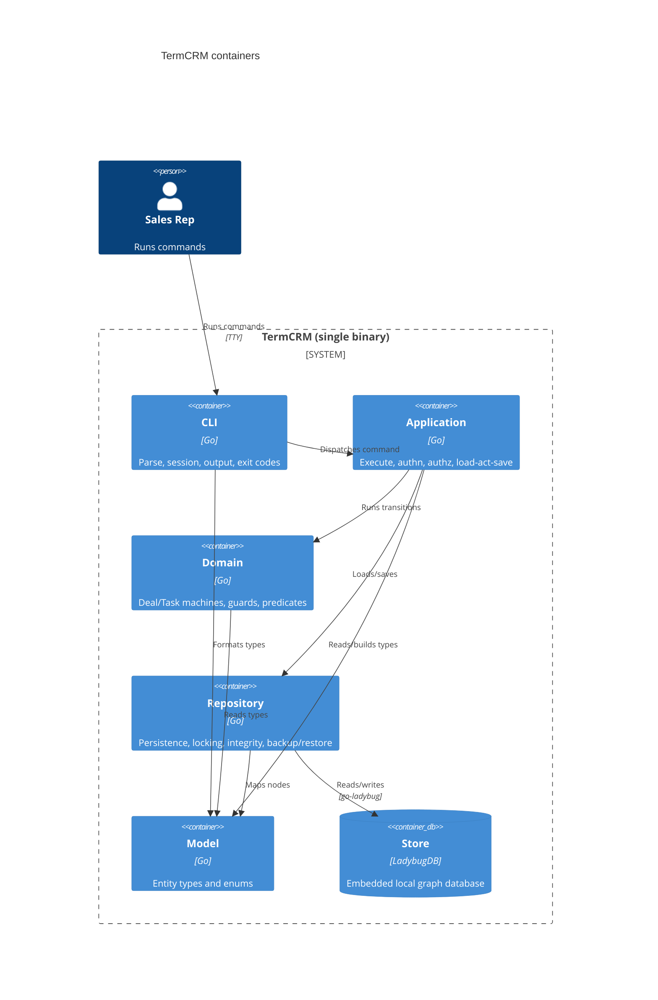

# TermCRM Architecture

Phase 2 of the machinery design. It fixes how the system is built and deployed and what each
dependency does when it fails. The source of truth for the model is `workspace.dsl`; this document
carries the narrative, the machine-checkable Architecture Contract, the interface contracts, the
dependency mitigation postures, the persistence-and-placement decisions, and the NFR record.

## 1. System context

TermCRM is a single self-contained command-line binary used by a small sales team (a few dozen
users at most) entirely from the terminal. There is no server and no network dependency. Four human
roles run it: `Admin`, `Manager`, `Sales Rep`, and `Read-only User`. All state lives locally in an
embedded graph database (LadybugDB, via `github.com/LadybugDB/go-ladybug`); the binary opens the
database file directly on each invocation.

## 2. Containers

One process, five code containers plus the embedded store:

- **CLI** (`cli`, Go): parses the command line, loads the caller's session, renders human-readable
  output, and maps outcomes to exit codes.
- **Application** (`app`, Go): the command-execution envelope. Opens the store, authenticates the
  session, authorizes the command, then runs the load-act-save loop: load the aggregate through the
  repository, run the pure domain transition, and persist through the repository.
- **Domain** (`domain`, Go): the Deal and Task state machines as pure transition functions, the
  guards, and the invariant predicates. It performs no I/O and imports only the model.
- **Repository** (`repo`, Go): the sole importer of `go-ladybug`. All graph access, optimistic
  version checks, the integrity check, and backup/restore live here.
- **Model** (`model`, Go): the entity types and enums shared by every layer. The one canonical data
  schema (see `domain.modelith.yaml`); no other layer restates it.
- **Store** (`store`, LadybugDB): the embedded local graph database, the state of record.

Container diagram (Mermaid C4; the DSL is the source of truth):



## 3. Technology stack and why

- **Go**, single statically linked binary: matches the "one self-contained command-line binary"
  requirement; easy to distribute; no runtime to install.
- **LadybugDB embedded** (`go-ladybug`): the mandated local graph database. Embedded (in-process),
  so there is no server and no network; the entities and their relationships map naturally onto a
  graph. Accessed only through `repo`.
- No web framework, no ORM, no message bus: none is needed for a local single-process CLI.

## 4. Deployment topology

A single binary on one operator's machine, opening one local database file. No replicas, no
operators, no HA, no orchestration. Multiple concurrent invocations are separate OS processes of the
same binary sharing the one database file; concurrency is handled by the store's write transaction
plus optimistic version checks (section 8), not by any coordinator. Backups are copies of the
database file produced by the `backup` command; restore replaces the file from a copy.

## 5. Architecture Contract

The machine-checkable twin of the narrative. `machinery_check.py --gate g2` verifies it against
`workspace.dsl`. `crm.repo` is the sole importer of the embedded store: an explicit `allow`
overrides the blanket `deny`, so any other layer importing `go-ladybug` is a G4-import violation.

```yaml
contract_version: 2
boundaries:
  - id: crm.cli
    kind: container
    element: cli
    code: [ "cmd/**", "internal/cli/**" ]
    exposes: [ "internal/cli/cli.go" ]
  - id: crm.app
    kind: container
    element: app
    code: [ "internal/app/**" ]
    exposes: [ "internal/app/app.go" ]
  - id: crm.domain
    kind: container
    element: domain
    code: [ "internal/domain/**" ]
    exposes: [ "internal/domain/domain.go" ]
  - id: crm.repo
    kind: container
    element: repo
    code: [ "internal/repo/**" ]
    exposes: [ "internal/repo/repo.go" ]
  - id: crm.model
    kind: container
    element: model
    code: [ "internal/model/**" ]
externals:
  - id: external.ladybug
    element: store
    imports: [ "github.com/LadybugDB/go-ladybug" ]
ignore:
  - "internal/testsupport/**"
dependency_rules:
  allow:
    - crm.cli    -> crm.app
    - crm.cli    -> crm.model
    - crm.app    -> crm.domain
    - crm.app    -> crm.repo
    - crm.app    -> crm.model
    - crm.domain -> crm.model
    - crm.repo   -> crm.model
    - crm.repo   -> external.ladybug
  deny:
    - "crm.* -> external.ladybug"
  notes:
    - "All graph access goes through crm.repo; it is the sole importer of go-ladybug."
    - "The domain layer is pure: it depends only on the model, never on repo or the store."
    - "The CLI never talks to the domain, the repo, or the store directly; it goes through the app."
```

## 6. Interface contracts at each boundary

For every relationship that crosses a boundary: request/response shape, enumerated errors (these
become the `onError` branches in Phase 3), and idempotency.

### cli -> app

- **shape**: `Command{ verb string, args map, actorUsername string (from the session file) } ->
  Result{ stdout string, exitCode int, err Error }`.
- **errors** (each maps to a distinct exit code): `AuthError`, `AuthzError`, `NotFoundError`,
  `ConflictError`, `CorruptError`, `ValidationError`, `InternalError`.
- **idempotency**: commands are not idempotent in general (a `create` makes a new record each time);
  read commands are naturally idempotent.

### app -> domain (pure, no I/O)

- **shape**: `DealTransition(current DealState, event DealEvent, ctx DealContext) ->
  (next DealState, actions []Action, err RejectedError)`; `TaskTransition(...)` identical in shape.
  Guards are pure boolean predicates `(ctx, event) -> bool`.
- **errors**: `RejectedError` when no guarded transition applies (an illegal move).
- **idempotency**: pure functions, trivially idempotent; no side effects.

### app -> repo

- **shape**: `Load<T>(id) -> (T, version uint64, err)` for each aggregate;
  `Save<T>(value T, expectedVersion uint64) -> err` (writes only if the stored version still equals
  `expectedVersion`, then bumps it); `Delete<T>(id, expectedVersion) -> err`; `Open() -> err`
  (opens the file and runs the integrity check); `Backup(path) -> err`; `Restore(path) -> err`.
- **errors**: `NotFoundError`, `ConflictError` (version mismatch: someone else wrote first),
  `CorruptError` (integrity check failed), `IOError`.
- **idempotency**: `Save`/`Delete` are idempotent under `(id, expectedVersion)`: replaying the same
  versioned write is a no-op or a `ConflictError`, never a double-apply. `Open`, `Backup` are
  read-only-safe to retry; `Restore` is idempotent in its effect (the file ends equal to the copy).

### repo -> store (external)

- **shape**: the `go-ladybug` node/edge API, wrapped so that no `go-ladybug` type escapes `repo`.
- **errors**: mapped onto the repo errors above (`ConflictError`, `CorruptError`, `IOError`).
- **idempotency**: the version-guarded write is the idempotency mechanism.

## 7. Dependency mitigation posture

For the one external dependency (the embedded store), the failure-and-mitigation posture that
Phase 3 turns into transitions. A mitigation reclassifies a failure; it does not delete it.

| dependency | failure modes | deployment mitigation | residual behavior the FSM must handle | bound | operator signal |
|---|---|---|---|---|---|
| `store` (LadybugDB) | write conflict (concurrent invocation wrote first), locked/busy, slow, file corruption, disk I/O error | none deployable (embedded, single local file); a `backup` command produces file copies and `restore` replaces from one | on a write: optimistic-version conflict -> bounded retry with backoff, then roll back the in-memory transition and politely refuse; on open: integrity failure -> abort loudly with restore instructions and make no writes | retries <= 3 (`MaxRetries`), backoff ~200 ms; write timeout 5 s | conflict-refused: non-zero exit + "another command changed this record, please retry"; corruption: distinct non-zero exit + "database corrupted, restore from backup with `crm restore <file>`" printed to stderr |

The store is the only Database/Queue/External-tagged element and the only contract external, so this
one row satisfies G2 mitigation coverage. The operator here is the user at the terminal; the
"operator signal" is the exit code plus the stderr message.

## 8. Persistence and placement

For every stateful component: how the Phase 3 machine is realized and how concurrent events are
serialized. In Go there is no cheap per-entity process, so aggregates use the explicit
persisted-state-plus-optimistic-lock pattern.

| component | machine placement | persistence | concurrency serialization |
|---|---|---|---|
| `Deal` | none; load-act-save loop in `crm.app`, transition function in `crm.domain` | a graph node carrying its `stage`, `amount`, `closedAt`, and a `version` property; rehydrated on load | optimistic lock: `Save` asserts the stored `version` is unchanged; on `ConflictError` the persist overlay retries with backoff up to `MaxRetries`, then rolls back and refuses |
| `Task` | none; load-act-save loop in `crm.app`, transition function in `crm.domain` | a graph node carrying its `status`, `dueDate`, and a `version` property | same optimistic lock plus bounded-retry-then-rollback overlay |
| `CommandExecution` | in-memory, one instance per CLI invocation, in `crm.app` | none (transient); reads the local session file, opens the store | one OS process per invocation; the store's write transaction serializes committing writers, and the optimistic version check turns a lost race into a `ConflictError` the aggregate overlay handles |
| `Company` (no machine: pure CRUD, no lifecycle) | none; direct create/update/delete in `crm.app` | a graph node with a `version` property | optimistic lock on write |
| `Contact` (no machine: pure CRUD, no lifecycle) | none; direct create/update/delete in `crm.app` | a graph node with a `version` property | optimistic lock on write |
| `Interaction` (no machine: append-only log, no lifecycle) | none; log/delete only in `crm.app` | an immutable graph node | create and delete only; no in-place update |
| `User` (no machine: the active flag is a boolean, not a lifecycle) | none; direct mutations in `crm.app` | a graph node with a `version` property | optimistic lock on write |
| `Team` (no machine: pure CRUD, no lifecycle) | none; direct create/rename in `crm.app` | a graph node with a `version` property | optimistic lock on write |

## 9. Event-contract table

N/A, with reason. TermCRM is a single process with no message bus and no cross-component
asynchronous events. Every boundary crossing in section 6 is a synchronous in-process function call,
and the only external is the embedded store behind `crm.repo`. No machine consumes an external bus
event, so there is no choreography and no redelivery to govern. Coupling that would be invisible to
import analysis (shared DB tables, bus topics) does not exist here: the store is reached only through
`crm.repo`, which the Architecture Contract enforces.

## 10. NFR record

- **Security posture**: authentication is username plus password; the password is verified against a
  non-reversible hash (a memory-hard KDF such as argon2id or bcrypt) and the plaintext is never
  stored (invariant `password-not-recoverable`). A deactivated user cannot open a session (invariant
  `deactivated-cannot-login`). Authorization is role-based (`Admin`, `Manager`, `Rep`, `ReadOnly`)
  plus ownership and team scoping (invariant `access-scope`); only a manager or admin may move
  ownership (invariant `reassign-role`). Secret handling: the session file and the database file are
  created with owner-only permissions (0600); no secret is logged.
- **Capacity assumptions**: thousands of records, not millions; a few dozen users total; a handful of
  concurrent invocations at most. Correctness is prioritized over speed. Interactive latency budget:
  a command should complete well under a second in the normal case; the write timeout is 5 s before a
  persist attempt is treated as failed.
- **Observability**: this is a local CLI, so the operator is the user and the signal is the process
  exit code plus stderr. Every command result maps to a distinct exit code (section 6). Two residual
  failure states must be loud: a conflict refusal after exhausted retries prints "another command
  changed this record, please retry" with a non-zero exit; a corrupted-store detection prints
  "database corrupted, restore from backup with `crm restore <file>`" with a distinct non-zero exit
  and makes no writes. There is no metrics backend; there is nothing to alert to beyond the terminal.
