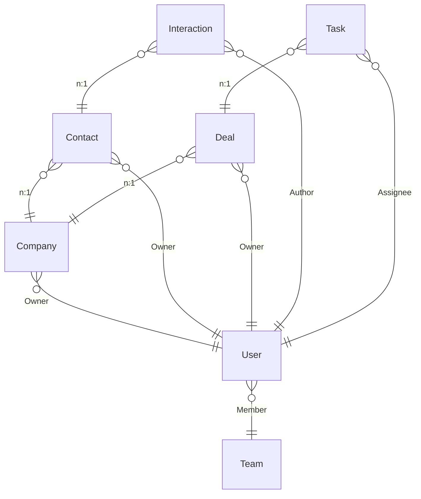
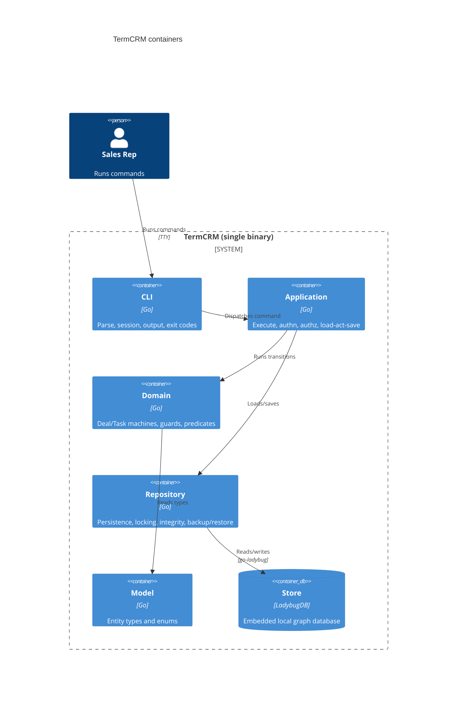

# BUILD: TermCRM

Mode: full (self-contained).

This is the single build blueprint. A coding agent with no prior context can implement TermCRM from
this document under hard TDD. It inlines every term, invariant, and contract it uses and references
the `design/` source files for full detail. Two artifact classes are never pasted here: the machine
JSON (section 5 references the files) and the transition tables (section 7 references the generated
oracles); those files are what the deterministic gates check.

## 1. Purpose and scope

TermCRM is a customer-relationship manager for a small sales team (a few dozen users at most), used
entirely from the terminal as a single self-contained command-line binary written in Go. It tracks
the companies the team sells to, the contacts at those companies, the deals it is trying to close,
the tasks people must get done, and an append-only log of interactions. All state lives locally in
an embedded graph database (LadybugDB, `github.com/LadybugDB/go-ladybug`). There is no server and no
network dependency. It exists so a sales team can keep and work its pipeline offline, on one machine,
with correctness prioritized over speed.

In scope: local multi-user accounts with roles, sessions that survive across command invocations,
CRUD on companies/contacts/deals/tasks, the deal pipeline lifecycle, the task lifecycle, an
append-only interaction log, optimistic-locked concurrent writes, and backup/restore.

Out of scope: email integration, a web UI, imports, multi-machine sync, and any reporting beyond
simple listing.

## 2. Glossary

The ubiquitous language. Source: `design/domain.modelith.yaml`.

- **User**: a person who operates the system, identified by a unique username and authenticated by a
  password stored only as a non-reversible hash. Holds one role; may be active or deactivated.
- **Admin / Manager / Rep / ReadOnly**: the four user roles. Admin may act on anything. Manager reads
  and writes their team's records. Rep owns and works their own records and reads across their team.
  ReadOnly may only read.
- **Team**: a named group of users, used to scope read access.
- **Company**: an organization the team sells to; owned by one user.
- **Contact**: a person at a company; belongs to one company; owned by one user.
- **Deal**: an opportunity with a company; moves through an ordered pipeline and ends Won or Lost;
  carries a non-negative money amount.
- **Task**: a unit of work with a due date and an assignee; created, worked, then finished or
  abandoned.
- **Interaction**: an append-only record of a touch with a contact (Call, Meeting, Email, Note);
  corrected only by deleting and re-logging.
- **Owner**: the user who owns a Company, Contact, or Deal. **Assignee**: the user responsible for a
  Task. **Author**: the user who logged an Interaction. **Member**: a user who belongs to a Team.
- **Stage**: the Deal pipeline position (Prospecting, Qualification, Proposal, Negotiation, Won,
  Lost). **Status**: the Task lifecycle state (Open, InProgress, Done, Abandoned).

## 3. Domain model (the what)

Source of truth: `design/domain.modelith.yaml` (lints clean, 0 errors / 0 warnings). Rendered prose
and diagrams: `design/domain.modelith.md`.

### Entities and relationships

### Data dictionary (the one canonical schema)

The architecture and machines reference these attributes; they never restate them. Every persisted
node also carries a `version uint64` used for the optimistic lock (see section 4).

- **User**: `id string`, `username string` (unique), `passwordHash string` (non-reversible),
  `role UserRole`, `active boolean`, plus `teamId` (Member -> Team).
- **Team**: `id string`, `name string` (unique).
- **Company**: `id string`, `name string`, `domain string`, plus `ownerId` (Owner -> User).
- **Contact**: `id string`, `name string`, `email string`, `phone string`, plus `companyId`
  (-> Company) and `ownerId` (Owner -> User).
- **Deal**: `id string`, `name string`, `amount integer` (cents, never negative), `stage DealStage`,
  `closedAt timestamp` (set at Won/Lost, else unset), plus `companyId` (-> Company) and `ownerId`
  (Owner -> User).
- **Task**: `id string`, `title string`, `dueDate timestamp`, `status TaskStatus`, plus `assigneeId`
  (Assignee -> User) and optional `dealId` (-> Deal).
- **Interaction**: `id string`, `kind InteractionKind`, `occurredAt timestamp`, `body string`, plus
  `contactId` (-> Contact) and `authorId` (Author -> User). Immutable.

Enums: `UserRole = {Admin, Manager, Rep, ReadOnly}`; `DealStage = {Prospecting, Qualification,
Proposal, Negotiation, Won, Lost}` (first four are open, in order; last two terminal);
`TaskStatus = {Open, InProgress, Done, Abandoned}`; `InteractionKind = {Call, Meeting, Email, Note}`.

### Invariants (non-negotiable rules, by id)

- `username-unique` (User): every User has a username unique across all users.
- `password-not-recoverable` (User): a User password is stored only as a non-reversible hash.
- `deactivated-cannot-login` (User): a User whose `active` is false cannot open a session.
- `rep-one-team` (User): every User with role Rep references exactly one Team.
- `access-scope` (User): a Rep reads/writes only records they own and reads across their Team; a
  Manager reads/writes their Team's records; an Admin may access everything; a ReadOnly user may
  only read.
- `team-name-unique` (Team): every Team has a name unique across all teams.
- `company-has-owner` (Company): every Company has exactly one owning User.
- `contact-in-company` (Contact): every Contact belongs to exactly one Company.
- `deal-amount-non-negative` (Deal): a Deal amount is never negative.
- `deal-forward-only` (Deal): a Deal stage only advances to the next open stage, closes to Won or
  Lost, or is reopened to Negotiation; it never otherwise moves backward.
- `deal-won-has-close-date` (Deal): a Deal in stage Won has a recorded `closedAt`.
- `deal-reopen-role` (Deal): only a Manager or Admin may reopen a closed Deal.
- `deal-reopen-to-negotiation` (Deal): reopening a closed Deal returns it to Negotiation.
- `task-has-assignee` (Task): every Task references exactly one Assignee.
- `task-has-due-date` (Task): every Task has a due date.
- `task-terminal-closed` (Task): a Task in Done or Abandoned accepts no further lifecycle actions.
- `interaction-append-only` (Interaction): an Interaction is immutable; correction is delete + re-log.
- `reassign-role` (model-level): only a Manager or Admin may change the owner of a Company, Contact,
  or Deal.

## 4. Architecture (the how)

Source: `design/workspace.dsl` and `design/ARCHITECTURE.md`. One process, five code boundaries plus
the embedded store.

### Containers and technology

- **crm.cli** (Go): parse the command line, load the session, render output, map outcomes to exit
  codes.
- **crm.app** (Go): the command-execution envelope (open, authenticate, authorize, execute) and the
  load-act-save orchestration.
- **crm.domain** (Go): the Deal and Task machines as pure transition functions, guards, predicates.
  No I/O.
- **crm.repo** (Go): the sole importer of `go-ladybug`; all graph access, optimistic version checks,
  the integrity check, backup and restore.
- **crm.model** (Go): entity types and enums (the schema in section 3). No dependencies.
- **store** (LadybugDB): the embedded local graph database, state of record.

### Deployment topology

A single binary on one operator's machine opening one local database file. No replicas, operators,
or HA. Concurrent invocations are separate OS processes sharing the one file; concurrency is handled
by the store's write transaction plus optimistic `version` checks, not by any coordinator. Backups
are file copies produced by `crm backup`; `crm restore` replaces the file from a copy.

### Architecture Contract (boundaries + dependency rules)

The coding agent must not introduce cross-boundary dependencies outside `allow`; `crm.repo` is the
sole importer of the store. G4-import enforces this against the code. Full contract:
`design/ARCHITECTURE.md` section 5.

- Boundaries: `crm.cli` (`cmd/**`, `internal/cli/**`), `crm.app` (`internal/app/**`), `crm.domain`
  (`internal/domain/**`), `crm.repo` (`internal/repo/**`), `crm.model` (`internal/model/**`).
- External: `external.ladybug` = `github.com/LadybugDB/go-ladybug`, imported only by `crm.repo`.
- Allowed edges: cli->app, cli->model, app->domain, app->repo, app->model, domain->model,
  repo->model, repo->external.ladybug. Everything else denied; `crm.* -> external.ladybug` is denied
  except the explicit repo allow.

### Interface contracts (feed the contract tests)

Full detail in `design/ARCHITECTURE.md` section 6. Summary:

- **cli -> app**: `Command{verb, args, actorUsername} -> Result{stdout, exitCode, err}`. Errors:
  AuthError, AuthzError, NotFoundError, ConflictError, CorruptError, ValidationError, InternalError.
  Not idempotent in general.
- **app -> domain** (pure): `DealTransition(state, event, ctx) -> (next, actions, RejectedError)`;
  `TaskTransition(...)` likewise; guards are pure `(ctx, event) -> bool`. Trivially idempotent.
- **app -> repo**: `Load<T>(id) -> (T, version, err)`, `Save<T>(value, expectedVersion) -> err`
  (writes only if the stored version is unchanged, then bumps it), `Delete<T>(id, expectedVersion)`,
  `Open() -> err` (opens + integrity check), `Backup(path)`, `Restore(path)`. Errors: NotFoundError,
  ConflictError, CorruptError, IOError. `Save`/`Delete` idempotent under `(id, expectedVersion)`.
- **repo -> store**: the `go-ladybug` API, wrapped so no store type escapes `crm.repo`.

### Event-contract table

N/A: single process, no message bus, no cross-component asynchronous events, no choreography. The
only external is the embedded store reached only through `crm.repo`. See `design/ARCHITECTURE.md`
section 9.

### Persistence and placement

Full table in `design/ARCHITECTURE.md` section 8. `Deal` and `Task` are persisted aggregates
realized as pure transition functions in `crm.domain` with the load-act-save loop in `crm.app`;
each is a graph node carrying its lifecycle attribute plus a `version`. Concurrency is an optimistic
lock: `Save` asserts the stored `version` is unchanged; on `ConflictError` the persist overlay
retries with backoff up to `MaxRetries` (3), then rolls back and refuses. `CommandExecution` is
in-memory per invocation. Company, Contact, Interaction, User, Team are pure CRUD / flag flips with
no lifecycle machine (waived in the placement table).

### NFR record

Full detail in `design/ARCHITECTURE.md` section 10. Security: username + password verified against a
memory-hard hash (argon2id or bcrypt), plaintext never stored; deactivated users cannot log in;
role + ownership + team authorization; session and database files created 0600; no secrets logged.
Capacity: thousands of records, a few dozen users, a handful of concurrent invocations; correctness
over speed; sub-second typical latency, 5 s write timeout. Observability: the operator is the user;
the signal is the process exit code plus stderr; a conflict refusal and a corruption detection each
print a distinct loud message with a distinct non-zero exit.

## 5. Behavior: the state machines (the logic)

Three machines. Do not paste the JSON; the files are the source and the gates lint them there.

### Deal (`design/machines/Deal.machine.json`)

A deal starts Prospecting and advances Qualification -> Proposal -> Negotiation, or is won or lost
from any open stage. Every state change is written through the persist overlay: the transition sets
a `pending` target and `prior` stage, invokes `persist`, and on success commits to `pending`; on a
retriable conflict it retries with backoff up to `MaxRetries`, then rolls back to `prior` and
refuses. A won or lost deal records `closedAt`. A closed deal may be reopened only by a Manager or
Admin (`canReopen`), which returns it to Negotiation. Nothing else moves it backward.

Named-unit contracts and failure catalog: `design/machines/Deal.matrix.md`. Every guard, action, and
actor the machine fires has a row there (14 guards, 7 actions, 1 actor), each with signature,
pre/post, maps-to (invariant id or C4 relationship), test type, and fixture. The `persist` actor is
an integration/side-effect contract (idempotent by `(dealId, version)`), not derivable from
transition tests.

### Task (`design/machines/Task.machine.json`)

A task starts Open, is started to InProgress, then completed to Done or abandoned to Abandoned (an
open task may also be abandoned directly). Done and Abandoned are terminal and accept nothing
further. Every change goes through the same persist overlay (retry-then-rollback) as Deal.

Named-unit contracts and failure catalog: `design/machines/Task.matrix.md` (7 guards, 5 actions,
1 actor, plus the create-time predicates `taskHasAssignee` and `taskHasDueDate`).

### CommandExecution (`design/machines/CommandExecution.machine.json`, `_role: operational`)

The operational envelope for one CLI invocation: open the store (integrity check), authenticate the
session, authorize the command, execute the domain operation, then terminate in one of five final
states: done, rejected (authz denied or an illegal domain move), refused (a write conflict the
aggregate could not resolve, or an execute timeout), failedCorrupt (the store is corrupt: abort
loudly with restore instructions), failedError (an unexpected IO error or timeout). It runs no retry
loop of its own; the bounded retry lives in the aggregate persist overlay.

Named-unit contracts and failure catalog: `design/machines/CommandExecution.matrix.md` (5 guards,
5 entry actions, 4 actors). `sessionActive` enforces `deactivated-cannot-login`; `permitted`
enforces `access-scope`.

## 6. Traceability matrix

Every invariant from section 3, its enforcement point, its component, its interface contract, and the
test id(s) that cover it. Machine-enforced rows cite oracle STABLE ids (section 7); the rest cite
named property or contract tests.

| invariant id | enforced by (guard / structural) | in component | interface contract | test id(s) |
|---|---|---|---|---|
| `username-unique` | structural: unique-username check before create | crm.app, crm.repo | app->repo Save (unique key) | PROP-username-unique |
| `password-not-recoverable` | action: hash on create / changePassword; never store plaintext | crm.app, crm.model | app->repo Save (hash only) | PROP-password-not-recoverable |
| `deactivated-cannot-login` | guard `sessionActive` | crm.app (CommandExecution) | app session-file read | COMM-9fe39b, COMM-a958de |
| `rep-one-team` | structural: a Rep's `teamId` is required and single | crm.app, crm.model | app->repo Load/Save | PROP-rep-one-team |
| `access-scope` | guard `permitted` | crm.app (CommandExecution) | app->repo scope read | COMM-70240a, COMM-913535 |
| `team-name-unique` | structural: unique-name check on create / rename | crm.app, crm.repo | app->repo Save (unique key) | PROP-team-name-unique |
| `company-has-owner` | structural: create sets exactly one owner | crm.app | app->repo Save | PROP-company-has-owner |
| `contact-in-company` | structural: create requires a company | crm.app | app->repo Save | PROP-contact-in-company |
| `deal-amount-non-negative` | guard `amountNonNegative` (create, updateAmount) | crm.domain, crm.app | app->domain create/update | PROP-deal-amount-non-negative |
| `deal-forward-only` | structural: the Deal graph + `setPendingAdvance`/`commit`; formal `StageForward` | crm.domain | app->domain transition | DEAL-baf45f, DEAL-be9325, DEAL-275c4a, PROP-deal-forward-only |
| `deal-won-has-close-date` | action `recordClose`; formal `Inv_CloseDate` | crm.domain | app->domain win | DEAL-798b5a |
| `deal-reopen-role` | guard `canReopen` | crm.domain | app->domain reopen | DEAL-e5780c, DEAL-ed5b89, T-DEAL-REOPEN-ROLE-falsify |
| `deal-reopen-to-negotiation` | action `setPendingReopen` + structural commit route | crm.domain | app->domain reopen | DEAL-e5780c, DEAL-dc6531 |
| `task-has-assignee` | guard `taskHasAssignee` (create) | crm.domain, crm.app | app->domain create | PROP-task-has-assignee |
| `task-has-due-date` | guard `taskHasDueDate` (create) | crm.domain, crm.app | app->domain create | PROP-task-has-due-date |
| `task-terminal-closed` | structural: Done and Abandoned are `final` | crm.domain | app->domain transition | TASK-007103, TASK-d893c2 |
| `interaction-append-only` | structural: only log / delete, no update action | crm.app, crm.repo | app->repo create/delete | PROP-interaction-append-only |
| `reassign-role` | guard `canReassign` on reassign (Company, Contact, Deal) | crm.app, crm.domain | app->domain reassign | PROP-reassign-role |

No invariant is left unenforced. The structural rows (`deal-forward-only`, `task-terminal-closed`,
`interaction-append-only`, `company-has-owner`, `contact-in-company`, `rep-one-team`,
`username-unique`, `team-name-unique`) are made impossible by the graph shape or the schema rather
than by a runtime guard; they are still property-tested (section 7).

## 7. Test specification (the hard-TDD oracle)

The transition test spec IS the generated `design/machines/<Component>.oracle.md` files:
`Deal.oracle.md` (29 rows), `Task.oracle.md` (14 rows), `CommandExecution.oracle.md` (17 rows).
Do not restate the transition tables. Each row is one table-driven test case: given source + context
+ trigger + guard, expect the target and the actions. **Tests key on the STABLE id** (e.g.
`DEAL-798b5a`), never the sequential test id: row numbers renumber when the design changes, stable
ids survive unrelated insertions and change only when that transition's stimulus changes.

BUILD.md adds what the oracles cannot derive:

### 7.1 Guard-branch completeness (falsifying-clause tests)

For each conjunction guard, one test per falsifying clause, each expecting the rejection path.

- `sessionActive` = (session present) AND (session unexpired) AND (user.active). Three falsifying
  tests, each expecting `authenticating -> rejected` (`COMM-a958de`):
  - T-COMM-SESSION-a: no session file present.
  - T-COMM-SESSION-b: session present but expired.
  - T-COMM-SESSION-c: session valid but the user's `active` is false (this is
    `deactivated-cannot-login`).
- `permitted` = (role allows the verb) AND (ownership or team scope allows the target). Falsifying
  tests, each expecting `authorizing -> rejected` (`COMM-913535`):
  - T-COMM-SCOPE-a: a Rep attempts to write a record they do not own.
  - T-COMM-SCOPE-b: a ReadOnly user attempts any mutation.
  - T-COMM-SCOPE-c: a Manager attempts to act on another team's record.
- `canReopen` = (actor role is Manager) OR (actor role is Admin). Its falsifying case is neither:
  - T-DEAL-REOPEN-ROLE-falsify: a Rep attempts `reopen` on a Won or Lost deal; the guard fails and
    the reopen does not fire (the command returns AuthzError). Covers `deal-reopen-role`.
- `amountNonNegative` = (amount >= 0). Falsifying:
  - T-DEAL-AMOUNT-falsify: create or updateAmount with a negative amount is rejected
    (ValidationError). Covers `deal-amount-non-negative`.

### 7.2 Named-unit test plan

Per the matrix files (section 5), each guard/action/actor has a test type and fixture:

- Guards and pending/prior/commit actions: unit tests, no fixture (pure functions over context).
- `recordClose`: unit test with a fake clock.
- `canReopen`, `sessionActive`, `permitted`: unit tests with fake actor/session/role fixtures.
- The `persist` actors (Deal, Task) and the `openDb`/`loadSession`/`checkScope`/`execute` actors:
  integration tests. `persist` idempotency (writes once per `(id, version)`) is a side-effect
  contract tested against a contract-tested LadybugDB fake plus one real-store test; it is not
  derivable from transition tests. `openDb` corruption detection is tested against a deliberately
  corrupted fixture file.

### 7.3 Contract tests (per boundary) and property tests (per invariant)

- Contract tests for each boundary in section 4: cli->app result/exit-code mapping; app->repo
  Save/Load/Delete under version guards (including the ConflictError on a stale version); repo->store
  error mapping (ConflictError, CorruptError, IOError).
- Property tests, one per invariant, named `PROP-<invariant-id>` in section 6. Each generates random
  valid and invalid inputs and asserts the invariant holds (or the operation is rejected). The
  machine-enforced invariants also have their formal proofs: `deal-forward-only` and
  `deal-won-has-close-date` are proved by `DealData.tla` (`StageForward`, `Inv_CloseDate`) and the
  overlay liveness by `Deal.tla`/`Task.tla`/`CommandExecution.tla` (`Live_OverlayResolves`).

`@xstate/graph` covering-path generation is not used (Go implementation); multi-step path coverage is
obtained by composing per-transition tests along the oracle rows.

## 8. State migration

`Deal` and `Task` persist their lifecycle attribute (`stage` / `status`) and a `version` on each
graph node (placement table, section 4). Because this is a greenfield design, there are **no
persisted instances yet**: the first deployment starts from an empty store, so no migration is
required for the initial build.

Protocol for future lifecycle changes (record it now so it is not improvised later): when a state is
renamed, split, or removed, ship with the change either (a) a mapping table from each old persisted
`stage`/`status` value to its new state, applied as a one-time migration over every node on `Open()`,
or (b) an explicit drain rule for in-flight instances (there are none here, since aggregates are
load-act-save with no long-lived in-memory instances). The overlay states (persisting, persistRetry,
rolledBack) are never persisted: they exist only within a single command's execution, so renaming
them needs no migration. Regenerate the oracles after any machine change and use the stable-id diff
(section 11) as the affected-test list.

## 9. (folded into sections 4 and 5)

Architecture and behavior are covered in sections 4 and 5; no separate content. Not omitted, just not
duplicated.

## 10. Language realization notes

Target language: Go (a single statically linked binary).

- The Deal and Task machines become explicit state fields plus a transition function in `crm.domain`:
  `func DealTransition(cur DealState, ev DealEvent, ctx DealContext) (DealState, []Action, error)`,
  implemented as a switch over `(cur, ev)` that returns the next state, the ordered actions, and a
  `RejectedError` when no guarded branch applies. The overlay (persisting/persistRetry/rolledBack) is
  driven by `crm.app`: it calls the transition to get `pending`, invokes `repo.Save` under the
  version guard, and on `ConflictError` loops with backoff up to `MaxRetries` before rolling back.
- Persistence uses the explicit persisted-state-plus-optimistic-lock pattern: each node stores its
  lifecycle attribute and a `version uint64`; `Save` is `WHERE version = expected` semantics on the
  graph node, bumping the version on success. There is no per-entity process (Go has no cheap actor);
  each command is load-act-save.
- CommandExecution is a straight-line function in `crm.app` returning one of the five outcomes; no
  library is needed.
- Do not pull in a state-machine library; the machines are small and the switch is clearer. A library
  would have to earn its place and does not here.

### Toolchain and versions

Pin the environment so two implementing agents cannot diverge:

- Go 1.23.x (set `go 1.23` in `go.mod`; build with the matching toolchain).
- `github.com/LadybugDB/go-ladybug`: pin the exact version in `go.mod` / `go.sum` (commit the
  lockfile); it is imported only by `crm.repo`.
- Password hashing: `golang.org/x/crypto` (argon2 or bcrypt), pinned in `go.mod`.
- Tests: the standard library `testing` package; property tests via `testing/quick` (standard
  library) so no extra dependency is required. Table-driven transition tests read the oracle rows.
- Lint / vet: `go vet` and `golangci-lint` (pin the version in CI).
- Design gates (run from the repo root; the design lives in `design/`):
  - `python3 <machinery-tools>/oracle_gen.py design/machines` (regenerate oracles after any machine
    edit; commit them).
  - `python3 <machinery-tools>/machinery_check.py design --impl .` (all gates, including G4-import
    once code exists; needs PyYAML, e.g. `uv run --with pyyaml -- python3 ...`).
  - `bash <machinery-tools>/verify_formal.sh design` (regenerate and TLC-check the formal suite;
    needs Java 11+).

## 11. Hard-TDD protocol (read this before writing any code)

1. A test-writer agent reads sections 6 and 7 and writes the full test suite from the spec, keying
   every transition test on the oracle STABLE id (e.g. `DEAL-798b5a`), plus the falsifying-clause
   tests (7.1), the named-unit tests (7.2), and the contract and property tests (7.3).
2. The tests are then LOCKED. The implementer agent may not modify them to make them pass.
3. The implementer writes the code in `crm.model`, `crm.repo`, `crm.domain`, `crm.app`, `crm.cli`
   until the locked tests pass, honoring the Architecture Contract (no cross-boundary edge outside
   `allow`; `crm.repo` the sole importer of `go-ladybug`).
4. Every oracle row has a test keyed on its stable id. Every guard-conjunction clause has its
   falsifying test (7.1). Every invariant in section 3 is property-tested (7.3). Coverage target:
   at least 80% combined unit + integration; unit tests may use fakes, integration tests must run
   against the real store; no mocks in integration or E2E.
5. Generated tests (from the oracles) live apart from hand-written tests (a `_generated_test.go`
   suffix or a `test/generated/` directory), so regenerating them on a design change never clobbers
   hand-written ones.
6. If a test is wrong, that is a design defect: stop, fix the design and this BUILD.md, rerun
   `oracle_gen.py` and `machinery_check.py`, and regenerate the affected tests. The stable-id diff
   between the old and new oracle is the affected-test list. Do not "adjust" a test to pass.

## 12. Open questions and residual risks

- **Embedded store has no deployable HA mitigation.** The store is a single local file; the only
  recovery from corruption is `restore` from a backup. Residual risk: data written since the last
  backup is lost on corruption. Mitigation offered: `crm backup` / `crm restore`, plus the loud
  `failedCorrupt` abort so corruption is never silently worked around. Recommend the user schedule
  regular backups; that scheduling is out of scope.
- **Concurrency model assumes the store enforces single-writer semantics.** The optimistic
  `version` guard and the retry-then-refuse overlay assume `Save` fails with a distinguishable
  `ConflictError` when the version moved. If `go-ladybug` cannot provide a compare-and-set write,
  the repo must emulate it inside a store write transaction; verify this against the library before
  the walking skeleton (section 13 below) and record the mechanism.
- **`closedAt` on Lost.** The model records `closedAt` on both Won and Lost for symmetry; only
  `deal-won-has-close-date` is an invariant. If the product later wants a distinct lost-date, add an
  attribute rather than overloading `closedAt`.
- **No audit trail of who changed what** beyond the append-only Interaction log, which is a
  deliberate scope choice, not an oversight.

## 13. Build plan

1. **Walking skeleton (thinnest end-to-end slice through one real boundary).** `crm login` then
   `crm deal create` then `crm deal advance`: parse (cli) -> authenticate + authorize (app,
   CommandExecution) -> Deal transition (domain) -> `repo.Save` under the version guard (repo ->
   store). Prove the topology, the session file, and one real optimistic-locked write before adding
   breadth. Definition of done: the Deal advance oracle rows (`DEAL-baf45f` then `DEAL-07bddb`) pass
   against a real store; a forced version conflict drives the persist overlay to `refused`.
2. **Deal lifecycle slice**: all Deal transitions and guards, `deal-forward-only`,
   `deal-won-has-close-date`, `deal-reopen-role`, `deal-reopen-to-negotiation`,
   `deal-amount-non-negative`; green before the next slice.
3. **Task lifecycle slice**: all Task transitions, `task-*` invariants.
4. **Accounts and access slice**: User/Team CRUD, sessions, `deactivated-cannot-login`,
   `access-scope`, `reassign-role`, `username-unique`, `rep-one-team`, hashing.
5. **CRUD slices**: Company, Contact (`company-has-owner`, `contact-in-company`,
   `team-name-unique`), then the append-only Interaction log (`interaction-append-only`).
6. **Operations slice**: `backup` / `restore`, the corruption abort path (`failedCorrupt`).

Definition of done per milestone: all its oracle transitions covered, all its invariants
property-tested, its contract tests green, no cross-boundary violation (G4-import clean), and the
formal suite still green.
