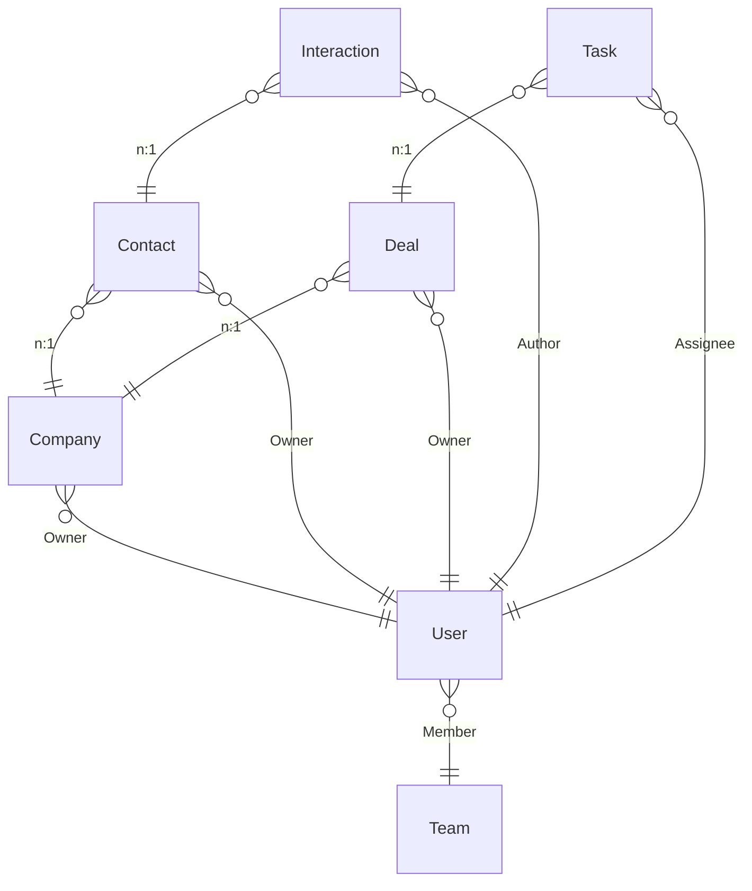

{/* Generated by `modelith render`. Do not edit by hand; edit the .modelith.yaml source and re-render. */}

# TermCRM Domain Model

A terminal CRM for a small sales team. It tracks the companies a team sells to, the contacts at those companies, the deals it is trying to close, the tasks people must get done, and an append-only log of interactions. All state lives locally in an embedded graph database; a single command-line binary is the only interface.

## Glossary

- **`Admin`** - A `User` with role Admin. May perform any action on any record and operates the system.
- **`Assignee`** - The `User` responsible for completing a `Task`.
- **`Author`** - The `User` who logged an `Interaction`.
- **`Manager`** - A `User` with role Manager. Reads and writes the records of their own `Team`.
- **`Member`** - A `User` who belongs to a `Team`.
- **`Owner`** - The `User` who owns a record (a `Company`, `Contact`, or `Deal`) and is entitled to work it.
- **`ReadOnly`** - A `User` with role ReadOnly. May read records for reporting but perform no mutations.
- **`Rep`** - A sales `User` with role Rep. Owns and works their own records and reads across their `Team`.

## Enums

### `DealStage`

Where a `Deal` sits in the sales pipeline. The first four are open stages, in order; the last two are terminal outcomes.

| Value | Definition |
| --- | --- |
| `Prospecting` | First contact has been made; the opportunity is unqualified. |
| `Qualification` | The opportunity has been qualified as real and worth pursuing. |
| `Proposal` | A proposal or quote is in front of the customer. |
| `Negotiation` | Terms are being negotiated; the last open stage before an outcome. |
| `Won` | The deal closed successfully. Terminal. Records when it closed. |
| `Lost` | The deal closed unsuccessfully. Terminal. |

### `InteractionKind`

What kind of touch an `Interaction` records.

| Value | Definition |
| --- | --- |
| `Call` | A phone call. |
| `Meeting` | An in-person or video meeting. |
| `Email` | An email exchange. |
| `Note` | A free-form note. |

### `TaskStatus`

The lifecycle state of a `Task`.

| Value | Definition |
| --- | --- |
| `Open` | Created but not yet started. |
| `InProgress` | Being worked on. |
| `Done` | Finished successfully. Terminal. |
| `Abandoned` | Given up without completing. Terminal. |

### `UserRole`

The authority a `User` holds over records.

| Value | Definition |
| --- | --- |
| `Admin` | Full access to every record and every administrative action. |
| `Manager` | Read and write access to the records of the manager's own `Team`. |
| `Rep` | Owns and works their own records; reads across their `Team`. |
| `ReadOnly` | Read-only access for reporting. |

## Entities

### `Company`

An organization the team sells to. A company is owned by one user and may have many contacts and deals. It is a customer account, distinct from a `Team`, which is an internal grouping.

**Relationships**

- `User` - n:1 - `Owner` - The user who owns and works this company.

**Attributes**

| Name | Type | Description |
| --- | --- | --- |
| `id` | string | Stable unique identifier. |
| `name` | string | Company name. |
| `domain` | string | Primary web domain, for disambiguation. |

**Actions**

- `create` - actor `Rep`; preserves access-scope, company-has-owner - Create a company owned by the creating user.
- `update` - actor `Owner`; preserves access-scope - Edit company fields.
- `delete` - actor `Manager`; preserves access-scope - Remove a company.
- `reassign` - actor `Manager`; preserves reassign-role, company-has-owner - Move ownership of the company to another user.

**Invariants**

- **company-has-owner** - Every `Company` has exactly one owning `User`.

### `Contact`

A person the team talks to at a `Company`. A contact belongs to one company and is owned by one user. A contact is a customer-side person, never an operator of this system (that is a `User`).

**Relationships**

- `Company` - n:1 - The company this contact works at.
- `User` - n:1 - `Owner` - The user who owns and works this contact.

**Attributes**

| Name | Type | Description |
| --- | --- | --- |
| `id` | string | Stable unique identifier. |
| `name` | string | Contact's full name. |
| `email` | string | Contact email address. |
| `phone` | string | Contact phone number. |

**Actions**

- `create` - actor `Rep`; preserves access-scope, contact-in-company - Create a contact under a company, owned by the creating user.
- `update` - actor `Owner`; preserves access-scope - Edit contact fields.
- `delete` - actor `Manager`; preserves access-scope - Remove a contact.
- `reassign` - actor `Manager`; preserves reassign-role - Move ownership of the contact to another user.

**Invariants**

- **contact-in-company** - Every `Contact` belongs to exactly one `Company`.

### `Deal`

An opportunity the team is trying to close with a `Company`. A deal moves through an ordered sales pipeline and ends Won or Lost. It carries a money amount that is never negative. A deal is the sellable opportunity, distinct from the `Company` it is with and the `Task`s that track work on it.

**Relationships**

- `Company` - n:1 - The company this deal is with.
- `User` - n:1 - `Owner` - The user who owns and works this deal.

**Attributes**

| Name | Type | Description |
| --- | --- | --- |
| `id` | string | Stable unique identifier. |
| `name` | string | Short description of the opportunity. |
| `amount` | integer | Deal value in the smallest currency unit (cents). Never negative. |
| `stage` | DealStage | Current pipeline stage. This is the lifecycle. |
| `closedAt` | timestamp | When the deal closed. Set when the deal reaches Won (and Lost); unset while open. |

**Actions**

- `create` - actor `Rep`; preserves deal-amount-non-negative, access-scope - Create a deal in stage Prospecting with a non-negative amount, owned by the creator.
- `advance` - actor `Owner`; preserves deal-forward-only - Move the deal to the next open stage. Not defined from Negotiation.
- `win` - actor `Owner`; preserves deal-forward-only, deal-won-has-close-date - Close the deal as Won from any open stage; records closedAt.
- `lose` - actor `Owner`; preserves deal-forward-only - Close the deal as Lost from any open stage; records closedAt.
- `reopen` - actor `Manager`; preserves deal-forward-only, deal-reopen-role, deal-reopen-to-negotiation - Reopen a closed deal back to Negotiation. Manager or Admin only.
- `updateAmount` - actor `Owner`; preserves deal-amount-non-negative - Change the deal amount, which must stay non-negative.
- `reassign` - actor `Manager`; preserves reassign-role - Move ownership of the deal to another user.

**Invariants**

- **deal-amount-non-negative** - A `Deal` amount is never negative.
- **deal-forward-only** - A `Deal` stage only advances to the next open stage, closes to Won or Lost, or is reopened to Negotiation; it never otherwise moves backward.

- **deal-won-has-close-date** - A `Deal` in stage Won has a recorded `closedAt` timestamp.
- **deal-reopen-role** - Only a `Manager` or `Admin` may reopen a closed `Deal`.
- **deal-reopen-to-negotiation** - Reopening a closed `Deal` returns it to stage Negotiation.

### `Interaction`

An append-only record of a touch with a `Contact`: a call, meeting, email, or note. An interaction is immutable once logged; a mistake is corrected by deleting and re-logging, never by editing. It is a historical log entry, not a mutable record like a `Deal`.

**Relationships**

- `Contact` - n:1 - The contact this interaction was with.
- `User` - n:1 - `Author` - The user who logged this interaction.

**Attributes**

| Name | Type | Description |
| --- | --- | --- |
| `id` | string | Stable unique identifier. |
| `kind` | InteractionKind | Call, meeting, email, or note. |
| `occurredAt` | timestamp | When the interaction happened. |
| `body` | string | Free-form details of the interaction. |

**Actions**

- `log` - actor `Author`; preserves interaction-append-only - Append a new interaction. There is no edit action.
- `delete` - actor `Author`; preserves interaction-append-only - Remove an interaction so a corrected one can be re-logged.

**Invariants**

- **interaction-append-only** - An `Interaction` is immutable; it is corrected only by deleting and re-logging, never edited in place.

### `Task`

A unit of work someone must get done, with a due date and an assignee. A task is created, worked on, then finished or abandoned. A task tracks work; it is not itself a `Deal` or a `Contact`.

**Relationships**

- `User` - n:1 - `Assignee` - The user responsible for this task.
- `Deal` - n:1 - Optional deal this task relates to.

**Attributes**

| Name | Type | Description |
| --- | --- | --- |
| `id` | string | Stable unique identifier. |
| `title` | string | What must be done. |
| `dueDate` | timestamp | When the task is due. |
| `status` | TaskStatus | Current lifecycle state. |

**Actions**

- `create` - actor `Rep`; preserves task-has-assignee, task-has-due-date - Create a task in status Open with a due date and an assignee.
- `start` - actor `Assignee` - Begin working the task; moves Open to InProgress.
- `complete` - actor `Assignee`; preserves task-terminal-closed - Finish the task; moves InProgress to Done.
- `abandon` - actor `Assignee`; preserves task-terminal-closed - Give up the task; moves an open or in-progress task to Abandoned.
- `reassign` - actor `Manager`; preserves access-scope - Move the task to a different assignee.

**Invariants**

- **task-has-assignee** - Every `Task` references exactly one `Assignee`.
- **task-has-due-date** - Every `Task` has a due date.
- **task-terminal-closed** - A `Task` in Done or Abandoned accepts no further lifecycle actions.

### `Team`

A named group of users overseen by a manager. Reps are grouped into teams so that read access can be scoped to a team. A team is a grouping, not a record that is sold to.

**Attributes**

| Name | Type | Description |
| --- | --- | --- |
| `id` | string | Stable unique identifier. |
| `name` | string | Human-readable team name. |

**Actions**

- `create` - actor `Admin`; preserves team-name-unique - Create a team.
- `rename` - actor `Admin`; preserves team-name-unique - Change a team's name.

**Invariants**

- **team-name-unique** - Every `Team` has a name that is unique across all teams.

### `User`

A person who operates the system, identified by a unique username and authenticated by a password that is never stored in a recoverable form. A user holds one role and may be active or deactivated. A user is not a contact: contacts are people at customer companies, users are operators of this system.

**Relationships**

- `Team` - n:1 - `Member` - A user belongs to at most one team; a rep belongs to exactly one.

**Attributes**

| Name | Type | Description |
| --- | --- | --- |
| `id` | string | Stable unique identifier. |
| `username` | string | Unique login name. |
| `passwordHash` | string | A non-reversible hash of the password. The plaintext password is never stored. |
| `role` | UserRole | The authority this user holds. |
| `active` | boolean | False once deactivated; a deactivated user cannot open a session. |

**Actions**

- `create` - actor `Admin`; preserves username-unique, password-not-recoverable, rep-one-team - Register a new user with a username, a hashed password, a role, and a team.
- `changePassword` - actor `User`; preserves password-not-recoverable - Replace the stored password hash. The plaintext is hashed and discarded.
- `deactivate` - actor `Admin`; preserves deactivated-cannot-login - Set active to false so the user can no longer open a session.
- `reactivate` - actor `Admin` - Set active to true again.
- `assignTeam` - actor `Admin`; preserves rep-one-team - Move a user to a team.

**Invariants**

- **username-unique** - Every `User` has a username that is unique across all users.
- **password-not-recoverable** - A `User` password is stored only as a non-reversible hash, never in a recoverable form.
- **deactivated-cannot-login** - A `User` whose `active` is false cannot open a session.
- **rep-one-team** - Every `User` with role Rep references exactly one `Team`.
- **access-scope** - A `Rep` reads and writes only records they own and reads across their `Team`; a `Manager` reads and writes their `Team`'s records; an `Admin` may access everything; a `ReadOnly` user may only read.

## Relationships

## Invariants

- **reassign-role** - Only a `Manager` or `Admin` may change the owner of a `Company`, `Contact`, or `Deal`.

## Scenarios

### Advance and win a deal

The happy path through the pipeline to a successful close.

**Actors:** Rep

**Steps**

1. A `Rep` creates a `Deal` in stage Prospecting with a non-negative amount.
2. The `Rep` advances the `Deal` to Qualification, then Proposal, then Negotiation.
3. The `Rep` wins the `Deal`; its stage becomes Won and `closedAt` is recorded.

**Invariants touched**

- **deal-forward-only** - A `Deal` stage only advances to the next open stage, closes to Won or Lost, or is reopened to Negotiation; it never otherwise moves backward.

- **deal-won-has-close-date** - A `Deal` in stage Won has a recorded `closedAt` timestamp.
- **deal-amount-non-negative** - A `Deal` amount is never negative.

### Reject a negative amount

A deal amount may never go negative.

**Actors:** Rep

**Steps**

1. A `Rep` tries to create a `Deal` with a negative amount; the create is rejected.
2. The `Rep` creates the `Deal` with a valid amount, then tries updateAmount to a negative value; it is rejected.

**Invariants touched**

- **deal-amount-non-negative** - A `Deal` amount is never negative.

### Only a manager reopens a closed deal

Reopening is role-gated and always returns to Negotiation.

**Actors:** Rep, Manager

**Steps**

1. A `Deal` is Lost.
2. A `Rep` attempts to reopen it; the action is rejected because the rep is neither manager nor admin.
3. A `Manager` reopens it; the `Deal` returns to stage Negotiation.

**Invariants touched**

- **deal-reopen-role** - Only a `Manager` or `Admin` may reopen a closed `Deal`.
- **deal-reopen-to-negotiation** - Reopening a closed `Deal` returns it to stage Negotiation.
- **deal-forward-only** - A `Deal` stage only advances to the next open stage, closes to Won or Lost, or is reopened to Negotiation; it never otherwise moves backward.

### Concurrent writers on one deal

Two terminals write the same deal at once; data is never corrupted.

**Actors:** Rep

**Steps**

1. Two commands both load the same `Deal` and both try to advance it.
2. The first write commits; the second detects the changed version and retries with backoff.
3. After the bounded retries are exhausted, the second command is politely refused and the `Deal` is unchanged by it.

**Invariants touched**

- **deal-forward-only** - A `Deal` stage only advances to the next open stage, closes to Won or Lost, or is reopened to Negotiation; it never otherwise moves backward.

### Deactivated user cannot log in

Deactivation blocks session creation.

**Actors:** Admin

**Steps**

1. An `Admin` deactivates a `User`.
2. That user runs a command; authentication refuses it because `active` is false.

**Invariants touched**

- **deactivated-cannot-login** - A `User` whose `active` is false cannot open a session.

### Team read but not write

A rep may read a teammate's record but not edit it until ownership moves.

**Actors:** Rep, Manager

**Steps**

1. A `Rep` reads a `Deal` owned by a teammate on the same `Team`.
2. The `Rep` tries to edit it and is refused because they are not the owner.
3. A `Manager` reassigns the `Deal` to the `Rep`, who may now edit it.

**Invariants touched**

- **access-scope** - A `Rep` reads and writes only records they own and reads across their `Team`; a `Manager` reads and writes their `Team`'s records; an `Admin` may access everything; a `ReadOnly` user may only read.

- **reassign-role** - Only a `Manager` or `Admin` may change the owner of a `Company`, `Contact`, or `Deal`.

### Task lifecycle and closure

A task runs to Done and then rejects further actions.

**Actors:** Rep, Assignee

**Steps**

1. A `Rep` creates a `Task` with a due date and an `Assignee`.
2. The `Assignee` starts the task, then completes it; status becomes Done.
3. A later attempt to start the Done task is rejected.

**Invariants touched**

- **task-has-assignee** - Every `Task` references exactly one `Assignee`.
- **task-has-due-date** - Every `Task` has a due date.
- **task-terminal-closed** - A `Task` in Done or Abandoned accepts no further lifecycle actions.

### Correct an interaction by re-logging

Interactions are append-only.

**Actors:** Author

**Steps**

1. An `Author` logs an `Interaction` with a mistaken body.
2. The `Author` deletes it and logs a corrected `Interaction`; the original is never edited in place.

**Invariants touched**

- **interaction-append-only** - An `Interaction` is immutable; it is corrected only by deleting and re-logging, never edited in place.

### Unique username enforced

Two users cannot share a username.

**Actors:** Admin

**Steps**

1. An `Admin` creates a `User` with a username.
2. The `Admin` tries to create a second `User` with the same username; it is rejected.

**Invariants touched**

- **username-unique** - Every `User` has a username that is unique across all users.

### Corrupted database fails loudly

A corrupted store stops the command with restore instructions rather than proceeding.

**Actors:** Rep

**Steps**

1. A command opens the embedded database and the integrity check fails.
2. The command aborts loudly, telling the user to restore from a backup, and makes no writes.

### Create a company and contact, then reassign

Account setup and ownership transfer across company and contact.

**Actors:** Rep, Manager

**Steps**

1. A `Rep` creates a `Company`, which is owned by the creating rep.
2. The `Rep` creates a `Contact` under that `Company`, owned by the rep.
3. A `Manager` reassigns the `Company` to another `User`.

**Invariants touched**

- **company-has-owner** - Every `Company` has exactly one owning `User`.
- **contact-in-company** - Every `Contact` belongs to exactly one `Company`.
- **reassign-role** - Only a `Manager` or `Admin` may change the owner of a `Company`, `Contact`, or `Deal`.

